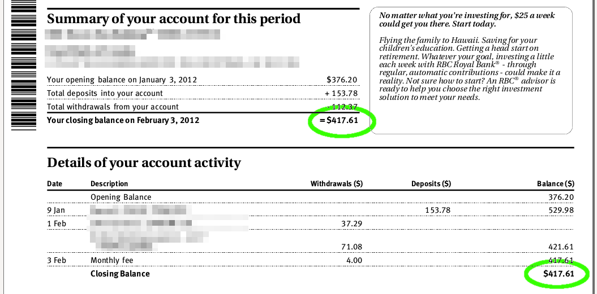

# Beancount 中的余额断言<a id="title"></a>

作者：Martin Blais，2014年7月

[<u>http://furius.ca/beancount/doc/proposal-balance</u>](http://furius.ca/beancount/doc/proposal-balance)

*本文档总结了所有命令行会计系统中余额断言的不同语义，并为 Beancount 提出了一种新的总余额和文件顺序运行断言语法。*

> [<u>动机</u>](#motivation)
>
> [<u>部分断言 vs. 完整断言</u>](#partial-vs.-complete-assertions)
>
> [<u>文件断言 vs. 日期断言</u>](#file-vs.-date-assertions)
>
> [<u>排序与歧义</u>](#ordering-ambiguity)
>
> [<u>日内断言</u>](#intra-day-assertions)
>
> [<u>日初 vs. 日终</u>](#beginning-vs.-end-of-day)
>
> [<u>状态</u>](#status)
>
> [<u>提案</u>](#proposal)
>
> [<u>文件断言</u>](#file-assertions)
>
> [<u>完整断言</u>](#complete-assertions)

## 动机<a id="motivation"></a>

Beancount 和 Ledger 都实现了*余额断言*。这些断言为系统提供了检查点，用于验证数据输入的完整性[^1]。

传统会计原则规定用户不得更改过去——更正过去的错误需要插入新的条目以撤销过去的错误[^2]——但在命令行会计社区中，我们对此提出异议：我们希望能够重建过去，更重要的是，在原始数据输入处更正过去的错误。是的，我们是业余爱好者，但我们致力于通过挑战现有概念简化簿记过程，只要它不破坏已知的余额。这些已知的余额就是我们通过余额断言提供的。

从另一个角度看，这些余额断言只是各种账户对账单上报告的底线金额，如下图所示。

根据[<u>这个线程</u>](https://groups.google.com/forum/#!topic/ledger-cli/vwkrPh74NFI)，我们发现 Ledger (3.0) 和 Beancount (2.0b) 的当前版本中对余额断言的解释有所不同。



## 部分断言 vs. 完整断言<a id="partial-vs.-complete-assertions"></a>

Beancount 中的断言当前如下所示：

```plaintext
2012-02-04 balance Assets:CA:Bank:Checking    417.61 CAD
```

该指令的含义是：“请断言在 2012 年 2 月 3 日结束时，账户 'Assets:CA:Bank:Checking' 的库存中包含正好 417.61 单位的 CAD”（所以它在 2 月 4 日标记，因为在 Beancount 中余额断言在当天开始时指定）。它不检查账户库存中的其他商品。例如，如果账户中包含“USD”单位，则这些单位不受检查。我们将此解释称为**部分余额断言**或**单一商品断言**。

另一种断言是详尽的：“请断言在 2012 年 2 月 3 日结束时，账户 'Assets:CA:Bank:Checking' 的库存中仅包含 417.61 单位的 CAD。”我们称之为**完整余额断言**。为了工作，这种第二种断言必须支持指定库存的全部内容。目前尚不支持。

进一步注意，我们并不断言库存的成本基础，只断言单位数量。

## 文件断言 vs. 日期断言<a id="file-vs.-date-assertions"></a>

在运行余额断言时有两种不同的解释和实现：

-   Beancount 首先对所有指令进行排序，并在指令日期的*开始*验证余额。在前面的示例中，即“*在 2012-02-04 之前应用任何交易的余额。”* 我们称之为**日期断言**或**基于日期的断言**。

-   Ledger 在其解析阶段保持每个账户库存的运行余额，并在文件中断言的位置*进行检查*。我们称之为**文件断言**或**文件顺序**或**基于文件的断言**。这种断言没有关联的日期（这在 Ledger 中有些误导，因为断言是附加到交易的过账上的，似乎暗示它们发生在交易日期，但实际上不是，它们严格应用于文件位置）。

### 排序与歧义<a id="ordering-ambiguity"></a>

这两种类型断言的重要区别在于，基于文件的断言不是顺序独立的。例如，以下输入文件：

```plaintext
;; 信用卡账户
2014/05/01 opening
  Liabilities:CreditCard    $-1000.00
  Expenses:Opening-Balances

2014/05/12 dinner
  Liabilities:CreditCard    $-74.20
  Expenses:Restaurant

;; 支票账户
2014/06/05 salary
  Assets:Checking            $4082.87
  Income:Salary

2014/06/05 cc payment
  Assets:Checking            $-1074.20 = $3008.67
  Liabilities:CreditCard     = $0
```

如果将信用卡付款上移到信用卡账户部分，则同一组交易会失败：

```plaintext
;; 信用卡账户
2014/05/01 opening
  Liabilities:CreditCard    $-1000.00
  Expenses:Opening-Balances

2014/05/12 dinner
  Liabilities:CreditCard    $-74.20
  Expenses:Restaurant

2014/06/05 cc payment
  Assets:Checking            $-1074.20 = $3008.67
  Liabilities:CreditCard     = $0

;; 支票账户
2014/06/05 salary
  Assets:Checking            $4082.87
  Income:Salary
```

这个微妙的问题可能难以理解。将文件断言移到没有日期的单独指令可能更能指示其语义，类似这样的内容：

```plaintext
balance Assets:Checking = $3008.67
```

日期的缺失表明检查不是在特定时间点进行的。

### 日内断言<a id="intra-day-assertions"></a>

另一方面，由于顺序独立性，基于日期的断言排除了日内断言，即发生在同一天同一账户上的两个过账之间的余额断言。

Beancount 目前不支持日内断言。

尽管存在这种缺点，但这并没有成为大问题，因为通常可以通过添加或删除一天来调整日期，甚至在无法实现的情况下跳过断言（跳过断言并不是什么大问题，因为它们是可选的，它们的目的是提供确定性。只要在跳过的断言之后出现一个断言，就没什么问题）。

然而，找到基于日期断言的日内断言的解决方案会很好。一个有趣的想法是扩展语义，以在发生在断言日期的所有交易集的平衡检查之前和之后应用文件顺序的断言，例如，这将平衡：

```plaintext
2013-05-05 balance Assets:Checking    100 USD

2013-05-20 * "Interest payment"
  Assets:Checking           12.01 USD
  Income:Interest

2013-05-20 balance Assets:Checking    112.01 USD

2013-05-20 * "Check deposit"
  Assets:Checking           731.73 USD
  Assets:Receivable
```

一旦在不同日期出现指令，魔咒就会被打破。

另一个想法是始终将余额断言按文件顺序作为第二排序键（在日期之后）进行排序并按此应用它们。不过，我不确定这是否容易理解。

### 日初 vs. 日终<a id="beginning-vs.-end-of-day"></a>

最后，为了完整性，值得一提的是，基于日期的断言在一天中*何时*应用具有明确的语义。在 Beancount 中，它们当前在当天开始时应用。

可能值得提供一种在当天结束时应用的基于日期的断言，例如“balance\_end”。Beancount v1 曾经有这个功能（“check\_end”），但在 v2 重写中被移除，因为不清楚是否真的需要。单一含义的余额断言也很简洁。

## 状态<a id="status"></a>

[<u>Ledger</u>](http://ledger-cli.org) 3.0 目前仅支持部分基于文件顺序的断言，适用于交易。

[<u>Beancount</u>](http://furius.ca/beancount/) 2.0 目前仅支持在日初进行的部分基于日期的断言。

## 提案<a id="proposal"></a>

我提出以下改进 Beancount 的余额断言。

### 文件断言<a id="file-assertions"></a>

文件断言应作为插件提供。它们看起来像这样：

```plaintext
2012-02-03 file_balance Assets:CA:Bank:Checking    417.61 CAD
```

理想情况下，为了明确它们严格按文件顺序应用，它们不应有日期，例如：

```plaintext
file_balance Assets:CA:Bank:Checking    417.61 CAD
```

但这破坏了所有其他指令语法的一致性。这也只是稍微增加了一个原本非常一致且简单的解析器的复杂性……*所有*其他指令都以日期和一个词开头，所有其他行基本上被忽略。这有点偏离此路径。最后，有一个日期仍然不错，可以将这些指令插入到渲染的日志中。因此，我正在考虑保留它的日期。如果您决定使用这些奇怪的断言，您应该知道它们的含义。

我也不喜欢将断言附加到交易上；交易语法已经足够繁忙，它需要保持简单。这应该是一个独立的指令，很少有人使用。

为了实现这一点，插件只需根据它们的文件位置对所有指令进行重新排序（使用指令的 `fileloc` 属性），忽略日期，并从上到下重新计算运行余额，同时应用检查。这可以完全通过后处理完成，就像基于日期的断言一样，而不干扰任何其他处理。

此外，使用插件的另一个优点是那些不使用此指令的人不必支付计算这些库存的成本。

### 完整断言<a id="complete-assertions"></a>

完整断言应通过当前的余额断言指令在 Beancount 中支持。它们不是非常重要，但可能有用。

可能的语法想法：

```plaintext
2012-02-03 balance* Assets:CA:Bank:Checking        417.61 CAD, 162 USD

2012-02-03 balance Assets:CA:Bank:Checking       = 417.61 CAD, 162 USD

2012-02-03 balance full Assets:CA:Bank:Checking    417.61 CAD, 162 USD

2012-02-03 balance 
  Assets:CA:Bank:Checking    417.61 CAD
  Assets:CA:Bank:Checking       162 USD
```

我仍然不确定哪个最好。目前这似乎是品味问题。

[^1]: 据我们所知，输入明确预期金额的概念在命令行会计系统中是独特的。其他系统通过冻结过去的更改来“对账”。

[^2]: 这样做有多个原因。首先，在计算机时代之前，会计是用书本进行的，手动重新计算运行余额涉及对书本进行多次烦人的更正。这一定非常不方便，并且在当前时间插入更正条目要容易得多。其次，如果您的会计余额用于报税，那么回溯更改一些余额使得在审计时难以返回并检查报告金额的细节。这一问题也适用于我们的情况，但是否允许过去更正取决于上下文和特定账户，我们让用户自行决定是否允许。
