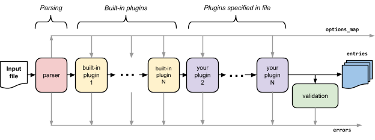

# Beancount 设计文档<a id="title"></a>

Martin Blais ([blais@furius.ca](mailto:blais@furius.ca))

[http://furius.ca/beancount/doc/design-doc](http://furius.ca/beancount/doc/design-doc)

*本指南旨在帮助开发者理解 Beancount 的内部工作。我希望通过这份文档提供源代码中主要对象的地图，以便在 Beancount 之上编写脚本和插件，甚至扩展它。*

> [介绍](#introduction)
> [不变量](#invariants)
> [输入的隔离](#isolation-of-inputs)
> [顺序独立性](#order-independence)
> [所有交易必须平衡](#all-transactions-must-balance)
> [账户有类型](#accounts-have-types)
> [账户生命周期与开启指令](#account-lifetimes-open-directives)
> [仅支持日期（不支持时间）](#supports-dates-only-and-no-time)
> [元数据用于用户数据](#metadata-is-for-user-data)
> [代码库概述](#overview-of-the-codebase)
> [核心数据结构](#core-data-structures)
> [数值](#number)
> [商品](#commodity)
> [金额](#amount)
> [批次](#_cb92j1m6vve0)
> [头寸](#_i2pg9u5nyf3k)
> [库存](#inventory)
> [账户](#account)
> [标记](#flag)
> [过账](#posting)
> [关于元组和可变性](#about-tuples-mutability)
> [摘要](#summary)
> [指令](#directives)
> [常见属性](#common-properties)
> [交易](#transactions)
> [标记](#flag-1)
> [收款人和说明](#payee-narration)
> [标签](#tags)
> [链接](#links)
> [过账](#postings)
> [平衡过账](#balancing-postings)
> [省略金额](#elision-of-amounts)
> [流处理](#stream-processing)
> [流不变量](#stream-invariants)
> [加载器和处理顺序](#loader-processing-order)
> [加载器输出](#_tk1oeldrq7r2)
> [解析器实现](#parser-implementation)
> [解析的两个阶段：不完整条目](#two-stages-of-parsing-incomplete-entries)
> [打印机](#the-printer)
> [唯一性和哈希](#uniqueness-hashing)
> [显示上下文](#display-context)
> [实现](#realization)
> [网络界面](#the-web-interface)
> [报告与网络](#reports-vs.-web)
> [客户端 JavaScript](#client-side-javascript)
> [查询接口](#the-query-interface)
> [设计原则](#design-principles)
> [最小化可配置性](#minimize-configurability)
> [更倾向于代码而不是 DSL](#favor-code-over-dsls)
> [文件格式还是输入语言？](#file-format-or-input-language)
> [通过解析器生成器生成语法](#grammar-via-parser-generator)
> [未来工作](#future-work)
> [标签字符串](#tagged-strings)
> [错误清理](#errors-cleanup)
> [类型](#_tzhbghu736gs)
> [结论](#conclusion)

## 介绍<a id="introduction"></a>

本文件描述了 Beancount 设计背后的原则及其代码库、数据结构、算法、实现和方法的高层次概述。这不是用户手册；如果你只是对使用 Beancount 感兴趣，请参阅相关的[用户手册](beancount_language_syntax.md)和所有其他[可用文档](index.md)。

但是，如果你想更深入地了解 Beancount 的工作原理，这份文件应该会非常有帮助。这也应该对开发者感兴趣。这是我写下的很多关于 Beancount 背后的想法的地方，这些想法没有找到其他发表的地方。预计会有一些对用户不重要的随机想法。

通常，人们在编写软件之前会编写设计文档。我没有这么做。但我认为仍然值得在这里阐明一些导致这个设计的想法。我希望有人能觉得这有用。

## 不变量<a id="invariants"></a>

### 输入的隔离<a id="isolation-of-inputs"></a>

Beancount 应该只接受你提供给其工具的文本文件中的输入。特别是，它不应该联系任何外部网络服务或打开任何“全局”文件，甚至只是历史价格缓存或其他文件。这种隔离是设计使然。将输入隔离到单一来源使调试、重现和隔离问题变得更容易。这是工具的一个很好属性。

此外，获取和转换外部数据非常混乱。外部数据格式可能非常糟糕，而且它们太多，无法处理所有格式（仅处理最常见的子集就会引发新的转换器实现问题）。最重要的是，表示数据与获取和转换数据的问题自然地分离开来：Beancount 提供了一个核心，它允许你摄取所有交易数据并从中派生报告，其语法是将其连接到这些外部交易或价格库的枢纽。它通过这种方式将自己与外部数据源的丑陋细节隔离开来。

### 顺序独立性<a id="order-independence"></a>

Beancount 保证其输入文件中的指令顺序对其计算结果无关紧要。你应该能够根据自己的方便组织输入文本和重新排列任何声明，而不必担心软件如何进行计算。这也使得实现多文件包含变得微不足道：你可以如果愿意的话，可以将文件连接起来，并且可以按任何顺序处理它们。

即使是声明账户或商品的指令也不要求在这些账户被使用之前出现在文件中。所有指令在任何计算或验证发生之前都会被解析并基本上排序（次要的细节是行号被用作排序中的次要键，以便重新排序是稳定的）。

相应地，语言中的所有非指令语法仅限于设置具有全局影响的值（“`option`”，“`plugin`”）或语法相关的便利性（“`pushtag`”，“`poptag`”）。

有一个例外：

- 选项可能在文件处理过程中产生效果，应该出现在文件的开头。目前，Beancount 不强制执行这一点，例如，通过执行多次解析，但它可能应该这样做。

- 此外，包含的文件中的选项当前被忽略。你应该把所有的选项放在顶层账本文件中。

### 所有交易必须平衡<a id="all-transactions-must-balance"></a>

所有交易必须按“重量”平衡。没有例外。Beancount 交易必须平衡。

特别是，不允许像 Ledger 中的“虚拟过账”这样的例外情况。Beancount 的第一个实现允许这种过账。结果，我经常使用它们来“解决”我不知道如何用其他方式建模的问题。当我重写 Beancount 时，我开始转换整个输入文件以避免使用这些，并随着时间的推移成功地做到了这一点，在此过程中学到了很多新东西。从那以后，我确信虚拟过账完全没有必要，使其可用只会为用户提供一个拐杖，而用户会依赖于此，而不是学习用平衡交易进行转移建模。我还没有遇到一个足够令人信服的案例来支持它们[^1]。

这提供了一个属性，即任何交易子集的总和都将为零。这是一个很好的属性，这意味着我们可以在任何时间点生成资产负债表。即使当我们最终[支持结算日期或每过账日期](settlement_dates_in_beancount.md)时，我们将拆分交易，以不会破坏此不变量的方式。

### 账户有类型<a id="accounts-have-types"></a>

Beancount 账户应受限于五种类型之一：资产、负债、收入、费用和权益。这背后的基本原理是，所有的计数事项可以通过永久性（资产、负债）或临时性（收入、费用）来描述，并且大多数账户具有通常的余额符号：正数（资产、费用）或负数（负债、收入）。给定一个要累积的数量，我们可以总是选择这些四种标签之一。

强制执行这一点使得能够实现永久账户的累计值报告（资产负债表）和一段时间内的变化报告（损益表）。尽管可以显式地将过账记入权益账户，但该类别中的项目的通常目的通常是记录过去对资产负债表的变化（净/保留收益或期初余额）。

这些时间和符号的概念超越了传统会计。不具备这些概念会引发有关如何处理计算这些类型报告的困难和不必要的问题。我们只需要你在这种模型中标记你的账户。承认这一点需要一点练习和深思熟虑，但最终结果是一个结构，可以轻松生成通常期望的输出。

### 账户生命周期与开启指令<a id="account-lifetimes-open-directives"></a>

账户有生命周期；账户在特定日期开启，并且可以选择在另一个日期关闭。这由开启和关闭指令指示。

所有账户都需要在流中有相应的开启指令。默认情况下，当在流中看到一个账户的开启指令时，它会抛出一个错误。你可以使用“auto\_accounts”插件自动生成这些指令，但无论如何，条目的流中将始终包含开启指令。写脚本时应该能够依赖这一假设。

（最终，类似的约束将适用于商品指令，以便流总是在使用之前包含一个指令；并且它们也应该自动生成。现在还没有实现这一点[2015年6月]。）

### 仅支持日期（不支持时间）<a id="supports-dates-only-and-no-time"></a>

Beancount 不表示时间，只表示日期。最小的时间间隔为一天。这样做是为了简单。虽然有些情况需要时间来消除账户余额的不明确性，但在实际操作中，它们的存在并不足以证明处理时间值和提供语法来处理它的额外复杂性是合理的。

如果你有一个需要时间的用例，可以使用元数据添加时间，或者更可能，你应该编写自定义软件。这超出了 Beancount 的范围，这是有意为之的选择。

### 元数据用于用户数据<a id="metadata-is-for-user-data"></a>

默认情况下，Beancount 不会对元数据字段和值做出假设。元数据保留给用户私用和插件使用。Beancount 核心不会读取元数据并根据它更改处理。但是，插件可以定义影响其生成内容的特殊元数据值。

尽管如此，Beancount 处理会生成一些特殊的元数据字段：

-   文件名：字符串，表示读取交易的文件名（或生成交易的插件）

-   行号：整数，表示读取交易的文件中的行号。

-   __tolerances__：货币到小数的字典，用于平衡交易的容差值。

-   __residual__（在过账上）：布尔值，如果过账已被自动添加以吸收舍入误差，则为真。

未来可能会生成更多字段，但无论如何，核心不应读取任何元数据并因此改变其行为。（我可能应该创建一个中心注册表或位置，所有特殊值都可以在一个地方找到。）

## 代码库概述<a id="overview-of-the-codebase"></a>

所有源代码都位于“[beancount](https://github.com/beancount/beancount/tree/master/beancount/)” Python 包下。它包含几个具有明确角色的包，它们之间的依赖关系严格执行。


*Beancount 源代码包及其之间的近似依赖关系。*

在底部，我们有一个 [beancount.core](https://github.com/beancount/beancount/tree/master/beancount/core) 包，它包含用于表示内存中交易和其他指令的数据结构。这里包含账户、金额、批次、头寸和库存的代码。它还包含一些常用的处理指令流的例程。

一个级别上，[beancount.parser](https://github.com/beancount/beancount/tree/master/beancount/parser) 包包含解析 Beancount 语言的代码和给定指令流生成相应文本的打印机。应该可以在文本和数据结构之间转换，并且此过程是无损的。

在主包的根目录下有一个 [beancount.loader](https://github.com/beancount/beancount/tree/master/beancount/loader.py) 模块，它协调将文件加载到内存中所需的所有操作。这是编写 Beancount 脚本的主要入口点，通常从加载指令流开始。这将调用解析器，运行一些处理代码，导入插件并按顺序运行它们以生成最终的指令流，用于生成报告。

[beancount.plugins](https://github.com/beancount/beancount/tree/master/beancount/plugins) 包含各种插件的实现。每个插件模块都是独立的。请参阅源代码中的文档字符串以了解每个插件的功能。这些插件中有些是原型。

有一个 [beancount.ops](https://github.com/beancount/beancount/tree/master/beancount/) 包，其中包含一些高级处理代码和一些默认情况下始终运行的代码，这些代码也实现为插件（例如使用 Pad 指令进行填充）。该包需要进行一些调整，以明确其角色。

在此基础上，报告代码调用这些包中的模块。对应于 Beancount 报告工具，有四个包含报告代码的包：

-   [beancount.reports](https://github.com/beancount/beancount/tree/v2/beancount/reports/)：该包包含生成不同类型输出的代码（由 bean-report 调用）。总体而言，我希望避免定义自定义例程来生成所需的输出，而是使用 SQL 查询工具来表达分组和聚合，但我认为总会有需要至少一些自定义报告的需求。报告在具有共同接口的类层次结构中定义，你应该能够扩展它们。每个报告支持一些输出格式的子集。

-   [beancount.query](https://github.com/beancount/beancount/tree/v2/beancount/query/)：该包包含查询语言和交互式 shell 的实现（由 bean-query 调用），允许你使用类似 SQL 的 DSL 对头寸进行分组和聚合。这基本上实现了对 Posting 对象的内存表的处理，并定义了作用于 Amount、Position 和 Inventory 对象的函数。

-   [beancount.web](https://github.com/beancount/beancount/tree/v2/beancount/)：该包包含默认 Web 界面的所有源代码（由 bean-web 调用）。这是一个简单的 [Bottle](http://bottlepy.org/) 应用程序，可以在本地机器上将 beancount.report 中的许多报告转换为 HTML 格式。Web 界面提供了对数据的简单视图和访问。（有很多改进的空间，目前还远不完美。）

-   [beancount.projects](https://github.com/beancount/beancount/tree/v2/projects/)：该包包含一些特定应用程序的自定义脚本，我想分享和分发。尽可能，我会将这些脚本合并到报告中。没有脚本来调用这些；你应该使用“python3 -m beancount.projects.<name>”来运行它们。

有一个 [beancount.scripts](https://github.com/beancount/beancount/tree/v2/beancount/scripts/) 包，其中包含位于 [bin 目录](https://github.com/beancount/beancount/tree/v2/bin) 下的所有脚本的“主”程序。这些脚本是简单的启动器，导入对应的 beancount.scripts 下的文件。这使得我们可以将所有源代码保存在一个目录下，方便对代码运行 lint 工具和其他代码健康检查。

最后，有一个 [beancount.utils](https://github.com/beancount/beancount/tree/master/beancount/utils) 包，包含一些通用的可重用随机实用代码。而且有一个相对不重要的 [beancount.docs](https://github.com/beancount/beancount/tree/master/docs/) 包，包含作者用于生成和维护此文档的代码（连接到 Google Drive 的代码）。

通过 [自定义脚本](https://github.com/beancount/beancount/tree/master/tools/dependency_constraints.py) 强制执行这些包之间的依赖关系。

## 核心数据结构<a id="core-data-structures"></a>

本节描述用于表示指令的基本数据结构。尽可能以概念方式描述数据结构。

### 数值<a id="number"></a>

**数值**使用 [decimal](https://en.wikipedia.org/wiki/Decimal_data_type) 对象表示，非常适合这种用途。会计系统中输入的大多数数值都是自然的小数数值，二进制表示涉及表示误差，导致显示和精度问题。分数数值避免了这个问题，但它们不具有用户在输入中所预期的有限精度。我们必须显式处理 [容差](precision_tolerances.md)。

因此，所有数值应使用 Python 的“decimal.Decimal”对象。方便的是，Python v3.x 本地支持小数类型的 C 实现（在其标准库中；这曾是一个需要安装的外部“cdecimal”包，但现在已集成到 C/Python 解释器中）。

默认的小数对象构造函数不支持我们希望允许的一些输入语法，例如整数部分的数字中包含逗号（例如，“278**,**401.35 USD”）或从空字符串初始化。这些是必须处理的重要情况。因此，我提供了一个特殊的构造函数来处理这些输入：“beancount.core.number.D()”。这是唯一应该用来创建小数对象的方法：

```python
from beancount.core.number import D
…
number = D("2,402.21")
```

我喜欢单独导入“D”符号（而不是使用“number.D”）。所有与数值相关的代码都位于 [beancount.core.number](https://github.com/beancount/beancount/tree/master/beancount/core/number.py) 下。

还定义了一些数值常量：`ZERO`、`ONE` 和 `HALF`。使用这些常量代替显式构造的数值（例如 `D("1")`），因为这样更容易搜索这些初始化。

### 商品<a id="commodity"></a>

**商品**或**货币**（在代码和文档中我交替使用这两个名称）是表示可以存储在账户中的一种“东西”的字符串。在实现中，它表示为一个 Python `str` 对象（没有货币操作代码的模块）。这些字符串只能包含大写字母、数字和一些特殊字符（参见词法分析器代码）。

Beancount 不预定义任何货币名称或类别——所有货币都是平等创建的。真的。它真的不知道美元、欧元或日元有什么特别之处。在源代码中唯一提到这些的地方是在测试中。没有支持使用“$”或其他货币符号的语法；我理解有些用户可能希望这种语法，但为了保持解析器非常简单和一致，我选择不提供该选项。

此外，Beancount 不区分表示“金钱”的商品和不表示的商品（例如股份、小时等）。这些在系统中被同等对待。它也没有“本位货币”的概念[^2]；它是一个真正的多货币系统。

货币不需要在输入文件格式中显式定义；你可以直接在文件中使用它们，它们会通过其独特的语法识别为货币（词法分析器会识别并发出货币标记）。然而，你可以使用 Commodity 指令声明一些。这只是为了让每种商品存在一个可以附加元数据的实体，并且一些报告和插件可以找到并使用这些元数据。

### 账户<a id="account"></a>

账户基本上只是与过账关联的一个桶的名称，表示为一个简单的字符串（一个 Python `str` 对象）。账户由词法分析器检测并标记，名称至少包含两个由冒号（“:”）分隔的词。

账户没有相应的对象类型；我们只通过其唯一的名称字符串（如 Python 中的文件名）引用它们。当需要每个账户的属性时，我们可以从条目流中提取开启指令并找到对应于我们要查找的特定账户的指令。

类似于 Python 的 os.path 模块，[beancount.core.account](https://github.com/beancount/beancount/tree/master/beancount/core/account.py) 中有一些用于操作账户名称的例程，这些函数的命名类似于 [os.path](https://docs.python.org/3.3/library/os.path.html) 模块中的函数。

账户名称的第一个组成部分限制为五种类型之一：

- Assets（资产）
- Liabilities（负债）
- Equity（权益）
- Income（收入）
- Expenses（费用）

账户类型名称在输入语法中可以通过一些“选项”指令自定义，以便你可以将这些名称更改为其他语言，或者如果你喜欢，也可以将“收入”重命名为“收入”。[beancount.core.account_types](https://github.com/beancount/beancount/tree/master/beancount/core/account_types.py) 模块包含一些用于处理这些的辅助工具。

注意，账户名称集形成了一个隐式的层次结构。例如，这些名称：

```
Assets:US:TDBank:Checking
Assets:US:TDBank:Savings
```

隐式定义了一个节点树，父节点为“Assets”、“US”、“TDBank”，叶节点为“Checking”和“Savings”。此隐式树在处理过程中不会被实现，但有一个 Python 模块可以轻松实现此功能（参见 [beancount.core.realization](https://github.com/beancount/beancount/tree/master/beancount/core/realization.py)），并创建树的线性化呈现。

### 标记<a id="flag"></a>

“标记”是一个单字符字符串，可以与交易和过账相关联，以指示它们是被认为正确（“对账”）还是被标记为可疑的。通常在交易实例上使用的值是字符“\*”。在过账上，通常省略（并设置为 None）。

### 金额<a id="amount"></a>

**金额**是数值和相关货币的组合，概念上为：

```
Amount = (Number, Currency)
```

金额实例用于表示特定货币的数量（“单位”）和过账上的价格。

一个类在 [beancount.core.amount](https://github.com/beancount/beancount/tree/master/beancount/core/amount.py) 中定义，作为一个简单的元组对象。存在一些函数可以直接对金额实例执行简单的数学运算。你也可以使用 `amount.from_string()` 创建金额实例，例如：

```python
value = amount.from_string("201.32 USD")
```

### 成本<a id="cost"></a>

成本对象表示特定商品批次的成本基础。概念上，它是

```
Cost = (Number, Currency, Date, Label)
```

数值和货币是成本本身的值，而不是商品的值。例如，如果你以 56.78 美元的价格购买了 40 股 AAPL 股票，*Number* 是一个“56.78”小数，*Currency* 是“USD”。例如：

```python
Cost(Decimal("56.78"), "USD", date(2012, 3, 5), "lot15")
```

*Date* 是对应批次的购置日期（一个 `datetime.date` 对象）。当一个过账增加一个库存时，交易的日期会自动附加到成本对象上，或者如果输入语法提供了一个显式的日期覆盖，它将自动附加。

*Label* 可以是任何字符串。它为用户提供了一个方便的参考特定批次或消除类似批次的歧义的工具。

在成本对象上，数值、货币和日期属性始终设置。如果标签未设置，则其值为“None”。

#### 成本规范<a id="costspec"></a>

在输入语法中，我们允许用户提供尽可能少的信息，以消除在过账之前库存中批次的不明确性。提供的数据将匹配的批次集过滤到一个明确的选择，或一个子集，从中将应用自动记账算法（例如“先进先出法”）。

此外，我们允许用户提供每单位成本和/或总成本。这种便利性允许 Beancount 根据总收益自动计算每单位成本。

```
CostSpec = (Number-per-unit, Number-total, Currency, Date, Label, Merge)
```

由于输入元素中的任何一个都可能省略，因此 CostSpec 的任何属性都可以为 None。如果缺少一个数值且需要填写，则会设置特殊值“MISSING”。

*Merge* 属性用于记录用户请求在应用交易之前合并所有输入批次并在应用交易之后合并它们。这是应用于所有过账到具有“AVERAGE”记账方法的账户的过账方法。

### 头寸<a id="position"></a>

头寸表示以成本持有的某种商品的单位。它简单地表示为

```
Position = (Units, Cost)
```

*Units* 是一个 *Amount* 实例，*Cost* 是一个 *Cost* 实例，或者如果商品没有成本，则为一个空值。库存包含 *Position* 实例的列表。参见其定义 [beancount.core.position](http://github.com/beancount/beancount/tree/v2/beancount/core/position.py)。

### 过账<a id="posting"></a>

每个交易指令由多个过账组成（在代码和邮件列表中我经常非正式地称这些为交易的“腿”）。每个过账与一个账户、一个头寸和一个可选的价格和标记相关联：

```
Posting = (Account, Units, Cost-or-CostSpec, Price, Flag, Metadata)
```

如你所见，*Posting* 嵌入了其 *Position* 实例[^3]。*Units* 是一个 *Amount*，‘cost’ 属性指向一个 *Cost* 或 *CostSpec* 实例（解析器输出具有 *CostSpec* 属性的 *Posting* 实例，在记账过程中将其解析为 *Cost* 实例；参见 [库存如何工作](how_inventories_work.md) 了解详细信息）。

*Price* 是一个 *Amount* 实例或一个空值。用于声明平衡交易的货币转换，或以成本持有的头寸的当前价格。这是在输入中出现在“@”旁边的金额。

过账上的标记相对罕见；用户通常会发现标记整个交易比特定过账更为合适。标记通常为 None；如果设置，则为单字符字符串。

过账类型在 [beancount.core.data](https://github.com/beancount/beancount/tree/master/beancount/core/data.py) 中定义，以及所有指令类型。

### 库存<a id="inventory"></a>

库存是一个账户余额在各种商品批次中的容器。本质上，它是一个包含适当操作定义的 *Position* 实例列表。概念上，你可以将其视为具有唯一键的映射：

```
Inventory = [Position1, Position2, Position3, … , PositionN]
```

通常，头寸的 (*Units.Currency, Cost)* 组合在列表中保持唯一，就像映射的键一样。对于相同货币和成本值的头寸通过将其 *Units.Number* 累加并保持单一头寸来合并在一起。并且简单头寸与以成本持有的头寸混合在列表中。

*Inventory* 是 Beancount 实现中最重要和最常用的对象之一，因为它用于总结一个或多个账户的余额。它也是应用库存减少算法的地方，可以在那里找到该机制的痕迹。[库存如何工作](how_inventories_work.md) 文档提供了该过程的全部详细信息。

对于测试，可以使用 `inventory.from_string()` 创建初始化的 Inventory 实例。所有库存代码都在 [beancount.core.inventory](https://github.com/beancount/beancount/tree/master/beancount/core/inventory.py) 中编写。

### 关于元组和可变性<a id="about-tuples-mutability"></a>

尽管该程序使用的语言并未使可变性“默认困难”，我设计软件以在大多数地方避免可变性。Python 提供了一个“`collections.namedtuple`”工厂，可以创建属性不能被重写的新记录类型。好吧…这只是部分正确：不可变元组的可变属性可以被修改。Python 并没有提供非常强的机制来强制执行这个属性。

无论如何，函数式编程不仅仅是我们使用的语言的属性，还在于我们在其结构中构建的保证。支持强保证的语言有助于强制执行这一点。但即使仅仅通过使用一组约定，我们设法大部分避免了可变性，我们就有了一个大部分函数化的程序，避免了大部分发生意外变异的问题，我们的代码因此更容易维护。不特别关注变异发生位置的程序最难维护。通过在函数式方法中避免大部分变异，我们避免了大部分这些问题。

- Beancount 使用的大多数数据结构都是 [namedtuples](https://docs.python.org/3/library/collections.html#collections.namedtuple)，这使得修改其属性变得不方便。

- 大多数代码将尝试避免变异，除了局部状态（函数内）或我们可以轻松掌握的狭窄范围内的变异。在可能发生变异的地方，通过约定我尝试默认避免它。当我们进行变异时，我会记录其效果。

- 我避免创建会变异其内部状态的类，除了少数情况（例如 web 应用程序）。我更喜欢函数而不是对象，并且在定义类时，我大多避免继承。

这些属性尤其适用于所有小对象：Amount、Lot、Position、Posting 对象以及 [beancount.core.data](https://github.com/beancount/beancount/tree/master/beancount/core/data.py) 中的所有指令类型。

另一方面，库存对象几乎总是用作累加器，并且*确实*允许修改其内部状态（需要一个特殊的、持久的数据结构来避免这一点）。你必须小心如何共享库存对象的访问…以及修改它们，如果你确实这么做。

最后，加载器生成的指令列表都是简单的 `namedtuple` 对象。这些列表形成了主要的应用程序状态。我避免将这些放入一些特殊的容器中，而是故意显式传递它们，而不是有某种大型“应用程序”对象，我已经修剪掉了所有的脂肪，所有的状态都表示在两件事中：一个日期和排序的指令列表，这些指令可以成为流处理的主题，还有一个常量只读选项值列表。我认为这样更简单。

*我归功于能够对中型 Python 代码库进行广泛的更改，是因为采用了这些原则。我希望有**类型**来防止另一类潜在错误，并计划试验 [Python 3.5 即将推出的 typing 模块](https://www.python.org/dev/peps/pep-0484/)。*

### 摘要<a id="summary"></a>

下图解释了这些对象如何相互关联，从过账开始。


例如，要访问过账的单位数，可以使用

```python
posting.units.number
```

对于成本货币：

```python
posting.cost.currency
```

你可以在 Python 中打印出元组来了解它们的结构。

#### 以前的设计<a id="previous-design"></a>

为了保存历史记录，如果你回溯到代码库中的早期版本，过账的结构更加深入和复杂。新设计反映了它的更平坦和简单版本。以下是旧设计的样子：


## 指令<a id="directives"></a>

加载 Beancount 输入文件的主要产出是指令列表。在代码库和文档中，我也会交替使用指令和条目这两个术语。指令有多种类型：

- 交易
- 余额和填充
- 开启和关闭
- 商品
- 备注
- 事件
- 价格
- 文档

在典型的 Beancount 输入文件中，大多数条目将是交易和一些余额断言。还会有开启和可能一些关闭条目。其他条目都是可选的。

由于这些条目与选项值映射结合在一起形成了整个应用程序状态，你应该能够将这些条目传递给生成报告的函数。系统围绕处理指令流以提取所有内容并生成报告这一思想构建，这些报告本质上是对指令流中的值进行不同风味的过滤和聚合。

### 常见属性<a id="common-properties"></a>

*所有*指令都有一些共同属性：

- **日期。** 一个 datetime.date 对象。这很有用且一致。对于交易，这是发生的日期。对于开启或关闭指令，这是账户开启或关闭的日期。对于填充指令，这是插入交易的日期。对于备注或文档，这是在该账户的过账流中插入备注的日期。对于事件，这是发生的日期。对于商品指令，它本质上提供了一个与商品相关的元数据挂接点，日期并不那么有意义；我选择在创建商品的那天对这些指令进行日期标记。

- **元数据。** 所有指令都有一个元数据属性（一个 Python 字典对象）。元数据的目的是允许用户挂接任何想要的辅助数据，然后在脚本或查询中使用这些数据。过账实例也有一个元数据属性。

### 交易<a id="transactions"></a>

交易指令是 Beancount 的主体，输入文件中最常见的指令，值得特别关注。会计系统的功能是以各种方式组织附加到交易的过账。所有其他类型的条目在我们的系统中扮演支持角色。

交易有以下附加字段。

#### 标记<a id="flag-1"></a>

单字符标记通常替代“txn”关键字（交易是唯一允许在没有输入其关键字的情况下输入的指令）。我一直在考虑稍微更改语法定义，以允许不输入标记或关键字，因为我希望最终支持这一点。目前，标记或关键字是必需的。标记属性可以设置为 None。

#### 收款人和说明<a id="payee-narration"></a>

说明字段是用户提供的交易描述，例如“与 Mary-Ann 共进晚餐。”你可以在这个字符串中输入任何信息。它会显示在日记报告中。通常用于丰富交易上下文，这些上下文无法自动导入，例如“从储蓄账户转账以支付汽车维修费用”。

收款人名称是可选的，存在的目的是描述进行交易的实体，例如“Whole Foods Market”或“Shell”。

请注意，我希望能够生成与特定收款人相关的所有交易的报告，因此输入一致的收款人名称会很好。问题是，这样做的努力有时太大。要么需要更好的工具，要么需要对名称进行松散匹配才能使其工作。

输入语法还允许仅提供单个字符串。默认情况下，这成为说明，但实际上有时仅输入收款人更方便。目前，如果你只想输入收款人字符串，你需要附加一个空的说明字符串。这一点应该在某个时候重新考虑。

#### 标签<a id="tags"></a>

标签是字符串的集合，可用于对一组交易进行分组（如果没有标签，则设置为 None）。然后可以生成此子集的视图，包括所有通常的报告（资产负债表、损益表、日记等）。你可以出于各种目的标记交易；以下是一些例子：

- 可能会标记特定旅行期间的所有交易，以后汇总你的旅行费用。那些交易通常发生在同一日期附近，因此有方便的语法用于自动标记文件中声明在一起的许多交易。

- 与完成特定项目相关的交易。我曾经在一个在线项目中上过一些课程，并标记了所有相关费用。我用它来跟踪特定阶段的所有移民相关费用（例如，绿卡）。

- 声明一组稍后由雇主（或你自己的公司）支付的费用。

- 与搬迁相关的费用。

我通常使用的标签名称类似于 `#trip-israel-2012`、`#conference-siggraph` 和 `#course-cfa`。

一般来说，当添加子账户不起作用时，标签很有用。通常，当一组相关费用属于不同类型时，它们不会属于单个账户。

在查询工具支持的情况下，它们最终可能会被元数据取代——我一直在考虑将标签转换为值为 True 的元数据键，以减少不必要的复杂性。

#### 链接<a id="links"></a>

链接是唯一的字符串集合或 None，实际上大多数交易通常为空。它们与标签的不同在于目的。

链接用于将一组相关交易链接在一起，并且有工具用于列出、导航和平衡链接在一起的交易子集。它们是交易引用其他交易的一种方式。它们不用于汇总。

示例包括：交易账户提供的交易 ID（这些通常提供“相关”或“其他”交易的 ID）；与相关更正相关的账户条目，例如，几周前一个无效费用之后的电话可能会链接到原始无效费用；房屋的购买和出售以及相关的购置费用。

与标签不同，它们的字符串通常是导入程序生成的唯一数字。没有为链接生成视图；只有链接交易的日记可以生成，并且呈现的交易应该伴有一个实际的“链接”图标，你可以点击它查看所有其他相关交易。

#### 过账<a id="postings"></a>

过账列表附加到交易对象上。技术上，这个列表对象是可变的，但实际上我们尽量不修改它。一个过账只能是单个交易的一部分。

有时，同一交易的不同过账将在其各自账户的不同日期结算，因此我们最终可能允许过账具有自己的日期来覆盖交易的日期，作为文档；在最简单的版本中，我们强制所有交易同时发生，这很容易理解，实际上也没有发现这是一个显著问题。最终，我们可能会通过将包含多个日期的交易隐式转换为多个交易，并使用某种过渡账户在日期之间持有待结余额来实现这一点。参见 [相关提案](settlement_dates_in_beancount.md) 了解详细信息。

#### 平衡过账<a id="balancing-postings"></a>

复式记账的基本原则在每个交易条目中得到强制执行：所有过账的总和必须为零。本节描述了我们实现这一点的具体方式，这是**关键逻辑**，使整个系统平衡良好。这也是系统中为数不多的超出简单过滤和聚合的计算之一。

如前所述，过账与

- 一个头寸，表示商品批次的单位数（批次本身可能有成本也可能没有）

- 一个可选的转换价格

鉴于此，我们如何平衡交易？

一些术语是必要的：对于此示例过账：

```
Assets:Investment:HOOL    -50 HOOL {700 USD} @ 920 USD
```

**单位。** 单位数是头寸的数量，即“50”。

**货币。** 批次的商品，即“HOOL”。

**成本。** 头寸的成本是单位数乘以成本货币的每单位成本，即 50 x 700 = 35000 USD。

**（总）价格。** 单位价格是附加价格金额，920 USD。头寸的总价格是单位数乘以转换价格，在此示例中为 50 x 920 = 46000 USD。

**重量。** 用于平衡每个过账的金额：

1. 如果过账有相关成本，我们计算头寸的成本（无论是否存在价格）；

2. 如果过账没有相关成本但有转换价格，我们将头寸转换为其总价格；

3. 最后，如果过账既没有相关成本也没有转换价格，则直接使用商品批次的单位数。

平衡非常简单：首先，将每个过账的头寸转换为其重量。然后将这些金额按货币分组，并且最终每种货币的总和被断言接近于零，即在一定的容差范围内（如 [由输入中的数值和选项推断的组合](precision_tolerances.md)）。

以下示例是情况（2），带有价格转换和一个没有成本和价格的常规腿（情况 3）：

```
2013-07-22 * "汇款到外国账户"
  Assets:Investment:HOOL     -35350 CAD @ 1.01 USD        ;; -35000 USD (2)
  Assets:Investment:Cash      35000 USD                   ;;  35000 USD (3)
                                                            ;;------------------
                                                            ;;      0 USD
```

在下一个示例中，第一个过账的头寸有成本，第二个过账既没有：

```
2013-07-22 * "买了一些投资"
  Assets:Investment:HOOL     50 HOOL {700 USD}            ;;  35000 USD (1)
  Assets:Investment:Cash    -35000 USD                    ;; -35000 USD (3)
                                                            ;;------------------
                                                            ;;      0 USD
```

这是一个更复杂的示例，包含价格和成本；价格在平衡目的上被忽略，仅用于在内部价格数据库中输入一个数据点：

```
2013-07-22 * "卖了一些投资"
  Assets:Investment:HOOL    -50 HOOL {700 USD} @ 920 USD  ;; -35000 USD (1)
  Assets:Investment:Cash     46000 USD                    ;;  46000 USD (3)
  Income:CapitalGains       -11000 USD                    ;; -11000 USD (3)
                                                            ;;------------------
                                                            ;;      0 USD
```

最后，这是一个包含多种货币的示例：

```
2013-07-05 * "COMPANY INC PAYROLL"
  Assets:US:TD:Checking                            4585.38 USD
  Income:US:Company:GroupTermLife                   -25.38 USD
  Income:US:Company:Salary                        -5000.00 USD
  Assets:US:Vanguard:Cash                           540.00 USD
  Assets:US:Federal:IRAContrib                     -540.00 IRAUSD
  Expenses:Taxes:US:Federal:IRAContrib              540.00 IRAUSD
  Assets:US:Company:Vacation                          4.62 VACHR
  Income:US:Company:Vacation                         -4.62 VACHR
```

这里有三组权重要平衡：

- USD: (4485.38) + (-25.38) + (-5000) + (540) ~= 0 USD

- IRAUSD: (540.00) + (-540.00) ~= 0 IRAUSD

- VACHR: (4.62) + (-4.62) ~= 0 VACHR

##### 省略金额<a id="elision-of-amounts"></a>

交易允许最多省略一个过账的金额，并自动设置；如果省略了金额，则将所有其他过账的最终余额归因于该余额。

随着 [库存记账提案](a_proposal_for_an_improvement_on_inventory_booking.md)，它应该扩展到能够处理更多的省略情况。一个有趣的想法是允许省略的过账至少指定他们正在使用的货币。这将允许用户省略多个过账，如下所示：

```
2013-07-05 * "COMPANY INC PAYROLL"
  Assets:US:TD:Checking                                    USD
  Income:US:Company:GroupTermLife                   -25.38 USD
  Income:US:Company:Salary                        -5000.00 USD
  Assets:US:Vanguard:Cash                           540.00 USD
  Assets:US:Federal:IRAContrib                     -540.00 IRAUSD
  Expenses:Taxes:US:Federal:IRAContrib                     IRAUSD
  Assets:US:Company:Vacation                          4.62 VACHR
  Income:US:Company:Vacation                               VACHR
```

### 流处理<a id="stream-processing"></a>

表示所有状态为单个指令流的一个重要副产品是 Beancount 中的大多数操作都可以通过接受指令列表作为输入并输出修改后的指令列表的简单函数来实现。

例如，

- “Pad” 指令是通过处理交易流、累积余额、在 Pad 指令后插入新的填充交易以断言余额失败时实现的。

- [汇总](https://github.com/beancount/beancount/tree/master/beancount/ops/summarize.py) 操作（打开账簿、关闭账簿、清除净收入到权益）都以这种方式实现，作为指令流的函数操作。例如，在特定日期打开账簿是通过总结某个日期之前的所有余额并用新的交易替换这些交易以从权益账户提取最终余额来实现的。关闭账簿仅涉及将损益表账户的余额转移到权益并截断该日期的交易列表。这非常优雅——报告代码可以忽略汇总的发生。

- 以成本持有的过账上的价格通常被忽略。通过处理操作流并在找到此类过账时自动插入普通的价格指令，实现在过账上生成隐含价格的选项。

- 许多类型的验证也以这种方式实现；[sellgains](https://github.com/beancount/beancount/tree/master/beancount/plugins/sellgains.py) 插件验证非收入余额是否检查过账的转换价格。这个不插入任何新指令，但可能会生成新的错误。

这些只是一些例子。我希望大多数操作以这种方式工作。这种设计证明是优雅的，但也出乎意料地灵活，并且催生了 Beancount 中可用的插件系统；你可能会惊讶地发现我最初没有想到提供插件系统……随着时间的推移，通过抽象和尝试避免程序中的状态，它自然而然地出现了。

*我正在考虑通过提供一个新的“Error”指令来将错误编织到指令流中，以供流处理函数插入。暂时还不确定这是否会使事情变得更简单，但这是一个想法[2015年7月]。*

### 流不变量<a id="stream-invariants"></a>

指令流提供了一些你可以依赖的保证：

- 所有指令按日期排序。由于许多日期有多个指令，为了稳定排序顺序，文件中的行号用作次要排序键。

- 所有账户的使用都由流中的相应开启条目之前的指令。输入未提供开启条目时，会自动生成一个开启指令。

- 所有余额指令在特定日期的任何其他指令之前。这是为了使余额断言的处理简单明了，并强调其语义是在当天开始。

## 加载器和处理顺序<a id="loader-processing-order"></a>

**加载**从输入文件中加载条目的过程是项目的核心。了解它对于理解 Beancount 的工作原理非常重要。参见下图。



它由以下步骤组成

1. **解析**步骤读取所有输入文件并生成可能不完整的指令流。

2. 由内置和用户指定的插件处理此指令流。此步骤可能会生成新的错误对象。

3. 最后验证步骤确保插件未破坏不变量。

[beancount.loader](https://github.com/beancount/beancount/tree/master/beancount/loader.py) 模块协调此处理。在代码和文档中，我小心区分“解析”和“加载”这两个术语。这两个概念是不同的。“解析”只是“加载”的一部分。

用户指定的插件按输入文件中提供的顺序运行。

**原始模式。** 一些用户表示希望更多地控制运行哪些内置插件及其运行顺序，因此启用“raw”选项会禁用所有内置插件的自动加载（你需要用显式“插件”指令替换这些插件）。还不确定这是否会有用，但它允许对加载过程进行更严格的控制以进行试验。

### 加载器输出<a id="loader-output"></a>

解析器和加载器生成三个列表：

- 条目：来自 beancount.core.data 的指令元组列表。这是数据流，应该主要由交易和余额实例组成。尽可能多地，所有数据转换都通过在此列表中插入或删除条目来执行。在代码和文档中，我交替称这些为条目或指令。

- 错误：错误对象列表。在 Beancount 中，我不使用异常报告错误；相反，所有函数生成错误对象，并在最合适的时间显示它们。（这些应该有一个基本的公共类型，但目前它们遵循的约定是它们都提供源（文件名，行号）、消息和条目属性。）

- options_map：在文件中提供和解析期间派生的选项字典。尽管这是一个可变对象，但我们从不修改它一旦解析器生成它。

## 解析器实现<a id="parser-implementation"></a>

Beancount 解析器是 C 和 Python 3 代码的混合体。这就是为什么你需要编译任何东西。解析器使用 [flex](http://flex.sourceforge.net/) 词法分析器和 [Bison](http://www.gnu.org/software/bison/) 解析器生成器在 C 中实现，主要是为了性能原因。

我选择 C 语言和这些陈旧的 [GNU](https://www.gnu.org/) 工具，因为它们是可移植的，可以在任何地方工作。有更好的解析器生成器，但它们要么需要用户安装更多的编译工具，要么需要用到陌生的语言。C 语言是一个很好的共同基准。我希望 Beancount 可以在任何地方工作，并且易于安装。我希望这样做是为了让别人更轻松，但我也希望这样做是为了我自己，因为某些时候我会处理其他项目，而依赖越少，维护老化软件的负担越轻。这也是我选择使用 Python 而不是我更自然喜欢的其他语言（Clojure、Go、ML）的原因之一；当我在计算账目时，我没有时间调试问题。Python 对其变化很小心，并且将长期存在。

有一个用 flex 编写的词法分析器文件 lexer.l 和一个 Bison 语法文件 grammar.y。这些工具用于生成相应的 C 源代码（lexer.h/.c 和 grammar.h/.c）。这些文件连同一些手写的 C 代码定义了一些模块的接口函数（parser.h/.c），被编译成一个扩展模块（_parser.so）。

我们最终可以考虑在 setup.py 中创建一个小的依赖规则，自动调用 flex 和 Bison，但目前为了最小化安装负担，我在存储库中检查生成的源代码（lexer.h/c 和 grammar.h/c）。


Python 和 C 代码之间的交互如下：

- 你导入 beancount.parser.parser 并调用 parse_file() 或 parse_string()。这使用 grammar.py 中的代码创建一个 Builder 对象，基本上提供在 Python 中处理语法规则的回调。

- parser.py 调用扩展模块中的 C 函数，带有 Builder 对象。该 C 代码设置 flex 以读取输入文件或字符串，然后通过调用生成的 C 函数“yyparse()”将控制权移交给解析器。

- yyparse() 是解析器，将使用连续调用“yylex()”从词法分析器 C 代码获取输入标记，并尝试减少规则。

- 当规则或标记成功减少时，C 代码调用提供的 Builder 对象上的回调方法。解析器的规则通过传递“PyObject*”实例相互通信，因此代码需要小心正确处理引用计数。这允许我在规则减少时运行 Python 代码，使其非常容易自定义解析器行为，同时保持语法规则处理的性能。

请注意，grammar.py Builder 从 lexer.py 中定义的类似 Builder 类派生，因此词法分析器识别的标记调用定义在 lexer.py 文件中的方法创建它们，并且解析器规则对应调用 grammar.py 的 Builder 中的方法。这种隔离不仅干净，还使我们可以仅使用词法分析器对文件进行标记（而不解析），以便从 Python 进行测试；如果你对其工作原理感兴趣，请参见测试中的使用方法。

我刚想出这个；我没见过其他地方这样做。我试了一下，比使用 PLY 的解析器快得多，所以我坚持使用这种模式。我非常喜欢这种模式，它是提供解析器生成器灵活性和允许我在 Python 中处理规则的性能折中。最终，我想将最重要的回调移到 C 代码中，以使其更快（还没有进行任何真正的性能优化）。

这到目前为止效果很好，但有一个问题：flex 词法分析器固有的几个限制已经证明是问题。特别是，为了使用缩进识别交易过账，我不得不标记行开头的空白。此外，输入中的单字符应该在其自身标记中，而不是与前面的标记合并。这些将得到解决。

### 解析的两个阶段：不完整条目<a id="two-stages-of-parsing-incomplete-entries"></a>

因为我希望解析器允许你重新排列交易，并且每个账户的创建和声明指令应该出现在其首次使用之前，我们将解析阶段分为两个步骤。

- 我们的 C 代码生成一个可能**不完整**的指令流。

- 然后，我们使用内置的“plugin_auto_accounts”插件来生成打开的指令，另一个插件来生成初始金额。用户定义的插件在这些之后运行。

一旦文件被解析为指令流，我们处理指令，生成必要的填充指令，这允许这些项目出现，因为我们在实现交易的顺序独立性中创建了一个特例。


指令流随后由内置和用户定义的插件流经，并生成所需的所有指令，输出最终指令流。然后指令流通过错误检查插件。

### 打印机<a id="the-printer"></a>

我们可以将指令列表返回为输入文件格式的字符串。此功能使得重新排列文件、从更改开始输入、生成和调试数据变得非常容易。实际上，这是重新排列和缩进文件的实用程序的基础。

[beancount.parser.printer](https://github.com/beancount/beancount/tree/master/beancount/parser/printer.py) 实现这一功能。此功能将指令对象（以及指令对象内的元组对象）转换为字符串。这是可能的，因为所有对象都有与输入文件语法直接对齐的简单格式。我们可以完全打印对象。对于涉及更改、重新排列或生成数据的任何操作，这非常有用。

这是一个有趣的细节：我们在解释输入时会引入容差值，因此生成的文件不会产生更改容差的副作用（该项目的一个目标是使容差适应用户的输入，但不会引入容差）。

请注意，解析后的指令将被重新排序并重新编号。如果你尝试从错误处理（显示）中保留行号，请务必使用它们。重排文件后，它们将丢失其原始行号（这与工具的现有设计一致，我无法改变这一点）。

## 唯一性和哈希<a id="uniqueness-hashing"></a>

指令、头寸和账户没有唯一标识符。不同对象通过其内容进行区分。为了对它们进行唯一性检查，我们实现了一个散列函数。散列允许我们生成帐簿快照，并在同一帐簿的不同时间点之间进行比较。

## 显示上下文<a id="display-context"></a>

生成报告时，建议将上下文指示与每个条目相关联。我们希望了解哪些条目是源文件的指令以及哪些条目是插件生成的。将生成的文件名和行号存储在元数据属性中。

`beancount.core.display_context` 模块实现了一种机制，用于在生成的条目上添加这些上下文。该机制通过生成包含文件名和行号的元数据，并附加到每个条目的元数据属性中。

## 实现<a id="realization"></a>

在生成资产负债表时，我们处理帐户余额，并将其组织成层次结构。为了实现此目的，我们使用了`beancount.core.realization`模块，该模块实现了一种机制，用于在层次结构中组织帐户余额。

该机制提供了一个“realization”对象，该对象表示帐户余额的层次结构，并提供了生成资产负债表的基本功能。

## 网络界面<a id="the-web-interface"></a>

Beancount 提供了一个简单的网络界面，用于生成报告。该界面使用 Bottle 框架实现，并提供了一些基本的报告功能。

## 报告与网络<a id="reports-vs.-web"></a>

报告和网络界面的主要区别在于生成报告的方式。报告是生成静态输出的过程，而网络界面是一个动态生成报告的过程。

## 客户端 JavaScript<a id="client-side-javascript"></a>

Beancount 提供了一些客户端 JavaScript 用于生成动态报告。客户端 JavaScript 使用了 jQuery 和其他一些库来生成动态报告。

## 查询接口<a id="the-query-interface"></a>

Beancount 提供了一个类似 SQL 的查询接口，用于对帐目进行分组和聚合。查询接口允许用户使用类似 SQL 的 DSL 进行查询。

## 设计原则<a id="design-principles"></a>

Beancount 的设计原则包括：

### 最小化可配置性<a id="minimize-configurability"></a>

尽量减少可配置性，以简化用户使用和维护代码。

### 更倾向于代码而不是 DSL<a id="favor-code-over-dsls"></a>

更倾向于使用代码而不是 DSL，以便用户可以更灵活地扩展和定制 Beancount。

### 文件格式还是输入语言？<a id="file-format-or-input-language"></a>

Beancount 的输入语法既可以视为文件格式，也可以视为输入语言。它的设计使得用户可以方便地进行手工编辑，同时也适合自动化处理。

### 通过解析器生成器生成语法<a id="grammar-via-parser-generator"></a>

Beancount 的语法是使用解析器生成器生成的，以确保解析器的高效性和可靠性。

## 未来工作<a id="future-work"></a>

未来的工作包括：

### 标签字符串<a id="tagged-strings"></a>

改进标签字符串的处理，以便更方便地进行标签管理。

### 错误清理<a id="errors-cleanup"></a>

改进错误处理机制，以便更清晰地显示错误信息。

### 类型<a id="types"></a>

改进类型系统，以便更好地支持复杂的会计操作。

## 结论<a id="conclusion"></a>

Beancount 的设计目标是提供一个灵活、可靠、高效的会计系统。通过本文档的介绍，希望你能对 Beancount 的设计有一个更深入的理解，并能够更好地使用和扩展 Beancount。
