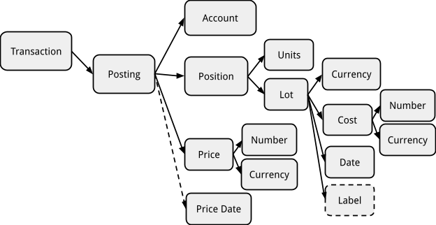

# Beancount 查询语言<a id="title"></a>

Martin Blais，2015年1月

[<u>http://furius.ca/beancount/doc/query</u>](http://furius.ca/beancount/doc/query)

## 介绍<a id="introduction"></a>

Beancount 的目的是允许用户创建一个准确且无错误的金融交易表示，通常是用户或机构的账户集合中发生的交易，然后从这些交易列表中提取各种报告。Beancount 提供了一些工具从交易主体中提取报告：自定义报告（使用 Beancount `bean-report` 工具）、一个网络界面（使用 `bean-web` 工具）以及用户编写自己的脚本以输出所需内容的能力。

金融交易的存储库总是从文本文件输入中读取，但一旦解析并加载到内存中，从 Beancount 中提取信息就像使用另一个数据库一样，即，不使用自定义代码从数据结构生成输出，而是可以编译并运行查询语言以遍历相对规则的交易列表。

实际上，您可以将过账列表展平到外部 SQL 数据库，并使用该数据库的工具进行查询，但这种方法的结果令人失望，主要是因为缺乏对库存操作的支持，这构成了 Beancount 中平衡规则的基础。通过提供一个稍微专业化的查询引擎，利用复式交易的结构，我们可以轻松生成特定于会计目的的自定义报告。

本文档描述了我们专业化的类似 SQL 的查询客户端。假设您至少对 [<u>SQL</u>](http://en.wikipedia.org/wiki/SQL) 语法有基本了解。如果没有，您可能需要先阅读一些[<u>相关内容</u>](http://www.amazon.com/Practical-SQL-Handbook-Using-Variants/dp/0201703092/) [<u>或其他</u>](http://www.w3schools.com/sql/)内容。

## 动机<a id="motivation"></a>

有人可能会问：为什么要创建另一个 SQL 客户端？为什么不将数据输出到 SQLite 数据库并允许用户使用该 SQL 客户端？

实际上，我们已经这么做了（参见 [<u>bean-sql</u>](https://github.com/beancount/beancount/tree/v2/beancount/scripts/sql.py) 脚本，该脚本将您的 Beancount 分类账转换为 SQLite 数据库），但结果并不理想。编写查询很痛苦，对按成本持有的批次进行操作也很困难。通过利用我们的内存数据结构的某些方面，我们可以做得更好。因此，Beancount 自带一个名为 “[<u>bean-query</u>](https://github.com/beancount/beancount/tree/master/beancount/scripts/query.py)” 的类似 SQL 的查询客户端。

客户端实现了以下对 Beancount 至关重要的“额外”功能：

-   它允许同时在两个级别轻松过滤：您可以过滤整个交易，这有利于遵守会计等式，然后通常出于展示目的，您还可以在过账级别过滤。

-   客户端支持 Beancount 实现的库存预订语义。它还支持对库存对象的聚合函数和渲染函数（例如，COST() 函数可渲染库存成本而不是其内容）。

-   客户端允许您将多个批次展平为单独的过账，以生成每个批次及其相关成本基础的持有清单。

-   交易可以汇总为生成资产负债表和损益表。例如，我们的 SQL 变体明确支持“结算”操作，类似于年度结算，将收入账户清零到权益并删除过去的历史记录。

请参阅 [<u>这篇帖子</u>](https://groups.google.com/d/msg/beancount/ZYsPCXt_fQo/NdCdgjbhEgAJ)，以获取类似的答案。

## 警告与注意事项<a id="warning-caveat"></a>

大约 70% 的[<u>原设计文档</u>](http://furius.ca/beancount/doc/proposal-query)中所需的功能在 2014 年末实现了查询语言。需要更多工作以覆盖全部功能集，但当前版本支持 Ledger 覆盖的大部分用例，我怀疑 Beancount 用户也是如此。在继续前进并改进 Beancount 的一些更基本方面（即库存预订）之前，我希望对当前版本有更多反馈并进行长期使用。因此，查询语言的第一个版本已合并到默认稳定分支中。本文档介绍了 Beancount 查询语言的这一首次迭代。

## 进行查询<a id="making-queries"></a>

我们提供的自定义查询客户端称为 `bean-query`。在您的分类账文件上运行它，如下所示：

```shell
$ bean-query myfile.beancount
Input file: "My Ledger’s Title"
Ready with 13996 directives (21112 postings in 8833 transactions).
beancount> _
```

这将启动交互模式的查询工具，您可以在内存中加载的数据集上输入多个命令。`bean-query` 解析输入文件，输出一些关于分类账的基本统计信息，并提供一个命令提示符，供您输入查询命令。您可以在此处键入 “`help`” 以查看可用命令的列表。

如果您的分类账中出现任何错误，它们将在提示符前打印。要抑制错误打印，请使用 “no-errors” 选项运行工具：

```shell
$ bean-query -q myfile.beancount
```

### 批处理模式查询<a id="batch-mode-queries"></a>

如果您希望直接从命令行运行查询，而不使用交互提示符，可以在文件名后直接提供查询：

```shell
$ bean-query myfile.beancount 'balances from year = 2014'
                         account                       balance
    ----------------------------------------------------------------------
    … <balances follow> … 
```

### 所有交互命令均受支持<a id="all-the-interactive-commands-are-supported."></a>

### Shell 变量<a id="shell-variables"></a>

交互式 shell 具有一些可以自定义的 “`set`” 变量，以更改 shell 的某些行为。这些变量类似于环境变量。键入 “`set`” 命令以查看可用变量及其当前值的列表。

这些变量包括：

-   format (string): 输出格式。目前仅支持“文本”。

-   boxed (boolean): 是否应在输出表格周围绘制一个框。

-   spaced (boolean): 是否在每行结果之间插入一个空行。这仅在具有多个批次的过账需要多行渲染时相关，插入空行有助于将它们分隔为独立行。

-   pager (string): 当输出大于屏幕时，用于分页输出的程序名称。初始值从 PAGER 环境变量复制。

-   expand (boolean): 如果为 true，则将渲染为列表的列展开到多行。

## 交易和过账<a id="transactions-and-postings"></a>

交易和条目的结构可以通过以下简化图示解释：


分类账的内容解析为一个指令列表，其中大部分是包含两个或更多 “Posting” 对象的 “Transaction” 对象。过账总是只链接到一个交易（它们不会在交易之间共享）。每个过账引用其父交易，但具有唯一的账户名称、金额和关联批次（可能带有成本）、价格和其他属性。父交易本身也包含一些有用的属性，例如日期、收款人名称、叙述字符串、标记、链接、标签等。

如果我们忽略交易以外的指令列表，您可以将数据集视为与其父交易连接的所有过账的单个表。主要是在这个连接的过账表上，我们希望进行过滤和聚合操作。

然而，由于复式记账约束，即附加到交易的过账金额之和为零，因此在交易级别进行过滤操作也非常有用。因为任何孤立的交易对全局余额的总影响为零，所以任何交易子集也将遵守会计等式（资产 + 负债 + 权益 + 收入 + 费用 = 0），对交易子集生成资产负债表和损益表提供有意义的视图，例如，“所有在巴哈马旅行期间发生的资产变动和费用”可以通过标签选择。

为此，我们修改了 SQL SELECT 语法，以提供两级过滤语法：由于我们只有一个数据表，我们用适用于交易的过滤表达式替换 FROM 中的表名称，WHERE 子句适用于从结果过账列表中提取的数据：

```sql
SELECT <target1>, <target2>, …
FROM <entry-filter-expression>
WHERE <posting-filter-expression>;
```

两个过滤表达式都是可选的。如果未提供过滤表达式，将枚举所有过账。注意，由于交易总是按日期顺序过滤，结果将默认按此顺序处理和返回。

### 过账数据列<a id="posting-data-columns"></a>

目标列表指的是过账或其父交易的属性。同样的列名列表在 *<posting-filter-expression>* 中可用，以根据过账属性进行过滤。例如，您可以编写以下查询：

```sql
SELECT date, narration, account, position 
WHERE account ~ ".*:Vacation" AND year >= 2014;
```

在这里，“date”、“year”和“narration”列指的是父交易的属性，“account”和“position”列指的是过账的属性。

您可以使用熟悉的 AS 运算符显式命名目标：

```sql
SELECT last(date) as last_date, cost(sum(position)) as cost;
```

可用的过账列和函数的完整列表最好通过查询实际客户端并使用 “`help targets`” 或 “`help where`” 查看，这会打印出每个可用数据列的列表和数据类型。您还可以参考以下图表，了解 Posting 对象的结构以及列与数据结构属性之间的对应关系。



### 条目数据列<a id="entry-data-columns"></a>

不同的列名列表可用于 `FROM` 子句的 *<entry-filter-expression>*。这些列指的是交易对象的属性。此子句旨在过滤整个交易（即，所有过账或一个也不包括）。可用属性包括日期、交易标记、可选的收款人、叙述、标签和链接集。使用 “`help from`” 命令可找到该子句中可用列和函数的完整列表。

Beancount 输入文件包含许多不同类型的条目，不仅仅是交易。这些其他类型的条目（如 Open、Close、Balance 等）也可能提供可从 `FROM` 子句访问的属性。这目前还处于初步阶段。（目前尚不清楚它们将如何使用，但我怀疑我们最终会找到一些有趣的应用。`FROM` 子句通过列 “`type`” 提供对数据条目类型的访问。这仍然是一个探索过程，我们可以在多大程度上实际使用 SQL 语言进行其他类型的指令。）

**“id” 列**

一个特殊列用于唯一标识每个交易：“`id`”。它是从交易中自动计算的唯一哈希，并且在运行之间应该是稳定的。

```sql
SELECT DISTINCT id;
```

此哈希是从交易对象本身的内容派生的（如果您更改交易的某些内容，例如编辑叙述，id 将会改变）。

您可以打印并选择此列。它可用于调试，例如：

```sql
PRINT FROM id = '8e7c47250d040ae2b85de580dd4f5c2a';
```

**“balance” 列**

一个常见的期望输出是时间顺序的条目日志（在 Ledger 中称为“登记簿”）：

```sql
SELECT date, account, position WHERE account ~ "Chase:Slate";
```

对于这种类型的报告，将累积余额列渲染为选定过账行是方便的。访问前一行不是标准的 SQL 功能，所以我们提供了一个特殊的列，称为 “`balance`”，它基于先前选定的行自动计算：

```sql
SELECT date, account, position, balance WHERE account ~ "Chase:Slate";
```

这提供了渲染典型账户对账单的能力，例如银行寄给您的对账单。输出可能如下所示：

```shell
$ bean-query $T "select date, account, position, balance where account ~ 'Expenses:Food:Restaurant';"
   date            account          position   balance  
---------- ------------------------ --------- ----------
2012-01-02 Expenses:Food:Restaurant 31.02 USD  31.02 USD
2012-01-04 Expenses:Food:Restaurant 25.33 USD  56.35 USD
2012-01-08 Expenses:Food:Restaurant 67.88 USD 124.23 USD
2012-01-09 Expenses:Food:Restaurant 35.28 USD 159.51 USD
2012-01-14 Expenses:Food:Restaurant 25.84 USD 185.35 USD
2012-01-17 Expenses:Food:Restaurant 36.73 USD 222.08 USD
2012-01-21 Expenses:Food:Restaurant 28.11 USD 250.19 USD
2012-01-22 Expenses:Food:Restaurant 21.12 USD 271.31 USD
```

### 通配符目标<a id="wildcard-targets"></a>

使用通配符作为目标列表（“\*”）选择一组默认列：

```sql
SELECT * FROM year = 2014;
```

要查看实际选择的列列表，您可以使用 EXPLAIN 前缀：

```sql
EXPLAIN SELECT * FROM year = 2014;
```

## 数据类型<a id="data-types"></a>

从过账或交易中提取的数据属性具有特定类型。大多数数据类型是常规类型，由底层 Python 实现语言提供，例如：

-   字符串（Python str）

-   日期（datetime.date 实例）。您可以使用 `#"..."` 语法解析日期；这使用 Python 的 dateutil 模块，接受的格式非常宽松。

-   整数（Python int）

-   布尔值（Python bool 对象），例如 `TRUE`、`FALSE`

-   数字（decimal.Decimal 对象）

-   字符串集合（Python 集合 str 对象）

-   空对象（`NULL`）

### 位置和库存<a id="positions-and-inventories"></a>

然而，我们的类似 SQL 的客户端存在的一个原因是能够对 Beancount 核心的数据结构（实现其平衡语义的库存位置）进行聚合操作。内部，Beancount 定义了 [<u>Position</u>](https://github.com/beancount/beancount/tree/master/beancount/core/position.py) 和 [<u>Inventory</u>](https://github.com/beancount/beancount/tree/master/beancount/core/inventory.py) 对象，并能够在 Inventory 实例中聚合它们。在每个过账上，“position” 列提取一个 Position 类型的对象，当对其进行求和时生成一个 Inventory 实例。

shell 能够适当地显示这些内容。更具体地说，Inventory 对象可以包含多个不同的持有批次，每个批次将分别在一行上渲染。

### 位置和库存的数量<a id="quantities-of-positions-and-inventories"></a>

默认情况下，Position 类型的对象以其完整细节渲染，包括数量和货币以及批次的详细信息。Inventory 由批次列表组成，因此类似地渲染为位置列表（每行一个位置），默认情况下每个位置具有其完整细节。这通常过于详细。

shell 提供了允许用户将位置汇总为各种派生数量的函数。派生数量的类型有：

-   “`raw`”：以其完整细节渲染位置，包括成本和批次日期

-   “`units`”：仅渲染位置的数量和货币

-   “`cost`”：渲染位置的总成本，即数量 x 单位成本

-   “`weight`”：渲染用于平衡交易过账的金额。成本和重量之间的主要区别在于价格转换的过账。

-   “`value`”：渲染最后一个条目的市场价值。

这些函数可以在位置或库存对象上操作。例如，可以生成每个账户的最终余额表，如下所示：

```sql
SELECT account, units(sum(position)), cost(sum(position)) GROUP BY 1;
```

请参阅下表，了解每种过账类型及其转换和渲染的显式示例。

<table><thead><tr class="header"><th><strong>过账</strong></th><th><strong>原始（完整细节）</strong></th><th><strong>单位</strong></th><th><strong>成本</strong></th><th><strong>重量</strong></th><th><strong>市场</strong></th></tr></thead><tbody><tr class="odd"><td><strong>简单</strong></td><td>50.00 USD</td><td>50.00 USD</td><td>50.00 USD</td><td>50.00 USD</td><td>50.00 USD</td></tr><tr class="even"><td><strong>带价格转换</strong></td><td>50.00 USD @ 1.35 CAD</td><td>50.00 USD</td><td>50.00 USD</td><td>67.50 CAD</td><td>50.00 USD</td></tr><tr class="odd"><td><strong>按成本持有</strong></td><td>50 VEA {1.35 CAD}</td><td>50 VEA</td><td>67.50 CAD</td><td>67.50 CAD</td><td>67.50 CAD</td></tr><tr class="even"><td><strong>按成本持有并带价格</strong></td><td>50 VEA {1.35 CAD} @ 1.45 CAD</td><td>50 VEA</td><td>67.50 CAD</td><td>67.50 CAD</td><td>72.50 CAD</td></tr></tbody></table>

## 运算符<a id="operators"></a>

提供了一些常见的比较和逻辑运算符，以对可用数据列进行操作：

-   =（等于），!=（不等于）

-   <（小于），<=（小于等于）

-   >（大于），>=（大于等于）

-   AND（逻辑与）

-   OR（逻辑或）

-   NOT（逻辑非）

-   IN（集合成员）

我们还提供了一个正则表达式搜索运算符，用于字符串对象：

-   ~（搜索正则表达式）

目前，匹配组被忽略。

您可以使用字符串、数字和整数常量与这些运算符，以及括号来显式表示优先级。您可以使用 `#"..."` 字面量语法输入日期（字符串的有效内容非常宽松，支持任何 Python 的 dateutil.parser 支持的格式）。

以下是使用这些运算符的示例查询：

```sql
SELECT date, payee 
WHERE account ~ 'Expenses:Food:Restaurant' 
  AND 'trip-new-york' IN tags
  AND NOT payee = 'Uncle Boons'
```

与 SQL 不同，bean-query 不实现 [<u>三值逻辑</u>](https://www.postgresql.org/docs/9.6/static/functions-logical.html) 用于 `NULL`。这意味着例如表达式 `NULL = NULL` 结果为 `TRUE` 而不是 `NULL`，这简化了事情，但可能会让经验丰富的 SQL 用户感到惊讶。

## 简单函数<a id="simple-functions"></a>

shell 提供了一些简单函数，可以对单个数据列进行操作并返回新值。这些函数对特定类型进行操作。shell 实现了基本的类型验证，应该能够警告您关于不兼容类型的问题。

一些示例函数如下：

-   COST(Inventory)，COST(Position)：返回一个金额，即位置或库存的成本。

-   UNITS(Inventory)，UNITS(Position)：返回位置或库存的单位。

-   DAY(date)，MONTH(date)，YEAR(date)：返回一个整数，即过账或条目日期的日、月或年。

-   LENGTH(list)：计算列表或集合的长度，例如标签。

-   PARENT(account-string)：返回父账户的名称。

这些只是示例；有关完整列表，请参见 “`help targets`”、`help where`、“`help from`”。

请注意，添加新函数[<u>极其容易</u>](https://github.com/beancount/beancount/tree/master/beancount/query/query_env.py)。截至 2014 年 12 月，我们刚开始广泛使用 shell，我们预计将根据需要添加新函数。如果您需要一个函数，请在此处添加评论或记录一个问题，我们将考虑将其添加到列表中（我们理解当前列表是有限的）。我打算自由添加新函数；只要它们具有通用应用，我认为不应该有问题。否则，我可能会提供一种机制，允许用户注册新的函数作为可以存在于 Beancount 代码库之外的 Python 插件的一部分。

## 聚合函数<a id="aggregate-functions"></a>

一些函数对多行进行操作。这些函数聚合并汇总它们所操作的数据列的多个值。此类函数的典型用法是对库存中的位置进行求和：

```sql
SELECT account, sum(position) WHERE account ~ 'Income' GROUP BY account;
```

如果查询目标中至少有一个聚合函数，则查询变为聚合查询（详见相关部分）。请注意，您不能在 `FROM` 或 `WHERE` 子句中使用聚合函数。

聚合函数的示例包括：

-   COUNT(...)：计算选定过账的数量（一个整数）。

-   FIRST(...)，LAST(...)：返回第一个或最后一个值。

-   MIN(...)，MAX(...)：计算最小值或最大值。

-   SUM(...)：对每组的值进行求和。适用于金额、位置、库存、数字等。

与简单函数一样，这只是一个起始列表。我们将根据需要添加更多函数。使用 “`help targets`” 访问可用聚合函数的完整列表。

注意：您不能过滤（使用 `WHERE` 子句）聚合函数的结果；这需要实现 `HAVING` 子句，目前尚未实现 HAVING 过滤。

## 简单查询 vs. 聚合查询<a id="simple-vs.-aggregated-queries"></a>

查询有两种类型：

-   **简单查询**，对于每个符合 WHERE 子句约束的过账生成一行结果。

-   **聚合查询**，对于每个符合 WHERE 子句约束的过账组生成一行结果。

如果查询中至少有一个聚合函数在目标列表中，则该查询为“聚合”查询。为了标识聚合键，所有非聚合列必须使用 GROUP BY 子句标记，如下所示：

```sql
SELECT payee, account, COST(SUM(position)), LAST(date) 
GROUP BY payee, account;
```

您还可以使用目标的顺序位置来声明组键，如下所示：

```sql
SELECT payee, account, COST(SUM(position)), LAST(date) 
GROUP BY 1, 2;
```

此外，如果您命名了目标，可以使用显式目标名称：

```sql
SELECT payee, account as acc, COST(SUM(position)), LAST(date) 
GROUP BY 1, acc;
```

如果您对 SQL 有初步了解，这些应该都很熟悉。

最后，因为我们实现了有限版本的 SQL，并且必须始终指定简单列，所以省略 GROUP BY 子句最终也应该可以工作，我们应该隐式按这些列进行分组，作为一种便利。

### DISTINCT<a id="distinct"></a>

有一个后过滤阶段支持唯一化结果行。您可以通过在 `SELECT` 之后的 `DISTINCT` 标志触发此唯一过滤，例如：

```sql
SELECT DISTINCT account;
```

## 控制结果<a id="controlling-results"></a>

### 排序<a id="order-by"></a>

与 GROUP BY 子句类似的是 ORDER BY 子句，它控制结果行的最终排序：

```sql
SELECT …
GROUP BY account, payee
ORDER BY payee, date;
```

该子句是可选的。如果未指定，将使用选定过账的默认迭代顺序输出结果（即，按日期排序的交易顺序，然后是其过账）。

与 SQL 中一样，可以通过 `DESC` 后缀（默认与指定 `ASC` 相同）逆序排序：

```sql
SELECT …
GROUP BY account, payee
ORDER BY payee, date DESC;
```

### LIMIT<a id="limit"></a>

我们的查询语言还支持 `LIMIT` 子句，以中断输出行生成：

```sql
SELECT … LIMIT 100;
```

这将输出前 100 行结果然后停止。虽然这是 SQL 语言中的常见子句，但在复式记账上下文中并不非常有用：我们总是处理相对较小的数据集。尽管如此，我们提供它以完整性。

### 格式<a id="format"></a>

对于 `SELECT`、`JOURNAL` 和 `BALANCES` 查询，默认的输出格式是文本表格。我们支持 CSV 输出。（*我们可以轻松添加对 XLS 或 Google Sheets 输出的支持。*）

但是，对于 `PRINT` 查询，输出格式为 Beancount 输入文本格式。

## 语句运算符<a id="statement-operators"></a>

shell 提供了一些运算符，旨在便于生成资产负债表和损益表。定义这些操作的方法学应详细描述在伴随 Beancount 的“[<u>复式记账简介</u>](the_double_entry_counting_method.md)”文档中，主要位于 [<u>summarize</u>](https://github.com/beancount/beancount/tree/master/beancount/ops/summarize.py) 模块的源代码中。

这些特殊运算符在 shell 语言的各种查询命令的 `FROM` 子句中提供。这些进一步转换了由 `FROM` 表达式在交易级别（而不是过账）选择的条目集。

请注意，这些不属于标准 SQL；它们是仅由此 shell 语言提供的扩展。

### 开启一个期间<a id="opening-a-period"></a>

在特定日期开启一个会计期间，用总结条目替换该日期之前的所有条目，将预期余额记入权益“期初余额”账户，并通过将收入和费用余额转移到权益“前期收益”账户隐式清零（详见 beancount.ops.summarize.open() 的实现细节）。

其调用方式如下：

```EA {1.35 CAD}</td><td>50 VEA</td><td>67.50 CAD</td><td>67.50 CAD</td><td>67.50 CAD</td></tr><tr class="even"><td><strong>按成本持有并带价格</strong></td><td>50 VEA {1.35 CAD} @ 1.45 CAD</td><td>50 VEA</td><td>67.50 CAD</td><td>67.50 CAD</td><td>72.50 CAD</td></tr></tbody></table>

## 运算符<a id="operators"></a>

提供了一些常见的比较和逻辑运算符，以对可用数据列进行操作：

-   =（等于），!=（不等于）

-   <（小于），<=（小于等于）

-   >（大于），>=（大于等于）

-   AND（逻辑与）

-   OR（逻辑或）

-   NOT（逻辑非）

-   IN（集合成员）

我们还提供了一个正则表达式搜索运算符，用于字符串对象：

-   ~（搜索正则表达式）

目前，匹配组被忽略。

您可以使用字符串、数字和整数常量与这些运算符，以及括号来显式表示优先级。您可以使用 `#"..."` 字面量语法输入日期（字符串的有效内容非常宽松，支持任何 Python 的 dateutil.parser 支持的格式）。

以下是使用这些运算符的示例查询：

```sql
SELECT date, payee 
WHERE account ~ 'Expenses:Food:Restaurant' 
  AND 'trip-new-york' IN tags
  AND NOT payee = 'Uncle Boons'
```

与 SQL 不同，bean-query 不实现 [<u>三值逻辑</u>](https://www.postgresql.org/docs/9.6/static/functions-logical.html) 用于 `NULL`。这意味着例如表达式 `NULL = NULL` 结果为 `TRUE` 而不是 `NULL`，这简化了事情，但可能会让经验丰富的 SQL 用户感到惊讶。

## 简单函数<a id="simple-functions"></a>

shell 提供了一些简单函数，可以对单个数据列进行操作并返回新值。这些函数对特定类型进行操作。shell 实现了基本的类型验证，应该能够警告您关于不兼容类型的问题。

一些示例函数如下：

-   COST(Inventory)，COST(Position)：返回一个金额，即位置或库存的成本。

-   UNITS(Inventory)，UNITS(Position)：返回位置或库存的单位。

-   DAY(date)，MONTH(date)，YEAR(date)：返回一个整数，即过账或条目日期的日、月或年。

-   LENGTH(list)：计算列表或集合的长度，例如标签。

-   PARENT(account-string)：返回父账户的名称。

这些只是示例；有关完整列表，请参见 “`help targets`”、`help where`、“`help from`”。

请注意，添加新函数[<u>极其容易</u>](https://github.com/beancount/beancount/tree/master/beancount/query/query_env.py)。截至 2014 年 12 月，我们刚开始广泛使用 shell，我们预计将根据需要添加新函数。如果您需要一个函数，请在此处添加评论或记录一个问题，我们将考虑将其添加到列表中（我们理解当前列表是有限的）。我打算自由添加新函数；只要它们具有通用应用，我认为不应该有问题。否则，我可能会提供一种机制，允许用户注册新的函数作为可以存在于 Beancount 代码库之外的 Python 插件的一部分。

## 聚合函数<a id="aggregate-functions"></a>

一些函数对多行进行操作。这些函数聚合并汇总它们所操作的数据列的多个值。此类函数的典型用法是对库存中的位置进行求和：

```sql
SELECT account, sum(position) WHERE account ~ 'Income' GROUP BY account;
```

如果查询目标中至少有一个聚合函数，则查询变为聚合查询（详见相关部分）。请注意，您不能在 `FROM` 或 `WHERE` 子句中使用聚合函数。

聚合函数的示例包括：

-   COUNT(...)：计算选定过账的数量（一个整数）。

-   FIRST(...)，LAST(...)：返回第一个或最后一个值。

-   MIN(...)，MAX(...)：计算最小值或最大值。

-   SUM(...)：对每组的值进行求和。适用于金额、位置、库存、数字等。

与简单函数一样，这只是一个起始列表。我们将根据需要添加更多函数。使用 “`help targets`” 访问可用聚合函数的完整列表。

注意：您不能过滤（使用 `WHERE` 子句）聚合函数的结果；这需要实现 `HAVING` 子句，目前尚未实现 HAVING 过滤。

## 简单查询 vs. 聚合查询<a id="simple-vs.-aggregated-queries"></a>

查询有两种类型：

-   **简单查询**，对于每个符合 WHERE 子句约束的过账生成一行结果。

-   **聚合查询**，对于每个符合 WHERE 子句约束的过账组生成一行结果。

如果查询中至少有一个聚合函数在目标列表中，则该查询为“聚合”查询。为了标识聚合键，所有非聚合列必须使用 GROUP BY 子句标记，如下所示：

```sql
SELECT payee, account, COST(SUM(position)), LAST(date) 
GROUP BY payee, account;
```

您还可以使用目标的顺序位置来声明组键，如下所示：

```sql
SELECT payee, account, COST(SUM(position)), LAST(date) 
GROUP BY 1, 2;
```

此外，如果您命名了目标，可以使用显式目标名称：

```sql
SELECT payee, account as acc, COST(SUM(position)), LAST(date) 
GROUP BY 1, acc;
```

如果您对 SQL 有初步了解，这些应该都很熟悉。

最后，因为我们实现了有限版本的 SQL，并且必须始终指定简单列，所以省略 GROUP BY 子句最终也应该可以工作，我们应该隐式按这些列进行分组，作为一种便利。

### DISTINCT<a id="distinct"></a>

有一个后过滤阶段支持唯一化结果行。您可以通过在 `SELECT` 之后的 `DISTINCT` 标志触发此唯一过滤，例如：

```sql
SELECT DISTINCT account;
```

## 控制结果<a id="controlling-results"></a>

### 排序<a id="order-by"></a>

与 GROUP BY 子句类似的是 ORDER BY 子句，它控制结果行的最终排序：

```sql
SELECT …
GROUP BY account, payee
ORDER BY payee, date;
```

该子句是可选的。如果未指定，将使用选定过账的默认迭代顺序输出结果（即，按日期排序的交易顺序，然后是其过账）。

与 SQL 中一样，可以通过 `DESC` 后缀（默认与指定 `ASC` 相同）逆序排序：

```sql
SELECT …
GROUP BY account, payee
ORDER BY payee, date DESC;
```

### LIMIT<a id="limit"></a>

我们的查询语言还支持 `LIMIT` 子句，以中断输出行生成：

```sql
SELECT … LIMIT 100;
```

这将输出前 100 行结果然后停止。虽然这是 SQL 语言中的常见子句，但在复式记账上下文中并不非常有用：我们总是处理相对较小的数据集。尽管如此，我们提供它以完整性。

### 格式<a id="format"></a>

对于 `SELECT`、`JOURNAL` 和 `BALANCES` 查询，默认的输出格式是文本表格。我们支持 CSV 输出。（*我们可以轻松添加对 XLS 或 Google Sheets 输出的支持。*）

但是，对于 `PRINT` 查询，输出格式为 Beancount 输入文本格式。

## 语句运算符<a id="statement-operators"></a>

shell 提供了一些运算符，旨在便于生成资产负债表和损益表。定义这些操作的方法学应详细描述在伴随 Beancount 的“[<u>复式记账简介</u>](the_double_entry_counting_method.md)”文档中，主要位于 [<u>summarize</u>](https://github.com/beancount/beancount/tree/master/beancount/ops/summarize.py) 模块的源代码中。

这些特殊运算符在 shell 语言的各种查询命令的 `FROM` 子句中提供。这些进一步转换了由 `FROM` 表达式在交易级别（而不是过账）选择的条目集。

请注意，这些不属于标准 SQL；它们是仅由此 shell 语言提供的扩展。

### 开启一个期间<a id="opening-a-period"></a>

在特定日期开启一个会计期间，用总结条目替换该日期之前的所有条目，将预期余额记入权益“期初余额”账户，并通过将收入和费用余额转移到权益“前期收益”账户隐式清零（详见 beancount.ops.summarize.open() 的实现细节）。

其调用方式如下：

```
sql
SELECT … FROM <expression> OPEN ON <date> …
```

例如：

```sql
SELECT * FROM has_account("Invest") OPEN ON 2014-01-01;
```

如果需要，可以仅查看插入的总结条目，如下所示：

```sql
PRINT FROM flag = "S" AND account ~ "Invest" OPEN ON 2014-01-01;
```

### 关闭一个期间<a id="closing-a-period"></a>

关闭一个会计期间主要涉及截断给定日期之后的所有条目，并确保正确更正货币转换（详见 beancount.ops.summarize.close() 的实现细节）。

其调用方式如下：

```sql
SELECT … FROM <expression> CLOSE [ON <date>] …
```

例如：

```sql
SELECT * FROM has_account("Invest") CLOSE ON 2015-04-01;
```

请注意，关闭日期应为您希望包括的最后一个交易日期之后的一天（这与 Beancount 中使用的约定一致，其中起始日期是包含的，结束日期是排除的）。

关闭日期是可选的。如果未指定日期，将使用最后一个条目日期之后的一天。

关闭一个期间后，收入和费用账户保持原样，即它们的余额不会清零到权益。这是因为关闭还用于生成收入报表的最终余额。仅当生成资产负债表时才需要“清算”。

### 清算收入和费用<a id="clearing-income-expenses"></a>

为了生成资产负债表，我们需要将收入和费用的最终余额转移到权益“当期收益”账户（有时称为“保留收益”或“净收入”；您可以在输入文件中选择特定账户名称）。收入报表账户的结果余额应为零（详见 beancount.ops.summarize.clear() 的实现细节）。

您可以这样清算：

```sql
SELECT … FROM <expression> CLEAR …
```

例如：

```sql
SELECT * FROM has_account("Invest") CLOSE ON 2015-04-01 CLEAR;
```

这是生成账户列表以构建资产负债表的合适语句。“`Equity:Earnings:Current`”（默认）将包含在前一期间内累积的净收入。输出中不应显示收入和费用账户的余额。

### 示例语句<a id="example-statements"></a>

当然，可以组合使用语句运算符。例如，如果您想要为 2013 年生成收入报表数据，可以发出以下语句：

```sql
SELECT account, sum(position) 
FROM OPEN ON 2013-01-01 CLOSE ON 2014-01-01
WHERE account ~ "Income|Expenses"
GROUP BY 1
ORDER BY 1;
```

这将生成收入和费用账户的余额列表。

要生成资产负债表，您需要添加 CLEAR 选项并选择其他账户：

```sql
SELECT account, sum(position) 
FROM OPEN ON 2013-01-01 CLOSE ON 2014-01-01 CLEAR
WHERE not account ~ "Income|Expenses"
GROUP BY 1
ORDER BY 1;
```

请注意，如果您将 CLEAR 运算符添加到收入报表账户的语句中，所有余额将显示为零，因为插入的交易将这些余额转移到期间结束时的权益净收入账户。

值得注意的是，上述示例未进一步过滤交易。如果您选择交易的子集，您可能希望不对账户进行开启、关闭和清算，因为仅应用一些交易在资产和负债账户的期初余额之上不会生成这些账户的正确余额。更有用的是让它们全部开启，并将资产负债表账户的余额解释为所选交易子集的*变动*。例如，如果您选择所有带标签的旅行交易，您将获得标记为包含在此次旅行中的费用（和可能的收入）的变动列表，资产和负债账户将显示这些费用的资金来源。

请参考“复式记账法简介”文档，了解这方面的图示表示。（当然，这可能值得专门撰写一个文档，我可能会在某个时候制作一个。）

### 示例获取成本基础<a id="example-fetching-cost-basis"></a>

*“...目前是否有一种简单的方法来确定给定日期的账户成本基础（除了手动为每个贡献加上 UNITS * COST，这有点麻烦）？我正在试图估计潜在股票销售的税收影响。” \[Matthew Harris 的问题\]*

有关详细的股票变动报告：

```sql
SELECT account, currency, position, COST(position) 
WHERE year <= 2015 
  AND account ~ "Assets:US:Schwab"
  AND currency != "USD"
```

或以下查询获取成本基础的总和：

```sql
SELECT sum(cost(position)) 
WHERE year <= 2015 
  AND account ~ "Assets:US:Schwab" 
  AND currency != "USD"
```

## 高级快捷方式<a id="high-level-shortcuts"></a>

对于会计应用程序，有两种非常常见的查询类型：日记账和余额报告。虽然我们有显式实现的报告可以使用 `bean-report` 工具生成，但我们也能够使用 `SELECT` 语句综合生成这些报告的良好近似。此部分描述了一些附加的选择命令，这些命令直接转换为 `SELECT` 语句，并使用相同的查询代码运行。它们旨在作为便捷的快捷方式。

### 选择日记账<a id="selecting-journals"></a>

一种常见的查询类型是生成条目线性日记账（Ledger 称之为“登记簿”）。这大致对应于账户对账单，但使用我们的语言，可以为任何过账子集生成此类对账单。

您可以使用以下语法生成日记账：

```sql
JOURNAL <account-regexp> [AT <function>] [FROM …]
```

正则表达式 *account-regexp* 用于选择要生成日记账的账户子集。可选的 “AT *<function>*” 子句用于指定渲染金额的聚合函数（通常是 `UNITS` 或 `COST`）。`FROM` 子句遵循 `SELECT` 语句的相同规则，是可选的。

以下是一个生成日记账查询的示例：

```sql
JOURNAL "Invest" AT COST FROM HAS_ACCOUNT("Assets:US");
```

### 选择余额<a id="selecting-balances"></a>

另一种最常见的报告类型是特定日期各种账户的余额表。这可以视为一个按账户分组的 `SELECT` 查询的余额表。

您可以使用以下语法生成余额报告：

```sql
BALANCES [AT <function>] [FROM …]
```

可选的 “AT *<function>*” 子句用于指定渲染余额的聚合函数（通常是 `UNITS` 或 `COST`）。`FROM` 子句遵循 `SELECT` 语句的相同规则，是可选的。

要生成特定日期的余额，请使用“`FROM… CLOSE ON`”形式关闭条目集，如上所述。

请注意，典型的资产负债表和损益表是此查询报告的余额表的子集。损益表报告在一段时间内出现的交易，资产负债表汇总其报告之前的交易，并在期间结束时将累积的收入和费用清零到权益账户。然后进行一些小的重新格式化。请参考双重记账法简介文档了解更多详细信息，以及上面讨论的“开启”、“关闭”和“清算”操作部分。

我们还将提供一个单独的文本处理工具，可以接受余额报告并将其重新格式化为类似于资产负债表和损益表的双栏格式。

### 打印<a id="print"></a>

生成 Beancount 格式的输出可能很有用，例如，可以保存交易子集到文件中。shell 提供了通过 `PRINT` 命令的能力：

```sql
PRINT [FROM …]
```

`FROM` 子句遵循本文档其他地方描述的通常语义。结果过滤的 Beancount 条目流将以 Beancount 语法打印输出。

特别是，仅运行 “`PRINT`” 命令将输出解析并加载的 Beancount 文件内容。您可以将此用于故障排除，或扩展正在开发的插件生成的交易。

## 调试 / 解释<a id="debugging-explain"></a>

如果您在编译和运行特定语句时遇到问题，可以在查询语句前添加 `EXPLAIN` 修饰符，例如：

```sql
EXPLAIN SELECT …
```

这不会运行语句，而是打印出中间 AST 和编译表示以及计算语句列表。这对于在邮件列表上报告错误很有用。

此外，这会显示 `JOURNAL` 和 `BALANCES` 语句的翻译形式。

## 未来功能<a id="future-features"></a>

以下功能列表原计划用于第一个版本，但我决定不包含它们。将来会在修订版中添加这些功能。

### 展平库存<a id="flattening-inventories"></a>

如果在查询后提供 `FLATTEN` 选项，它会告诉查询引擎将多个批次的库存展平成每个批次的单独行。例如，如果您有一个库存余额，包含以下内容：

```plaintext
3 AAPL {102.34 USD}
4 AAPL {104.53 USD}
5 AAPL {106.23 USD}
```

使用以下查询：

```sql
SELECT account, sum(position) GROUP BY account;
```

应该返回一行结果，渲染为三行。然而，添加选项：

```sql
SELECT account, sum(position) GROUP BY account FLATTEN;
```

这应该返回三行结果，每行包含选定的所有属性，就像有那么多过账一样。

### 子选择<a id="sub-selects"></a>

从另一个 `SELECT` 的结果中进行选择的功能当前不受支持，但查询代码的内部准备支持此功能。

## 更多信息<a id="more-information"></a>

本文档试图提供我们查询语言支持功能的良好高级总结。然而，如果您需要更多信息，可以查看 [<u>原提案</u>](http://furius.ca/beancount/doc/proposal-query)，或查阅 [<u>beancount.query</u>](https://github.com/beancount/beancount/tree/v2/beancount/query/) 目录下的源代码。特别是 [<u>parser</u>](https://github.com/beancount/beancount/tree/master/beancount/parser) 将提供语法细节的洞察，查询 [<u>environments</u>](https://github.com/beancount/beancount/tree/v2/beancount/query/query_env.py) 将揭示支持的数据列和函数。请随意在源代码中查找并在邮件列表上提问。

## 附录<a id="appendix"></a>

### 未来功能<a id="future-features-1"></a>

*本节记录了未来版本中计划实现的功能想法。*

#### 按轴旋转<a id="pivot-by"></a>

一个特殊的 `PIVOT BY` 子句最终可用于将输出从一维结果列表转换为二维表格。例如，以下查询：

```sql
SELECT
  account,
  YEAR(date) AS year,
  SUM(COST(position)) AS balance
WHERE
   account ~ 'Expenses:Food' AND
   currency = 'USD' AND
   year >= 2012
GROUP BY 1,2
ORDER BY 1,2;
```

可能生成以下结果表：

```plaintext
        account          year   balance
------------------------ ---- -----------
Expenses:Food:Alcohol    2012   57.91 USD
Expenses:Food:Alcohol    2013   33.45 USD
Expenses:Food:Coffee     2012   42.07 USD
Expenses:Food:Coffee     2013  124.69 USD
Expenses:Food:Coffee     2014   38.74 USD
Expenses:Food:Groceries  2012 2172.97 USD
Expenses:Food:Groceries  2013 2161.90 USD
Expenses:Food:Groceries  2014 2072.36 USD
Expenses:Food:Restaurant 2012 4310.60 USD
Expenses:Food:Restaurant 2013 5053.61 USD
Expenses:Food:Restaurant 2014 4209.06 USD
```

如果您向查询添加一个 PIVOT 子句，如下所示：

```sql
…
PIVOT BY account, year;
```

您将得到一个这样的表：

```plaintext
  account/year              2012        2013        2014                                                                                                                                                         
------------------------ ----------- ----------- -----------
Expenses:Food:Alcohol      57.91 USD   33.45 USD
Expenses:Food:Coffee       42.07 USD  124.69 USD   38.74 USD
Expenses:Food:Groceries  2172.97 USD 2161.90 USD 2072.36 USD
Expenses:Food:Restaurant 4310.60 USD 5053.61 USD 4209.06 USD
```

如果您的表有超过三列，非轴旋转的列将水平扩展，如下所示：

```sql
SELECT
  account,
  YEAR(date),
  SUM(COST(position)) AS balance,
  LAST(date) AS updated
WHERE
   account ~ 'Expenses:Food' AND
   currency = 'USD' AND
   year >= 2012
GROUP BY 1,2
ORDER BY 1, 2;
```

您将得到一个这样的表：

```plaintext
        account          year   balance    updated
------------------------ ---- ----------- ----------
Expenses:Food:Alcohol    2012   57.91 USD 2012-07-17
Expenses:Food:Alcohol    2013   33.45 USD 2013-12-13
Expenses:Food:Coffee     2012   42.07 USD 2012-07-19
Expenses:Food:Coffee     2013  124.69 USD 2013-12-16
Expenses:Food:Coffee     2014   38.74 USD 2014-09-21
Expenses:Food:Groceries  2012 2172.97 USD 2012-12-30
Expenses:Food:Groceries  2013 2161.90 USD 2013-12-31
Expenses:Food:Groceries  2014 2072.36 USD 2014-11-20
Expenses:Food:Restaurant 2012 4310.60 USD 2012-12-30
Expenses:Food:Restaurant 2013 5053.61 USD 2013-12-29
Expenses:Food:Restaurant 2014 4209.06 USD 2014-11-28
```

轴旋转，这将生成这样的表：

```plaintext
account/balance,updated  2012/balanc 2012/updat 2013/balanc 2013/updat 2014/balanc 2014/updat
------------------------ ----------- ---------- ----------- ---------- ----------- ----------
Expenses:Food:Alcohol      57.91 USD 2012-07-17   33.45 USD 2013-12-13
Expenses:Food:Coffee       42.07 USD 2012-07-19  124.69 USD 2013-12-16   38.74 USD 2014-09-21
Expenses:Food:Groceries  2172.97 USD 2012-12-30 2161.90 USD 2013-12-31 2072.36 USD 2014-11-20
Expenses:Food:Restaurant 4310.60 USD 2012-12-30 5053.61 USD 2013-12-29 4209.06 USD 2014-11-28
```
