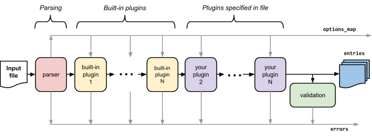

# Beancount 脚本和插件<a id="title"></a>

Martin Blais，2014年7月

[<u>http://furius.ca/beancount/doc/scripting</u>](http://furius.ca/beancount/doc/scripting)

> [<u>介绍</u>](#introduction)
>
> [<u>加载管道</u>](#load-pipeline)
>
> [<u>编写插件</u>](#writing-plug-ins)
>
> [<u>编写脚本</u>](#writing-scripts)
>
> [<u>从文件加载</u>](#loading-from-file)
>
> [<u>从字符串加载</u>](#loading-from-string)
>
> [<u>打印错误</u>](#printing-errors)
>
> [<u>打印条目和往返</u>](#printing-entries-round-tripping)
>
> [<u>进一步了解</u>](#going-further)

## 介绍<a id="introduction"></a>

本文档提供了一些示例和指南，说明如何编写使用分类账内容的脚本。还提供了有关如何编写自己的“插件”的信息，插件只是 Python 函数，您可以通过它们配置来转换您的交易或以编程方式合成交易。这是扩展 Beancount 功能和编写自定义报告的主要两种方法。您只需使用 Python 即可完成。

## 加载管道<a id="load-pipeline"></a>

您需要了解 Beancount 如何处理其输入文件。内部，加载输入文件的单点入口是 `beancount.loader.load_file()` 函数，该函数接受一个输入文件并执行一系列转换步骤，如下图所示：



加载的阶段如下：

1.  **解析器。** 将输入文件通过解析器运行。此阶段的输出是
    1.  条目：一个元组列表（定义在 beancount.core.data 中），对应于文件中出现的每个指令，并按日期和行号排序。此外，同一天发生的交易指令始终保证排序在其他指令之后。这为处理条目做了准备。此条目列表将在随后的各个阶段中进行转换和精炼。
    2.  options_map：一个 Python 字典，包含输入文件中的选项值。有关详细信息，请参见 beancount.parser.options。一旦创建，它将不会被修改。
    3.  错误：如果发生任何错误，会生成一个错误对象列表。在每个阶段，收集生成的新错误。
2.  **处理插件。** 对于每个插件，加载插件模块并调用其函数，传入上一个阶段的条目列表和 options_map，并用插件返回的条目列表替换当前列表。这实际上允许插件过滤条目。
    插件运行列表由一组实现 Beancount 内置功能的默认插件模块组成，后跟用户在输入文件中提供的“插件”选项列表。
3.  **验证。** 通过验证阶段运行生成的条目，以确保插件生成或修改的指令符合代码库所依赖的一些不变量。这主要是为了生成错误。

通过此管道生成的条目列表属于 beancount.core.data 中定义的各种类型，在典型的输入文件中，大部分将是 *Transaction* 类型。Beancount 自己的过滤和报告程序直接处理这些条目，您也可以这样做。这些条目是只读对象（Python [<u>namedtuples</u>](https://docs.python.org/3/library/collections.html#collections.namedtuple)），没有显式修改其内容的方法。Beancount 内部的所有处理都是以函数式风格进行的，处理假定为不可变的条目列表。

用户插件列表是加载阶段的一部分，因为这允许监视文件更改的程序重新加载它并重新应用相同的插件列表。它还允许输入文件的作者通过这种方式选择性地启用各种可选功能。

## 编写插件<a id="writing-plug-ins"></a>

如前一节所示，加载 Beancount 文件本质上会生成一个指令列表。许多语法扩展可以通过在插件处理阶段将指令列表转换为新列表来实现。以下是一些可能需要对某些指令进行的转换示例：

-   自动添加一些过账
-   将一些交易用共同标签链接起来
-   合成新交易
-   删除或替换一些交易集
-   修改各个字段

只要您的插件生成的条目符合某些约束（所有过账平衡，所有数据类型符合预期），您可以做任何事情。

插件通过选项语法添加到输入文件，例如：

```plaintext
plugin "accounting.wash_sales"
```

通过此指令，加载器将尝试导入 `accounting.wash_sales` Python 模块（代码必须是 Python-3.3 或更高版本），查找一个特殊的 `__plugins__` 属性，该属性应该是一个要运行的函数序列，然后运行这些函数。

要运行插件，请参见下文的执行插件部分。

例如，您可以将代码放在 “`accounting/wash_sales.py`” 文件中：

```python
__plugins__ = ['wash_sales']

def wash_sales(entries, options_map):
    errors = []
    for entry in entries:
        print(type(entry))
    return entries, errors
```

这是一个最小的示例，它不修改条目并将其打印在控制台上。实际上，要做一些有用的事情，您需要修改列表中的一些条目并输出它们。

然后，您可以在输入文件上调用 Beancount 提供的常用工具。各种过滤器和报告将对您的插件输出的条目列表进行操作。有关如何操作条目的详细信息和示例，请参见 [<u>beancount.core</u>](https://github.com/beancount/beancount/tree/master/beancount/core/) 中的源代码。

### 插件配置<a id="plugin-configuration"></a>

有些插件需要配置。为了向插件提供一些特定于您的文件的数据，您可以提供一个配置字符串：

```plaintext
plugin "accounting.wash_sales" "days=31"
```

然后插件函数将收到一个额外的参数，即配置字符串。插件本身决定如何解释它。

## 编写脚本<a id="writing-scripts"></a>

如果您需要生成无法通过内置过滤和报告功能实现的自定义分析或可视化，您可以编写一个显式加载指令的脚本。这使您可以控制程序的流程，并且可以做任何您想做的事情。

### 从文件加载<a id="loading-from-file"></a>

您可以简单地调用 `beancount.loader.load_file()` 加载函数。以下是一个最小的脚本示例：

```python
#!/usr/bin/env python3
from beancount import loader

filename = "/path/to/my/input.beancount"
entries, errors, options = loader.load_file(filename)
… 
```

此时，您可以按照需要处理条目、打印它们、生成 HTML、调用 Python 库等。（建议您使用最佳编程实践，并在脚本中使用 docstring 和主函数；上述脚本旨在保持最小）。再次说明，参见 [<u>beancount.core</u>](https://github.com/beancount/beancount/tree/master/beancount/core/) 中的源代码，了解如何操作条目的详细信息和示例。

### 从字符串加载<a id="loading-from-string"></a>

您也可以直接解析字符串。使用 `beancount.loader.load_string()`：

```python
#!/usr/bin/env python3
from beancount import loader

entries, errors, options = loader.load_string("""

   2014-02-02 open Assets:TestAccount   USD
   … 

""")
```

stdlib 的 [<u>textwrap.dedent</u>](https://docs.python.org/3/library/textwrap.html#textwrap.dedent) 函数非常有用，如果您希望缩进 Beancount 指令并自动删除缩进。有关许多示例的来源，请参见 Beancount 源代码中的各种测试。

### 打印错误<a id="printing-errors"></a>

默认情况下，加载器在加载时不会打印任何错误；我们更喜欢加载默认情况下不产生任何副作用。您可以提供一个可选参数来打印错误，该参数是一个用于写入错误字符串的函数：

```python
#!/usr/bin/env python3
import sys
from beancount import loader

filename = "/path/to/my/input.beancount"
entries, errors, options = loader.load_file(filename, 
                                            log_errors=sys.stderr)
… 
```

或者，如果您更喜欢自己显式地处理，可以调用 `beancount.parser.printer.print_errors()` 辅助函数：

```python
#!/usr/bin/env python3
from beancount import loader
from beancount.parser import printer

filename = "/path/to/my/input.beancount"
entries, errors, options = loader.load_file(filename)
printer.print_errors(errors)
… 
```

### 打印条目和往返<a id="printing-entries-round-tripping"></a>

直接打印 [<u>namedtuple</u>](https://docs.python.org/3/library/collections.html#collections.namedtuple) 条目将输出一些可读但相对格式较差的内容。最好使用 `beancount.parser.printer.print_entry()` 实用函数以可读方式打印条目：

```python
#!/usr/bin/env python3
from beancount import loader
from beancount.parser import printer

filename = "/path/to/my/input.beancount"
entries, errors, options = loader.load_file(filename)
for entry in entries:
    printer.print_entry(entry)
```

特别是，Beancount 保证打印机的输出始终可解析，并在重新读取时生成相同的数据结构。（如果不是这种情况，应视为错误。）

有关更多实用函数，请参见 `beancount.parser.printer` 模块的源代码。

## 执行插件<a id="executing-plugins"></a>

要找到插件模块，确保它存在于您的 `PYTHONPATH` 环境变量中（确保相关的 `__init__.py` 文件存在以供导入）。它可以存在于您的代码中：无需修改 Beancount 本身。

还有一个选项，可以添加到您的 Beancount 文件中：

```plaintext
option "insert_pythonpath" "True"
```

这会将包含 Beancount 文件的文件夹添加到 `PYTHONPATH`。这样，您可以将插件放在 Beancount 文件旁边，并在使用此文件时执行它们。

这是一个简短示例，使用我们在上面编写的 wash_sales.py 插件。您的 Beancount 文件将包含以下行：

```plaintext
option "insert_pythonpath" "True"

plugin "wash_sales"
```

Python 文件 wash_sales.py 将存储在与 .beancount 文件相同的文件夹中。

## 进一步了解<a id="going-further"></a>

要了解如何操作条目，您应该参考源代码，可能还需要更多了解以下模块：

-   [<u>beancount.core.data</u>](https://github.com/beancount/beancount/tree/master/beancount/core/data.py)
-   [<u>beancount.core.account</u>](https://github.com/beancount/beancount/tree/master/beancount/core/account.py)
-   [<u>beancount.core.number</u>](https://github.com/beancount/beancount/tree/master/beancount/core/number.py)
-   [<u>beancount.core.amount</u>](https://github.com/beancount/beancount/tree/master/beancount/core/amount.py)
-   [<u>beancount.core.position</u>](https://github.com/beancount/beancount/tree/master/beancount/core/position.py)
-   [<u>beancount.core.inventory</u>](https://github.com/beancount/beancount/tree/master/beancount/core/inventory.py)

有关更多详细信息，请参阅 [<u>设计文档</u>](beancount_design_doc.md)。享受吧！
