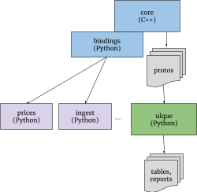

# Beancount Vnext：目标与设计<a id="title"></a>

[<u>Martin Blais</u>](mailto:blais@furius.ca)，2020年7月

[<u>http://furius.ca/beancount/doc/Vnext</u>](beancount_v3.md)

## 动机<a id="motivation"></a>

是时候给 Beancount 进行一次更新，并制定一个具体计划，以明确下一版本的目标。我已经在脑海中思考这些想法很久了——至少有一年时间——现在我把它们写下来，一部分是为了分享我对我们用来管理财务的产品的愿景，一部分是为了征求反馈意见，另一部分是为了整理我的想法，并优先处理重要的内容。

**当前状态。** 目前 Beancount 的开发已经停滞了一段时间，原因有很多。软件的状态还远远不完美（在本文档中我将列出主要问题），但为了给自己和其他人提供一个真正稳定的基础，我一直在抵制做出太多的改变。更重要的是，虽然我以前能够在周末花大量时间开发它，但最近由于生活变化和职业重点的转移，我很难再找到额外的时间（毕竟已经过去了10年）。大量的想法堆积在 [<u>这个 TODO 文件</u>](https://raw.githubusercontent.com/beancount/beancount/master/TODO) 中，但它太详细了，难以理解，有点像垃圾堆，这份文档应该更有用。

**为什么重写会发生。** 当我编写 Beancount 的版本 2 时（对第一个版本的完全重写），是因为一系列改进我第一版草稿的想法汇聚在一起；我抵制了一段时间，但最终这些想法在我看来如此合理，以至于不重写它是不可能的。当时推动重新设计的许多理念今天仍然是设计的基本原则：去除顺序依赖，用 BNF 语法规范化语法，将自定义处理转换为简单指令流的一系列插件，当前的记账选择设计和成本基础工作，以及“交易”之外的所有指令。这些理念在很大程度上塑造了今天许多人喜欢使用 Beancount 的原因。

**目标。** 现在是 Beancount 进化的又一波浪潮的时候了，同样，我将在本文档中列出的一组新想法与从 v1 到 v2 的过渡一样具有变革性。我对 Vnext 的愿景是通过将 Beancount 分解为更简单、更独立、更可重用、更明确的部分来简化它，而不仅仅是在现有基础上添加新功能。在许多方面，Vnext 将是对当前系统的*提炼*。它还将为最终实现用户最常希望的核心功能腾出空间。而这些变化将增强一些组织方面的功能：允许更多的贡献，并减少我自己处理的代码部分，以便我能更有效地专注于核心功能。

## 当前问题<a id="current-problems"></a>

### 性能<a id="performance"></a>

我的个人账簿，以及我知道的许多用户的账簿，都太大，无法即时处理。当前文件在我家用的 [<u>NUC</u>](https://www.intel.com/content/www/us/en/products/boards-kits/nuc/kits/nuc6i5syh.html) 桌面上需要 6 秒——但这太长了。我非常希望能够每次处理所有输入，而不是强迫用户将账簿分成多个文件，在任意年份点进行“结账”过渡，但我真的想要那种运行两字母 UNIX 程序时的“瞬间”感觉，也就是说它在*远低于半秒*的时间内运行。这使得使用它更加互动和有趣。

**C++ 重写。** 当前性能缓慢的原因之一是 Beancount 是用 Python 实现的，甚至在解析器层次上也是如此（C 代码回调 Python 驱动程序）。一个明显的解决方案是用更接近硬件的语言重写软件核心，而这将是 C++。我选择 C++ 是因为它的控制性，并且当前围绕它的工具足够成熟和广泛，应该很容易为大多数人构建，不会有太多问题，而且我可以利用需要的 C 库。使用函数式语言可能会很有趣，但我想要的许多库根本不可用，或者普通人很难构建。

**简单、可移植的 C++。** 需要提到的是，我心中的 C++ 代码风格不像 Boost 那样使用大量模板的现代 C++ 代码，而更像是 [<u>Google 使用的几乎没有异常的 C 子集</u>](https://google.github.io/styleguide/cppguide.html)，基础是 [<u>Abseil-Cpp</u>](http://abseil.io)（例如和风格，见 [<u>tips</u>](https://abseil.io/tips/)). 这么做的原因是稳定性和可移植性，虽然这次重写是为了更快的性能，但我相信没有必要使用模板技巧来使其运行足够快；仅仅避免 Python 运行时的直接移植就可能足够了。最重要的是我希望保持新代码简单并尽可能“函数化”（如果可以避免就不使用类），依赖于一组受信任的 [<u>稳定依赖项</u>](beancount_v3_dependencies.md)，使用 [<u>Bazel</u>](http://bazel.build) 构建工具以隔离方式构建。

**Python API。** 保留 Python API 用于插件和脚本也很重要，并且所有单元测试套件都应移植到新版本的代码中。毕竟，能够使用所有个人财务数据编写自定义脚本是基于文本的方法最吸引人的特点之一。核心实现之外的代码将继续使用 Python，并且基于 Python API 的现有代码应非常容易地移植到 Vnext。通过使用 pybind11 暴露指令，可以实现这一点。

**其他语言。** Beancount 核心的解析输出将是协议缓冲对象流，因此将会首先支持从其他语言（例如 Go）进行处理。

**处理模型。** 性能的另一个算法改进（如果必要的话）是定义插件处理的迭代器函数，它们可以级联并交织指令流的处理，而不是对完整的指令列表进行完全独立的遍历。虽然允许每个插件自行处理所有指令的自由对于保持系统不需要同步应用程序状态并使我能够将插件的行为彼此隔离至关重要，但也有机会在单次遍历中联合多个转换。更少的遍历=更快。

### 中间解析数据与最终指令列表<a id="intermediate-parsed-data-vs.-final-list-of-directives"></a>

在 Beancount v2 中，我从未太注意明确区分：

1. 解析器输出的指令列表**，缺少插值和记账，使用 `position.CostSpec` 而不是 `position.Cost` 在每个批次上，和

2. 解析并记账的最终指令列表，应用了记账算法以选择匹配的批次，并填充了插值值，以及各种插件应用的转换。

这两种指令列表在目的上确实截然不同，尽管它们共享许多常见的数据结构，并且大多数情况下，第一种列表主要出现在解析器模块中。有些情况下，即使对我来说，操纵的是哪一个列表也很困惑。部分原因是因为我对两者大多使用相同的 Python 数据结构，这使得我在类型上弯曲了规则。

更重要的是，因为插件在记账和插值之后运行，并且需要输出完全插值和记账的交易，因此插件很难扩展在输入语法下无效的交易。请参见 [<u>\#541</u>](https://github.com/beancount/beancount/issues/541) 了解示例。

下一个版本将看到解析器生成的中间指令和最终解析的指令列表都实现为协议缓冲消息，并具有严格区分的数据类型。这将取代 `beancount.core.data`。将明确区分这两种流，并且我将尽量隐藏前者。目标是避免插件编写者看到中间列表。它应该成为核心实现的隐藏细节。

此外，可能会有两种类型的插件：一种在未插值、未记账的解析器输出上运行的插件，另一种在解析和记账的流上运行的插件。这将允许在插值和记账限制下无效的部分输入的更具创造性的使用。

更新：

- 我们可以将插件系统转换为在记账/插值时运行的系统。

- 我们应该尝试使记账/插值具有原子性，这样可以编写一个带有累加器的 Python 循环并独立调用它，以便理论上记账可以用于导入器（如我对 Ameritrade 所做的那样）。

### 使输入重写成为一等公民<a id="make-rewriting-the-input-first-class"></a>

*在 2020 年 12 月添加评论和 [<u>\#586</u>](https://github.com/beancount/beancount/issues/586) 后添加。*

许多常见问题涉及如何处理输入数据。通常，新用户会尝试加载账簿内容，修改数据结构并打印以更新文件，而没有意识到打印机包括所有插值、记账数据和插件修改，因此这无法工作。

然而，由于我们正在重写解析器并确保中间 ASI 类数据和处理后的最终指令之间的干净分离，我们可以为 AST 中间数据实现一个特殊的打印机，这样用户可以仅运行解析器，修改中间指令并将其打印回去，可能只会丢失一些格式和空白。格式丢失可以利用以更自然地重新实现 bean-format：该打印机的输出应始终格式化整齐。这将避免用户必须在输入文件上编写临时解析器、sed 类转换等。可以通过修改数据结构正确地进行。

更重要的是，为了准确地实现这一点，我们必须在解析后延迟算术运算的处理，以便能够将其重新输出。这提供了另一个优势：如果在解析后处理计算，可以提供一个选项，让用户指定用于 mpdecimal 的精度配置。我非常喜欢这个想法，因为它避免了硬编码计算精度，并且更好地定义了这些选项的结果，潜在地为删除经常渲染出来的额外数字提供了更合理的方法。

最后，如果可以制作一个漂亮的库函数来就地处理交易并将其输出回去，保留所有评论，这可以成为我们清理收款人等的另一种方式。目前，解决方案是编写一个插件来清理数据，但输入文件仍然有些混乱。使自动清理输入文件变得容易是一个有吸引力的选择，并且可能会为 Beancount 工作流增加一个重要的新维度。

我希望做出所有必要的更改以使这一点成为可能并得到良好支持（我现在想象着我的账簿文件已经清理干净了，这非常吸引人）。我认为这工作量不大，它涉及：

- 在所有内容上存储开始/结束行信息。

- 添加用于表示算术计算的 AST 结构。

- 添加解析器评论到渲染器。

- 实现一个新的渲染器，可以重现 AST，包括处理缺失数据。

- 实现一个库，使得就地修改文件与编写插件一样容易，同时保留文件中的所有非指令数据。

### 贡献<a id="contributions"></a>

在 Beancount 的大部分开发过程中，我对接受贡献一直相当谨慎。它一直是我密切关注的宠物项目，因为它对我的个人财务安排有很大影响，我担心计划外的破坏。我对贡献的主要保留意见有两个：

- **测试不足。** 提议的更改没有包含足够的测试，或者根本没有测试，有时甚至没有防止基本破坏的测试。当我接受一些提案并承诺自己编写测试时，有时会花费数小时（如果不是几天）在这上面。这并不实际。

- **连锁设计影响。** 一些提案没有考虑到会影响代码其他部分的更广泛设计考虑因素，这可能是我没有很好地传达或记录清楚的缘故。我不得不为了保持设计的一致性和“紧凑性”而拒绝一些想法。

部分是我的错：对贡献设立了高门槛，阻止了潜在贡献者获得足够的上下文和熟悉代码库的机会，从而进行兼容设计的更改。

**允许更多贡献。** 从 Vnext 开始，我希望重新构建项目，以便更多人能够直接参与，并与一些贡献者在特定功能上紧密合作。显然，Beancount 受益于更多人的直接输入。最近迁移到 GitHub 只会加剧使其更容易的紧迫性。

为此，我想实施一些策略：

1. **将代码分解成部分。** 这是许多其他项目自然演变的结果；我不是 Linus 也不是 Guido，但像他们的各自项目一样，随着受欢迎程度的增加，原作者专注于核心部分并让其他人扩展相关但也重要的功能。我希望更多地专注于仅影响诸如结算日期支持、货币账户、拆分交易、贸易报告等功能的核心功能。让其他人处理添加或更新价格来源、改进导入框架、以及美化数据呈现和报告。随着时间的推移，我可能最终将这些库分解成独立的存储库，具有较宽松的贡献指南和/或为其他人添加 ACL 以直接推送到这些存储库。

2. **获取“副手”。** 我需要为可信任和频繁的贡献者留出更多空间，让他们更自由地贡献。例如，Martin Michlmayr 现在拥有大多数文档的直接编辑访问权限，并且一直在做许多有帮助的贡献和更新。Kirill Goncharov 将文档从 Google Docs 转换的工作简直美丽。RedStreet 和其他许多人定期在邮件列表中提供答案。Stefano Zacchiroli 和 Martin 构建了一个独立的从 Ledger 转换的工具。Daniele Nicolodi 提议对扫描器和解析器进行一些底层更改。当然，Dominik Aumayr 和 Jakob Schnitzer 继续在 Beancount 旁边开发 Fava 项目。还有许多其他人，熟悉的名字逐渐增加。

   我的心中的问题是：有没有办法与常客沟通，以便我们在设计上保持一致，并能在同一方向上协调我们的努力？由于冠状病毒危机，最近的在线视频会议熟悉度是否为我们提供了一个以前不存在的协调渠道？Python 社区在很大程度上因为其参与者的年度面对面互动以及一些核心开发人员的相聚而蓬勃发展。我们能否在线上实现同样的事情，因为我们是一个较小的社区？如果是这样，良好的协调可能会使接受提议的更改变得更容易。我在想是否应该提议一个月一次的“团队”会议。

3. **20% 项目。** 我应该提供一份“20% 项目”的列表，这些项目与项目的方向高度一致，供其他人如果愿意的话可以选择，并添加大量指导和有关这些提议功能的下游影响的细节。这个想法是让新来者能够贡献更改，这些更改可能会很好地融入并容易集成和接受到代码库中。

- **提案。** Beancount 的相当于 Python 的 “[<u>PEPs</u>](https://www.python.org/dev/peps/)” 实际上是我从线程开始的 Google Docs 提案文档，许多人在其中发表评论和建议。应该将这些中央列表共享到一个文件夹中，标识为这样，并允许其他人编写类似的提案。也许围绕这些提供更多结构和纪律将是有用的。

### 重构代码<a id="restructuring-the-code"></a>

在非常粗略的层次上，Vnext 的代码重构如下所示：

- **C++ 核心、解析器和内置插件。** Beancount 核心、解析器、记账算法和插件将用简单的 C++ 重写，解析并记账内容输出为协议缓冲对象流。

- **查询引擎。** Beancount 查询/SQL 将分叉到一个**独立项目**，在任意数据模式上运行，范围比 Beancount 更广。参见下面的部分。

- **其余部分。** 大部分其他内容将被拆分成独立项目，或者至少在仓库中的一个不同位置（直到核心被重写）。

请注意，因为核心将输出指令流作为 proto 对象，因此协议缓冲支持的任何语言都应该能够读取这些对象。这扩展了 Beancount 的影响力。以下是展示此概念的简化图：



以下是对今天代码库中各个部分的详细分析，以及我认为它们将会发生的事情：

- **核心。** 这是 Beancount 代码的部分，将用 C++ 重写，并将消息序列输出为指令流。我将继续密切关注这一部分，保持保守的眼光以确保稳定性，但在 Vnext 中将添加迄今缺少的期望新功能，如本文档下一节所述。核心将包括以下包：

    - beancount/core

    - beancount/ops

    - beancount/parser

    - beancount/utils

    - beancount/loader.py

    - beancount/plugins（部分，见下文）

    - beancount/utils（大部分）

- **查询。** 查询语言将被分离到一个完全独立的仓库，具有更广泛的应用领域（并具有定制 Beancount 的钩子）。我怀疑随着时间的推移，该项目将获得更广泛的贡献者，其中许多人甚至不是 Beancount 用户。包括以下包的代码：

    - beancount/query

    - beancount/tools

- **价格。** 这是一个简单的库和工具，帮助用户从外部来源获取价格。这个库绝对应该迁移到另一个仓库，我欢迎新的所有者构建一个竞争解决方案。人们向我发送补丁以获取新的价格来源，但由于上游来源的变化或消失，我没有足够的时间长期维护它们。这几乎不需要 Beancount 本身（理论上你可以直接打印指令输出，而无需加载库代码），但我认为 Beancount 核心应该包含并提供在特定日期从给定账簿中列出所需日期/工具对的方法（我乐意支持这一点）。请注意，内部价格数据库核心将保留在核心中，因为需要它。受影响的包有：

    - beancount/prices

> 价格库迁移出 Beancount 仓库后应进行改进：我们应该将 Beancount 代码隔离到几个模块，并将项目范围扩展到 Beancount 之外：它实际上是三件事：

> a\) 一个由社区维护的最新价格获取器的 Python 库，具有单元测试（即，当来源中断时，我们更新库）和通用 API 接口（需要从现有 API 改进，API 应支持一次调用获取时间序列）；

> b\) 一个随附的命令行工具（货币“bean-price”）用于从命令行获取这些价格。这需要指定“特定来源的特定货币的价格”作为字符串。我想改进这个规范，使 USD: 前缀成为可选，并可能消除规范中的价格链，这在实践中并不常用，将其上移。

> c\) 使获取账簿相关信息（例如，缺失/所需价格列表和工具列表）的接口模块化：beancount v2、beancount Vnext、ledger、hledger，并渲染输出格式到任何这些。换句话说，即使没有安装 Beancount，这个库也应该能够获取价格。将此项目转变为可以独立于 beancount 运行的东西。

- **导入。** 导入器库可能会迁移到另一个仓库，最终甚至可能找到另一个所有者。我认为最有趣的部分是明确阶段的建立：识别、提取和文件任务，以及一个回归测试框架，它在检查真实输入文件时对预期转换输出进行测试，这在升级导入器时（它们确实会定期中断，这是常态）大大减少了痛苦。过去我曾经使用一些技巧，使项目提供的命令行工具支持作为 Python 代码输入配置，但也可能集成到脚本中；我将删除通用程序，用户需要将其配置本身变成一个脚本，该脚本在运行时将提供子命令；对现有用户来说，这个更改非常容易：只需要在现有文件底部添加一行代码。Bazel 构建可能会在从 Bazel 工作区加载 Python 扩展模块到机器级 Python 安装时带来一些小困难，但我相信我们会解决它。我也很乐意最终让别人接管这个框架，只要基本功能和 API 保持稳定。示例 csv 和 ofx 导入器应从中移除并在各自的仓库中生活，也许：

    - **ofx。** OFX 导入器应该用 ofxtools 替代（我构建的那个非常糟糕），CSV 导入器确实需要彻底重写，并对其现在支持的大量选项进行大量单元测试（这些测试非常缺失）。

    - **csv。** 此外，我认为 CSV 导入器可以增强，以更智能和更灵活地自动检测列标题和推断数据类型的文件中的列应该转换为哪个字段。我不会做这个（我没有时间）。有想法做最终自动 CSV 解析器的人应该为此创建一个单独的仓库。

    受影响的包有：

- beancount/ingest : 可能最终迁移到另一个仓库。

- beancount/ingest/importers: 有人可以复兴一个导入器实现的仓库，如 LedgerHub 曾经的目标，并吞下这些代码。

> 有关导入代码的详细信息，请参见 [<u>本文档</u>](beangulp.md)。

- **自定义报告和 bean-web** 应该被移除：底层的 [<u>bottle</u>](https://bottlepy.org/docs/dev/) 库似乎没有维护，Fava 取代了 bean-web，我也从来不喜欢自定义报告代码（它们修改起来很麻烦）。我自己现在不再使用它们（除了通过 bean-web）。我真的认为可以用增强的 SQL 查询结果上的过滤器来替代这些。从 Beancount 转换到 Ledger 和 HLedger 现在似乎没什么用处，我不确定是否有人在使用它们。我可能会将这些移到另一个仓库，它们最终会腐烂，或者如果有人关心，采用它们并维护或改进它们。

- beancount/web : 将被删除或移到另一个仓库。

- beancount/reports : 将被删除或移到另一个仓库。

- 请注意，这包括弃用 **`beancount/scripts/bake`**，它严重依赖 bean-web。我没有 bean-bake 的替代方案，但我想最终构建一个更好的工具，一个直接渲染用户提供的特定 SQL 查询列表到 PDF 文件并整理它们的工具，你可以打印。

Jupyter notebook 支持。bean-web 曾经提供的轻量级界面的替代品可能是 Jupyter Notebook 对查询引擎的集成，这样用户可以从单元格运行 SQL 查询并将其渲染为表格，或者可能是一个超轻量级的 Web 应用程序，仅支持将通用 SQL 查询渲染为表格。

- **内置插件。** Beancount 提供了一个内置插件列表，位于 **`beancount/plugins`** 下。没有明确说明，但那里已经发展出两组插件：核心使用的稳定插件，以及展示想法的实验插件，通常是来自邮件列表线程提议的不完整实现。前者将被移植到 C++，后者可能应该迁移到另一个位置，接受约束较少。

首先，有“元插件”，它们只包含其他插件组：应该只保留一个，并且可能默认启用（使 Beancount 默认挑剔）：

- auto

- pedantic

以下插件应保留在核心中并移植到 C++：

- auto_accounts

- check_closing

- check_commodity

- close_tree

- commodity_attr

- check_average_cost

- coherent_cost

- currency_accounts

- implicit_prices

- leafonly

- noduplicates

- nounused

- onecommodity

- sellgains

- unique_prices

以下是实验性实现的想法，应移到一个专用仓库，其他人可以在那里加入其他插件实现：

- book_conversions

- divert_expenses

- exclude_tag

- fill_account

- fix_payees

- forecast

- ira_contribs

- mark_unverified

- merge_meta

- split_expenses

- tag_pending

- unrealized

由于这是一个非常常见的情况，新的 transfer_lots 插件应成为内置插件的一部分。

- 项目。beancount/projects 目录包含导出脚本和一个生成遗嘱数据的项目。遗嘱脚本将被移出 Beancount 核心，我不确定是否有人在使用它。也许新的外部插件仓库可以包括该脚本和我在 /experimental 下共享的其他脚本。导出脚本应与 beancount/scripts/sql 和其他方法一起分组以便发送/共享账簿外的数据；这些可以保留在核心中（我经常使用导出脚本同步我的聚合和股票敞口到 Google Sheets 文档中，以反映日内变化）。

- **脚本。** 一些脚本与 Beancount 完全无关，它们是伴侣。scrape 验证器。sheets 上传。treeify 工具。这些应该移到其他地方。

将所有代码放在同一个仓库中的一个优势是，可以通过一次提交同步整个代码库的 API 更改。因此，我可能会在新 C++ 核心稳定之前将一些代码保留在同一个仓库中，并且在 Vnext 发布时正确分离它们。

### 通用轻量级查询引擎 (ulque)<a id="universal-lightweight-query-engine-ulque"></a>

Beancount 的 SQL 查询引擎最初是一个原型，但它已经成为从中获取数据的主要方式。我在需要时非常自由地添加了功能，现在是时候清理它并考虑一个更完善的解决方案了。

在 Vnext 中，查询/SQL 代码最终将被分叉到一个**独立项目**（和仓库），在任意数据模式上运行（通过 protobuf 作为各种数据源的通用描述），并支持 Beancount 集成。想象一下，如果你可以从任意 CSV 文件中自动推断模式，并对其进行操作，无论是作为 Python 库函数还是独立工具。此外，该工具将支持从 Google Sheets、XLS 电子表格、序列化 protos 的二进制流容器、HTML 网页表格、PDF 文件、文件目录等来源和/或接收数据。这将是一个数据分析工具，范围接近 [<u>Pandas</u>](https://pandas.pydata.org/) 库，而不仅仅是一个会计专注的项目，但也是一个通用转换工具，将包括 [**<u>upload-to-sheets</u>**](https://github.com/beancount/beancount/blob/master/bin/upload-to-sheets) 脚本的功能（将被移除）。Beancount SQL 查询引擎的一个教训是，通过一点点后处理（例如 [**<u>treeify</u>**](https://github.com/beancount/beancount/blob/master/bin/treeify)），我们可以做大部分 Beancount 中的操作（日志、资产负债表和收入报表）作为带有过滤器和聚合的查询。

该工具将按照需要的方式进行扩展，以添加 Beancount 所需的一些特有之处，包括：

- **十进制类型**的本地支持。

- **带有 `beancount.core.Inventory/Position/Amount` 语义的自定义聚合器类型**的添加。

- 自动生成一个动态列的能力，该列渲染另一列（或一组列）的逐行聚合，即，**“余额”列**。

- 渲染聚合列的能力，用于金额和库存拆分为多个列（例如，“123.00 USD”变为两列：（123.00，“USD”）以便在电子表格中处理，以及将借方和贷方拆分到各自的列中。特别是，将一个账户中积累的多个批次自然地从 SQL 查询中打印出来，取代“平展”功能。

此外，拓宽焦点的新项目定义将使彻底测试成为可能（当前的一个仍然有点原型阶段，缺乏所需的测试），并且还包括数据类型验证（不再有运行时异常），通过实现一个类型化的 SQL 转换器。我将在其他地方记录这一点。这是一个更大的项目，但我怀疑随着更广泛的范围，它会更容易测试并自成一体。

我正在准备一份设计文档。

### API 重构<a id="api-rework"></a>

我编写了很多自定义脚本，有一些关于当前 Beancount API 的问题我希望能有根本性的改进：

- **将符号统一到“bn”下。** 内部 API 调用要求从每个包分别导入符号，但现在我已经将导入和报告代码分离，所有公共 API，或者至少核心中常用的大部分对象应该可以从单个包中获取，有点像 numpy：

    ```python
    import beancount as bn

    …

    bn.Inventory(...)

    bn.Amount(...)

    bn.Transaction(...)

    # 等等。
    ```

    我希望“bn”成为我们编写所有脚本的默认两字母导入。

- **构造函数中的默认值。** namedtuple 容器非常好，但它们的构造函数从未有可选参数，并且创建这些容器时总是有很多“None”选项的舞蹈。我从未喜欢它。在下一版本中我们会使这变得整洁。

- **没有 API 文档。** 虽然项目有大量文档，但没有文档向人们展示如何使用 Python API，例如如何累积余额，如何创建和使用实现树，如何从累积库存对象中提取信息等。我认为记录一些最常见的操作将大大增强人们充分利用 Beancount 的能力。这些操作包括：

    - 累积库存的批次并打印它们。

    - 转换为市场价值，并进行相应的账户调整。

    - …. *添加更多 …*

- **公开可用的记账。** 记账将是一个简单的循环，可以从 Python 调用一个条目和一些累积状态。此外，Inventory 对象应该开始实现一些低级操作所需的记账，例如，迭代一组过账并进行例如平均记账，可以通过 Inventory 对象上的方法调用完成。Inventory 应该在 API 中占据更重要的位置。

- **数据类型。** 应为所有对象提供明确的数据类型，以便在所有新代码上广泛使用 typing 模块。也许创建一个名为“bn.types”的模块，但它们应该直接从“bn.*”中可用，以便有一个单一的短命名导入。

- **术语。** 在 Vnext 中我希望停止使用“条目”并统一使用“指令”这个名称。

- **实现。** 我一直在交替使用 collections.defaultdict(Inventory) 和“实现”。这两者都是从账户名（或其他键）到库存状态对象的映射。我想统一这两种结构到实现中，并使其成为一个常用对象，带有一些辅助方法。

## 解析器重写<a id="parser-rewrite"></a>

由于我们现在依赖于 C++，解析器将被重写。不要担心：输入语法将保持不变，或至少与现有 v2 解析器兼容。将会改变的是：

- **Unicode UTF-8 支持。** 词法分析器将使用 [<u>RE/flex</u>](https://www.genivia.com/doc/reflex/html/) 而不是 GNU flex 重写。这个扫描生成器原生支持 Unicode，任何输入标记都将支持 UTF-8 语法。这应包括账户名，这是一个经常请求的功能。

- **标志。** 当前扫描器限制了我们支持任何标志的能力，并且只支持一个小列表。我认为列表已经足够使用，但由于我将投入一些工作在新扫描器上，我希望清理这个故事并支持更广泛、更明确定义的单字母标志集。

- **时间。** 解析器将解析并提供时间字段，除了日期。时间可能用作排序指令的额外键。这方面的细节尚未确定，但经常请求，至少解析器将其作为元数据输出，最好可能成为一等功能。

- **缓存。** 将移除 pickle 缓存。直到 [<u>最近</u>](https://github.com/beancount/beancount/commit/5fa980176c7bd6fc9ae5d990c83867f942120f11) [<u>最近</u>](https://github.com/beancount/beancount/commit/d9a70473e937f6792ef8543bfe9267edbc1b9f9c)，没有很好的选项来禁用它（环境变量），我宁愿移除 Beancount 荣誉的 [<u>唯一两个环境变量</u>](https://github.com/beancount/beancount/blob/master/beancount/loader.py#L673) 作为副作用。由于 C++ 代码应该足够快，希望不需要缓存。

- **标签和链接。** 实践中，这两个功能在元数据中占据了非常相似的位置（用于过滤交易）。我在考虑将标签和链接的特殊位置转换为元数据；输入语法不会被移除，而是将值合并到元数据字段中。我还不确定是否要这样做，愿意讨论。此外，解析器应该被制作接受 \#tag 和 ^link 作为元数据声明的位置，这将是方便的语法。最后，用户希望在过账上使用标签。我们应该考虑这一点。

- **插件配置为 protos。** 各种插件的选项松散地定义为 eval'ed Python 代码。这非常松散，并且不提供插件验证或记录其预期输入的好机会。我想通过在输入语法中支持文本格式化的 protos（由插件自己提供的消息类型）来形式化插件配置语法。

- **解析器用 C++ 编写。** 解析器将用 C++ 重写。在编写 Vnext 的过程中，我将尝试通过调用 C++ 驱动接口尽可能长时间保持单一语法，这将有两个不同的实现：一个用于调用 Python 的 V2 版本，另一个用于生成 protos 的 Vnext 解析器。在这个过程中，我可能会将词法分析器和语法 Python 实现移植到 C，如 [<u>在此票证中讨论的</u>](https://github.com/beancount/beancount/pull/471#issuecomment-643785321)。

- **更好的包含。** 当前包含无法识别顶级文件中未包含的选项。过去这引起了许多惊讶，应该修复这一点。至少应该引发
