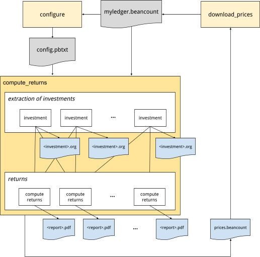
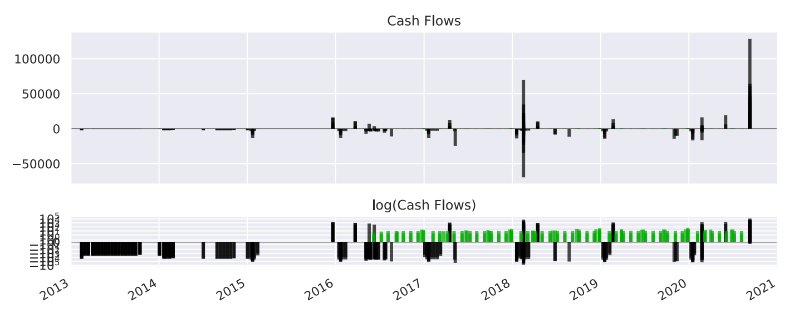
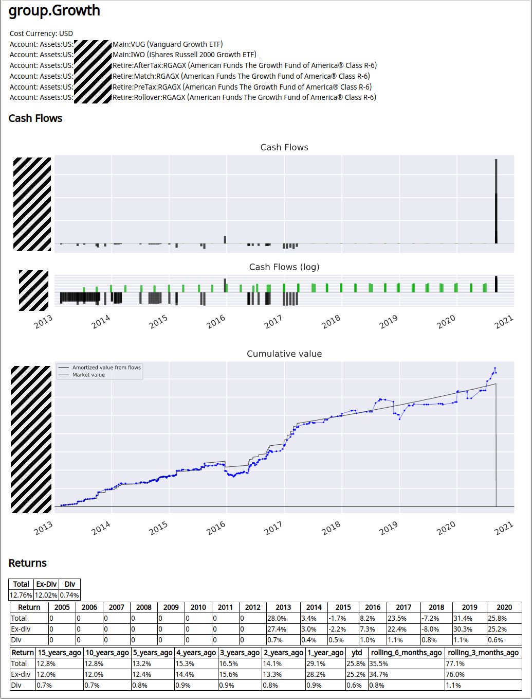

# 计算投资组合收益率

[<u>Martin Blais</u>](http://plus.google.com/+MartinBlais), 2020年9月

[<u>http://furius.ca/beancount/doc/returns</u>](http://furius.ca/beancount/doc/returns)

*本文档描述了如何从 Beancount 分类账中计算投资组合的收益率。*

## 动机

您可能会惊讶地发现，折扣券商通常不会根据您的特定现金流提供准确和完整的投资回报计算。他们往往报告其他绩效衡量标准：

-   **价值变化。** 他们提供的最简单的是期初和期末（或年度）的账户价值快照。这种方法的问题在于，它不会反映您的资金注入或撤回的情况，也不会反映您的头寸变化。例如，如果您在年初有一个账户，里面有 $50,000，并且在八月份增加了 $30,000，那么在十二月底报告 $37,000 的差额是没有用的（您必须在一年中进行投资时对新投资的现金进行心理折扣，如果您想分解和比较账户中不同工具的收益率，该怎么办？）。

-   **基础绩效。** 他们可能会报告基础资产的增长情况，而忽略您的特定头寸。如果您只是在下半年投资，说 "HDV 在去年增长了 8.2%" 不是很有用。我想知道的是，考虑到我的特定头寸变化和时间安排，我的具体投资增长了多少。换句话说，我做得怎么样？

-   **没有股息。** 另一个问题是，绩效通常仅报告由于投资价格变化带来的资本增值。理想情况下，人们希望将绩效分解为资本增值和股息的回报，以及每个部分的整体回报，以便比较股票和债券的回报。您有时可以从摘要中的收益字段中找到该信息，但对于不均匀的分配，这将无法帮助我找出任何期间内实际的股息回报是多少。

-   **佣金和管理费用。** 一些券商根据账户的价值按月收取管理费用。我想知道我的投资组合收益率扣除这些费用后的情况。

**我想要基于我的实际现金流和随时间变化的头寸的准确收益报告。**

如果我在 Beancount 分类账中维护我的投资信息，从理论上讲，它包含了计算我真实回报所需的所有数据，基于我自己储蓄（现金注入）的特定时间安排和我在特定时间持有的头寸。它只是不在执行计算所需的最简单格式——Beancount 交易比我们想要的要灵活得多，需要从中提取更简单的现金流系列。**本文档解释了我如何最终从我的分类账中实现这一点。** 并且基于一些简单的规则，我们可以将其推广到您的分类账。本文的大部分内容致力于提取正确数据的细节。

源代码可以在 [<u>这里</u>](https://github.com/beancount/beangrow) 找到。

此外，基于相同的现金流，应可以进行公平和诚实的与其他投资情景的比较。例如，您应该能够生成类似于“我对 ZZZ 的投资回报率为 8.2%，其中 1.1% 来自股息，如果我投资于 60/40 的股票和债券组合，则回报率为 7.2%”的数据。换句话说，我想评估我的表现*相对于*一些常见的替代方案。

（最后，请注意，如果您只需要当前头寸的快照，这已经由 [<u>导出脚本</u>](https://github.com/beancount/beancount/blob/v2/beancount/projects/export.py) 处理。）

### 历史

2014 年，我尝试了一次 [<u>简短的尝试</u>](https://github.com/beancount/beancount/blob/2.3.1/experiments/returns/returns.py)，以从我的分类账中提取信息来做到这一点。当时，我陷入了一些细节中，当我提取的一些时间序列没有产生看起来合理的结果（有些有异常值）时，我进展不顺。有时候，最好是完成整个任务，然后再处理细节。我当时没有记录足够的调试信息，我对其输出的信心不足，无法使用它。当时我从未真正完成这项工作，最终将脚本移到实验中并放弃了。“以后再说。”

2020 年 8 月，我再次坐下来做这件事，这次目标不再那么雄心勃勃，只是想获得一个好的近似值并生成大量的调试输出，将提取简化为仅提取现金流并完成所有账户的工作，即使这意味着对我的输入文件进行一些调整。事实证明这是正确的决定：我成功完成了任务，本文档展示了我的旅程、方法、假设、特点和一些结果。

## 方法概述

我将使用的方法是提取每项投资的现金流信息。在此上下文中，我所谓的**“投资”**是一种**金融工具**，例如，“VTI”是 Vanguard 总股票市场 ETF 的股票，**投资于特定账户**，例如 Vanguard 401k。现金流列表是一个有日期的正负货币列表，这些货币作为收益注入或提取到/从该投资。因此，我有每个账户的现金流列表，每个账户只记录一个金融工具。

为了报告，我将这些每账户系列**分组**为逻辑上的**“报告”**，例如，将在不同账户/券商购买的相同工具合并，或合并代表相同基础资产的不同工具的现金流。或者甚至按“策略”分组。基本上，通过合并多个账户的现金流，我有一种通用的方法来分组任何账户子集并计算其收益。

使用现金流，然后运行一个**简单的根查找例程来计算这些现金流必须以何种平均年增长率才能达到其最终市场价值**。这为我提供了整体回报。这类似于计算[<u>内部收益率</u>](https://en.wikipedia.org/wiki/Internal_rate_of_return)。我将对整个时间序列进行计算，但也会对时间序列中的子区间进行计算，例如日历回报（即每年或每季度）或追踪期的累计回报。由于现金流被标记为股息或非股息，我可以将收益从升值中分离出来，也可以将收益从股息中分离出来。将为每个组生成带有图表的报告。

这是一个显示“配置”、“compute\_returns”和“download\_prices”脚本如何协同工作的图表：

这些将在下面进一步详细介绍。

## 配置

首先，需要创建一个[<u>配置</u>](https://github.com/beancount/beancount/blob/v2/experiments/returns/config.proto)，以定义要生成报告的投资和投资组的列表。此配置以文本格式的 [<u>协议缓冲区</u>](https://developers.google.com/protocol-buffers) 消息提供。

-   **投资。** 投资对应于存储在特定账户中的特定工具。它还涉及其他不直接涉及该特定账户的交易。我们需要提供一些账户名称：

    -   **资产账户。** 持有该投资商品的账户名称。

    -   **匹配账户。** 选择包含其交易的其他账户列表。

    -   **现金账户。** 投资外部的账户列表，这些账户将用于标记流入和流出投资的资金。

-   **报告。** 虽然我们可以计算每项投资的收益，但更常见且更有用的情况是计算它们的组别收益。报告只是投资名称的列表。将为每个报告生成一个 PDF 文件。

这是 6 个投资和 3 个报告的示例：

    investments {
      # BTrade 的账户                                           
      investment {
        currency: "GLD"
        asset_account: "Assets:US:BTrade:GLD"
        cash_accounts: "Assets:US:BTrade:Cash"
      }
      investment {
        currency: "AMZN"
        asset_account: "Assets:US:BTrade:AMZN"
        cash_accounts: "Assets:US:BTrade:Cash"
      }
      investment {
        currency: "QQQ"
        asset_account: "Assets:US:BTrade:QQQ"
        dividend_accounts: "Income:US:BTrade:QQQ:Dividend"
        cash_accounts: "Assets:US:BTrade:Cash"
      }

      # IBKR 的账户                                           
      investment {
        currency: "IAU"
        asset_account: "Assets:US:IBKR:IAU"
        cash_accounts: "Assets:US:IBKR:Cash"
      }
      investment {
        currency: "SLV"
        asset_account: "Assets:US:IBKR:SLV"
        cash_accounts: "Assets:US:IBKR:Cash"
      }

      # Schwab 的账户                                           
      investment {
        currency: "GOOG"
        asset_account: "Assets:US:Schwab:GOOG"
        cash_accounts: "Assets:US:Schwab:Cash"
        cash_accounts: "Assets:AccountsReceivable"
        cash_accounts: "Assets:US:GoogleInc:GSURefund"
      }
    }

    groups {
      group {
        name: "strategy.gold"
        investment: "Assets:US:BTrade:GLD"
        investment: "Assets:US:IBKR:IAU"
      }
      group {
        name: "strategy.tech"
        investment: "Assets:US:BTrade:QQQ"
        investment: "Assets:US:BTrade:FB"
        investment: "Assets:US:Schwab:GOOG"
      }
      group {
        name: "all"
        investment: "Assets:US:*"
        currency: "USD"
      }
      group {
        name: "accounts.BTrade"
        investment: "Assets:US:BTrade:*"
        currency: "USD"
      }
    }

不同的报告可以包括相同的投资。配置中的账户和投资名称引用支持简单的 UNIX 风格通配符模式。这些模式在运行时扩展为完整的账户名称并存储在输出中。

一个名为 “[<u>configure.py</u>](https://github.com/beancount/beancount/blob/v2/experiments/returns/configure.py)” 的脚本可以自动从现有的 Beancount 分类账中推断出一个基本配置。将为每个独特的工具生成一个报告，并且“导出”脚本所遵循的相同元数据字段（“assetcls”，“strategy”）也将生成报告。我建议您在您的分类账上运行此脚本，然后手动定制配置。

### 查找账户

此脚本需要确定要报告的可用投资列表。根据惯例，我在我的分类账中为每种商品类型保留一对专用的叶账户，一个用于包含实际头寸（资产），一个用于接收股息，例如，对于在 BTrade 持有的“VTI”，账户如下：

    2012-03-01 open Assets:US:BTrade:VTI              VTI
    2012-03-01 open Income:US:BTrade:VTI:Dividend     USD

这有两个结果：（a）它使得找到包含投资的账户列表变得容易（任何具有叶账户名称的账户也会在分类账中找到商品），以及（b）通过找到所有涉及该账户的交易，它很好地将与这些投资相关的所有活动隔离开来**。我建议您在您的账户图表中遵循相同的惯例。** 结果是一个账户列表，如“Assets:US:BTrade:VTI”，特定于每个（工具、机构）。

我进一步将此列表筛选到在过去 15 年内仍然开放的账户子集（当账户完成时，我会使用 Beancount 的 Close 指令关闭我的账户）。在我的特定情况下，当时我没有多少储蓄，没有必要费心去标准化我在那段时间内投资历史中的那些小额。

## 提取现金流数据

本节描述了我从分类账中提取相关数据的各个步骤。

### 提取相关交易

对于每个已识别的资产账户，我们希望从分类账的交易中提取影响该账户的交易列表。我们只需遍历整个分类账的交易，保留至少有一个过账到投资的资产账户、股息收入账户或定义的其他“匹配账户”的交易。

例如，现金股息支付的交易不会显示资产过账，因此如果支付了股息；典型的股息支付仅包含股息收入过账和现金过账（用于存款）：

    2019-11-27 * "Dividend"
      Income:US:BTrade:VTI:Dividend   -123.45 USD
      Assets:US:BTrade:Cash            123.45 USD

因此，有必要在配置中包括股息账户，以包括这些交易，因为它们通常不涉及资产账户。

### 账户分类

下一步是将交易泛化为*模板*：我们记录每项投资提取交易中涉及的所有账户集，并根据它们在交易中的角色将它们分配到一般类别。例如，如果我检查我的“VTI”交易，我将遇到以下账户：

     Assets:US:BTrade:Cash
     Assets:US:BTrade:VTI
     Expenses:Financial:Commissions
     Income:US:BTrade:VTI:Dividend

我将每个账户映射到以下几种通用类别之一（我现在可能可以简化这些类别）：

    ASSET      # 持有商品的账户。
    CASH       # 现金账户，雇主匹配，贡献。
    DIVIDEND   # 股息收入账户。
    EXPENSES   # 佣金、费用和其他费用。
    INCOME     # 非股息收入，P/L，收益或其他。
    OTHERASSET # 除主要资产外的其他资产账户。
    OTHER      # 任何其他账户。

如下所示：

     'Assets:US:BTrade:Cash': CASH
     'Assets:US:BTrade:VTI': ASSET
     'Expenses:Financial:Commissions': EXPENSES
     'Income:US:BTrade:VTI:Dividend': DIVIDEND

通过这种方式，我可以跨工具比较类似交易，并使用相同的代码从中提取信息。例如，涉及股息账户和现金账户的交易是一笔现金股息支付，我可以编写一个通用的处理程序来提取现金流。这种分类最初是通过一组特设规则进行原型设计的，但现在配置提供了分类。

    注意：在此过程中，我注意到我的账户命名中存在许多不规则之处。例如，我有时使用“:Dividend”和“:Dividends”。我遍历了我的分类账，不得不做出一些更改，以一致地命名账户，并迭代直到所有账户都正确分类。您可能也需要检查一些数据输入。

### 使用签名处理交易

使用前一节中的账户类别映射，我能够为每笔交易导出一个唯一的“签名”。例如，像这样的交易：

    2020-03-12 * "(DOI) ORDINARY DIVIDEND"
      Income:US:BTrade:VTI:Dividend  -1312.31 USD                                                                                                                                                                                                                                                                                                                                                                                  
      Assets:US:BTrade:Cash           1312.31 USD                                                                                                                                                                                                                                                                                                                                                                                  

将具有签名

    CASH_DIVIDEND

希望这总是一笔股息支付。Beancount 具有非常灵活的语法，不强制要求您的交易遵循这样的特定模板，因此当我开始这个项目时，我不确定在我 12 年的随意数据输入分类账中会找到什么模式……我不确定这种分类和这些签名是否足以正确处理现金流的转换。因此，我让我的脚本生成两个调试文件集：

1.  **投资详情。** *为每项投资*生成一个文件，列出提取的所有交易，带有推断的每个过账的元数据分类，以及遇到的所有账户的分类映射。我通过视觉检查这些文件，以确保从配置中提取的账户/模式正确提取了涉及该投资的完整交易集。

2.  **签名交易。** *为每个唯一签名*生成一个文件，其中包含匹配该签名的所有投资的完整交易列表。通过检查这些文件，我确保所有匹配相同签名的交易确实发挥相同的角色，因此每个签名的单个处理程序足够。

此时，我有一个有限的唯一签名列表，每个签名都有明确的唯一角色：

    ASSET_CASH                 : 买入或卖出
    ASSET_CASH_EXPENSES        : 含佣金的买入或卖出
    ASSET_CASH_INCOME          : 含收益的买入或卖出
    ASSET_CASH_INCOME_EXPENSES : 含佣金和收益的买入或卖出
    ASSET_EXPENSES             : 从清算支付的费用
    ASSET_INCOME               : 成本基数调整（含 P/L）
    ASSET_INCOME_EXPENSES      : 含 P/L 的清算费用
    ASSET                      : 股票分割 
    ASSET_DIVIDEND             : 再投资股息
    CASH_DIVIDEND              : 现金股息支付
    CASH_INCOME_DIVIDEND       : 现金股息支付和收益分配
    ASSET_OTHERASSET           : 股票/符号交换
    … 

请注意，特定列表实际上取决于您的分类账的具体内容，您应该检查生成的文件以确保正确性。

然后，我编写了特定的处理程序来生成每个交易签名对应的*现金流*，独立处理每个案例。这使我能够正确生成每项投资的完整现金流列表。

> ***注意：** 实际上，我遇到了一些有点奇特的签名类型，并通过修复我的分类账，我设法纠正或分解这些交易为等效但更简单的交易。特别是，我的一个导入程序将同一天发生的交易合并在一起，我回过头来手动修复了这些交易。ASSET\_OTHERASSET 签名，特别是股票交换（Google -> GOOG,GOOGL）。进行类似操作会带来记账技术上的特性。一致性并使用更少的模板是有帮助的。*
>
> *为此，创建一个伴随的插件以限制可能的模板集是一项有价值的想法，以便数据输入受到约束，能够很好地与此收益生产代码一起工作。*

### 现金流的泛化生产

在检查每个签名处理程序后，我尝试将它们泛化为一个统一的处理程序，该处理程序适用于所有交易。事实证明，至少在我现有的分类账交易中，这是可能的。

本质上，记录到现金账户或其他资产的流入或流出是足够的。在这样的交易中：

    2013-09-18 * "Buy shares of HOOL"
      Assets:US:BTrade:Cash            -818.55 USD
        flow: CASH
      Assets:US:BTrade:HOOL                  8 HOOL {101.20 USD}
        flow: ASSET
      Expenses:Financial:Commissions      8.95 USD
        flow: EXPENSES

“CASH”过账是一个足够的流入现金流，因此我们记录 -818.55 USD。在一笔现金股息支付中：

    2013-12-17 * "Cash Dividend payment"
      Assets:US:BTrade:Cash              38.50 USD
        flow: CASH
      Income:US:BTrade:HOOL:Dividends   -38.50 USD
        flow: DIVIDEND

同样，38.50 是一个足够的流出现金流，因此我们记录 +38.50 USD。另一方面，再投资资产股息，如在某些共同基金中不会产生任何现金流；它只是保持在投资中并增加其总价值：

    2013-12-30 * "Reinvested dividend"
      Assets:US:BTrade:HOOL              0.356 {103.41} USD
        flow: ASSET
      Income:US:BTrade:HOOL:Dividends   -36.81 USD
        flow: DIVIDEND

此规则似乎足以正确处理我的分类账的所有内容。

最后，我实现了两种方法：我使用一般规则生成现金流列表，但我也调用显式处理程序并交叉检查提取的现金流是否相同，以确保准确无误。这是通过 compute\_returns.py 中的标志 (`--check-explicit-flows`) 启用的。这迫使我确保我分析了所有可能的交易模板。

    注意：如果在使用此脚本时发现分类账中无法通过一系列现金账户处理的情况，请告知我（在邮件列表上）。

### 现金流

前一节中描述的处理程序各自生成每笔交易的现金流列表，合并到账户中时，它们本质上是：

    (Date, Amount, IsDividend)

现在，这是一个更简单的模型。对于每个账户，我们现在有一个排序的日期现金流系列。注意，*Amount* 包含其成本货币（我有 USD 和 CAD），*IsDividend* 是一个标志，标识现金流是股息支付与否（用于计算不包括股息的收益）。这些投资的现金流系列可以很容易地在账户之间合并，并通过插入初始或最终现金流在时间上截断，这些现金流相当于那些日期的市场价值。呈现出来可能如下所示（由于规模原因，呈现日志会带来难以看到的细节；股息用绿色呈现）：

注意，由于许多交易不会产生现金流，投资的现金流列表本身不足以计算随时间变化的投资价值。当在时间间隔内截断时，投资的市场价值是使用交易列表推导得出的。

最后，可以通过连接来轻松地合并每个报告的投资组的现金流列表。

## 计算收益

### 计算平均增长率

对于每个现金流系列，现金流被合并在一起。我使用 [<u>scipy.optimize.fsolve</u>](https://docs.scipy.org/doc/scipy/reference/generated/scipy.optimize.fsolve.html) 来计算满足净现值的利率：

*c**f**i*/(1 + *r*)*t**i*= 0

其中 *cfi* 是现金流量，并且 *ti* 是每个现金流量的时间（以年为单位）。我们解 *r*。为了计算不包括股息的收益，我们只需排除股息产生的现金流量。差异告诉我们我们的收益有多少是由于股息收入。

重要的是要注意，如果相应的头寸仍在投资中，则必须在最新日期插入一个最终的负现金流量，作为市场价值来归零。您实际上是在模拟一次出售。如果会涉及到重大交易成本，您可能需要模拟这些成本（例如，如果您正在为房屋做这个，特别是）。

这其中的妙处在于：**没有使用任何基础价格**，除了标记当前头寸的市场价值。我们没有读取任何外部收益衡量标准。这些收益是*基于现金流进和流出*计算的。这些是*实际*实现的收益。它们不会撒谎。

**区间。** 为了计算日历收益，例如，2016、2017、2018、2019、2020 年的收益，我截断现金流，以仅保留区间内的现金流，例如 2018 年为 2018-01-01 到 2018-12-31，并在区间开始时插入一个负现金流，相当于那些日期的市场价值。如果在区间开始时存在现有头寸，我会插入一个相当于那些日期市场价值的负现金流。我在区间结束时执行相同操作，使用一个正现金流，如前所述。

理想情况下，我希望查看不同区间集：

-   **投资生涯。** 整个头寸生涯的总回报，将其归结为一个数字。

-   **日历。** 最近 10 或 15 年的年度或季度回报，以见证随时间变化的回报。

-   **累计。** 最近 10 或 15 年的累计回报，按日历期对齐，以了解我的策略在近期是否有所改善或恶化（例如，最近 3 年）。

-   **高频累计。** 最近 12 个月的累计回报，按月或每周日期对齐，以评估短期决策的影响。

这些可以在表格中呈现，可以通过这种方式比较投资。

### 填充缺失的价格点

计算不同区间的收益需要在区间开始和结束日期将头寸标记为市场价值。由于 Beancount 设计为封闭系统，即它不会从外部获取任何价格，只使用分类账中的价格数据库查找，将自动生成请求日期之前的最后一个可用价格点及其记录日期。根据您的记录纪律，其中一些价格可能已过时并引入不准确性。这尤其重要，因为在期间结束时转换的金额（即估算当前头寸的价值）可能很大并且会显著影响甚至生命周期的收益数字。

因此，在分类账的价格数据库中有相对新鲜的价格点非常重要。现在的问题是，**给定随时间变化的头寸集合，对于给定的区间日期，哪些价格条目是生成准确结果所需的？**

由于这在很大程度上取决于收益脚本的特定输入，为了解决这个问题，我只是用一个外观包裹价格数据库，该外观在生成报告期间收集所有（工具，日期）对，用于请求的转换，并按某个年龄阈值（例如，价格不超过 3 天）筛选这些。它们本质上是文件中缺少的价格点。

在脚本末尾，我将这些输出到一个包含价格指令的文件中，另一个程序（download\_prices.py）可以读取该文件并获取这些历史价格。它生成更新的价格，您可以将其粘贴到分类账文件中作为一次性调整，然后重新计算更准确的收益。从 Yahoo! Finance 拉取数据对我持有的 90% 头寸有效，但我一些较旧的工具非常旧或已退役，或者不可用（例如，一些退休基金），所以我不得不通过浏览手动输入其中一些价格点（大约有 30 个……不算太麻烦）。

**滚动窗口。** 重要的一点是，今后，将报告区间与某个基于日历的区间对齐（例如，每月）会更容易，这样每次生成收益时我不必重新生成价格数据。每月对齐对我的时间范围来说可能足够了。

**股票拆分。** Beancount 不会显式调整股票拆分的价格，因此如果您按这样记录股票，您的价格来源应返回该时点的拆分前价格。您应该能够使用 Fava 检查价格时间序列中的错误。

### 货币转换

另一个重要细节是每项投资都有其自己的报价货币。我曾经住在加拿大，我的一些较旧投资以 CAD 计价。因此，问题来了：我计算收益是按当地货币（CAD）还是按我的参考货币（USD）计算？

幸运的是，Beancount 的 Inventory 对象有函数，可以轻松地在需要时进行这些转换。由于提取的现金流使用 Beancount 的 Amount 对象存储，我在提取的数据集中已经正确地包含了报价货币。在任何组中，如果所有工具都有相同的报价货币，我会以该货币报告收益。如果该组包含不同的报价货币，我会进一步将所有内容转换为 USD（这样我会得到 USD 的收益）。

## 报告

### 分组账户

收益是为配置中定义的每个“报告”中的每组账户计算的。以下是一些有意义的分组示例：

-   **在不同账户中购买相同工具。** 如果您在不同账户中购买相同的股票，联合报告这些股票的收益是有意义的。

-   **相同基础。** 一些工具代表相同的股票，例如 GOOG 和 GOOGL（不同的股票类别，相同的公司）。此外，IAU 和 GLD（黄金）是不同的 ETF，其价值都来自于实际黄金储备（存放在伦敦的银行地下室）。

-   **相同资产类别。** 来自相同资产类别的工具，例如“金属”，包括 IAU、GLD、SLV、COPX 等，或者“REITs”，包括 VNQ、VGSLX 等。或者“所有股票”对比“所有债券”。

-   **按策略。** 在我的投资组合投资方法中，我有一个多头策略，我定义了具体的广泛策略，然后选择一系列工具来实现它。

    -   例如，我有一个“技术行业”策略，其中包括 FAANG 公司。

    -   或者一个“增长型股票”策略，其中可能包括不同的指数，如 VUG、IWO 和 RGAGX。我可以报告这些策略的表现如何，跨券商。

    -   或按地理位置，“发达 APAC”，包括 EWY、EWT、EWS、EWA。

-   **按券商。** 我可以按券商或券商账户报告收益。特别是，这是区分不同税收待遇的已实现利润的一种简单方法（例如，401k 是税延的）。

-   **资产类型。** 比较所有指数基金与所有管理基金（例如，共同基金）。

请注意，不同的报告可以包括相同的投资。分组不是唯一的。您定义最适合您情况的分组。作为参考，我使用了超过 20 个报告组。

### 运行代码

只需调用

    ./experiments/returns/compute_returns.py <file.beancount> <config.pbtxt> <output-dir>

来生成所有报告和调试文件，其中 *&lt;config.pbtxt&gt;* 采用“配置”中显示的格式。它有点慢——可以进行一些性能改进——但是如果您在最后一个参数后提供一个报告名称列表，只处理那些投资和报告，这样可以更快地进行迭代。有关详细信息，请参阅标志 `--help` 和 `config.proto` 的配置输入文档。

### 渲染结果

对于每个报告组，我目前生成：

-   **现金流随时间变化**的图表，以及*日志*（现金流）的较小图表。股息支付通常被本金的现金流淹没，因此日志图表使我能够看到时间安排。主要用于查看随时间的活动概览和调试。

-   累积价值图，其中我渲染两个曲线：

    -   **累积现金流**，带有与我回归的回报率匹配的增长曲线。结果应该是一个在现金流之间缓慢倾斜的图表（对应于总回报增长），最终降至零。

    -   **随时间变化的市场价值**：随时间变化的投资组合市场价值曲线。这使我能够对日历回报有一些理解，通过目睹资产价值随价格变化。

-   **总回报**、不包括股息的回报和仅股息回报的表格。

-   每年的**日历回报**表格，也分为总回报、不包括股息的回报和仅股息回报。（我可能会在未来将其呈现为图表。）

-   **累计回报**的表格。

我将在 2020 年 9 月积极开发此代码，因此将不断改进和增加。

### 示例

这是一个报告示例，用于在不同券商持有的具有“增长”重点的账户子集。我为每个报告组生成一个这样的报告。（出于隐私原因，我将部分内容灰显了。）

### 解释注意事项

需要注意几点：

**所有利率都是*年化的***。这使得比较数字变得容易，但也意味着短期持有的头寸会产生不适合长期外推的不现实数字。特别是最近几个月进入的新头寸可能会受到高增长或大跌的影响，当它们外推到整年时，可能会显示出惊人的百分比。请记住这一点，尤其是在查看最近添加到投资组合的头寸时。

**税收未计入**。应以不同方式评估应税账户和税延账户的收益，如果税收差异很大，它们就不太容易比较。请记住，在大多数国家，收益仅在实现（出售）时征税，因此实际上长期持有的投资行为类似于税延账户。只需不要卖得太多。这在持有广泛分散的 ETF 时是一个巨大的优势（通常未量化，因为人们的注意力仍然过分关注注册账户的这些好处，例如 401k 计划）。

**成本基础**。请注意，我们的计算中没有使用或考虑成本基础，因此不要将其与市场价值混淆。成本基础仅用于与税收相关的影响。

## 其他工具类型

请注意，以这种方式计算收益不仅限于股票和债券。使用相同的方法，我们可以包括其他类型的工具：

### **P2P 借贷**

在所有对冲基金都参与捡拾低悬果实之前，我曾使用 LendingClub 进行投资，最终让我投资的债券到期。将相同的方法应用于计算这些投资的回报非常容易。最初，我有记录的纪律，通过使用如下交易从月度 PDF 对账单记录这项投资：

    2016-10-31 * "2016-10-31.Monthly_Statement.pdf"
      Assets:US:LendingClub:FundsLent     -451.52 LENCLUB {1 USD}
      Assets:US:LendingClub:Cash           451.52 USD
      Income:US:LendingClub:LoanInterest   -21.68 USD
      Income:US:LendingClub:Recoveries      -5.92 USD
      Expenses:Financial:Fees                1.08 USD ;; Recovery fees                                                                                                                                                                                                                                                                                                                                                                      
      Expenses:Financial:Fees                4.71 USD ;; Service fees                                                                                                                                                                                                                                                                                                                                                                       
      Expenses:Financial:Fees                0.45 USD ;; Collection fees                                                                                                                                                                                                                                                                                                                                                                    
      Assets:US:LendingClub:Cash
      Assets:US:LendingClub:FundsLent      -23.05 LENCLUB {1 USD}
      Income:US:LendingClub:ChargedOff      23.05 USD

后来，在主要债券到期后，交易如下：

    2018-11-30 * "2018-11-30.Monthly_Statement.pdf"
      Income:US:LendingClub:Recoveries  -2.73 USD
      Expenses:Financial:Fees            0.49 USD ;; Recovery fees                                                                                                                                                                                                                                                                                                                                                                          
      Assets:US:LendingClub:Cash

要计算收益，只需为投资配置以下内容：

      investment {
        currency: "LENCLUB"
        asset_account: "Assets:US:LendingClub:FundsLent"
        match_accounts: "Income:US:LendingClub:Recoveries"
        cash_accounts: "Assets:US:LendingClub:Cash"
      }

请注意，匹配账户配置是必要的，以拾取后来交易中只有恢复（没有资产账户过账）的碎片。值得一提的是，我能够从这项投资中获得 6.75% 的回报。唉。

### 房地产

可以从与房屋相关的所有交易中提取现金流，因此可以计算为投资目的所投入的所有资金的收益。

通常，买房是为了其他原因——孩子的稳定，能够进行自己的改进，定期本金支付中的强制储蓄，通常还有一种“拥有房屋”的感觉——但在绝大多数情况下，拥有房屋更像是一个成本中心，投资回报会更好（请参阅[<u>这本书</u>](https://www.amazon.in/Wealthy-Renter-Choose-Housing-That-ebook/dp/B01B2DK68E)，其中对优缺点进行了很好的阐述）。就个人而言，我有更好的事情要做，而不是修理马桶和担心冬天窗户漏水，所以我回到了租房，但我经历了一次，这非常值得作为一种学习经验，但也体验到了拥有自己房屋的“乐趣”。通过这项练习，可以计算出拥有房屋的实际成本，以及如果将同样的现金流投入市场，可能会赚取多少收益。

这稍微复杂一些，因为，

-   您需要有纪律地将您不会有的租金费用分离到特定的房屋账户中。

-   您需要考虑等效的租金收入，因为您住在房子里而不必支付租金。

-   如果您仍然拥有房屋，您需要模拟一个相当大的代理费和其他结算成本（通过插入交易）。

-   大多数地方在出售房产时有很大的税收优惠（有时是全部资本增值），因此*确实*需要考虑到这一点。特别是如果您在所有权期间出租了房产，在这种情况下，您可能只能扣除部分资本增值。

-   对某些人来说，能够轻松且低成本地搬家（例如，接受在全国另一端的新工作）具有很大的*选择权*价值，这种个人价值将难以估计。

这将需要我做更多的分类工作，并且最好作为一个单独的项目记录下来，尽管使用相同的代码。我确实设法创建了一个简单的配置并从中提取了约 5% 的数字，但我认为我需要做更多工作才能宣告胜利。更多内容将陆续发布。

### 期权

有时我会通过长期的 OTM PUT 头寸对投资组合的下行风险进行对冲。我出售了 OTM PUT 和 CALL 以在短期内筹集资金。我在本文档中描述的用于股票的方法同样适用于期权，即从现金中提取现金流。

主要区别在于：

-   **货币名称。** 工具名称特定于每个合约——它们包括到期日和行使价——因此我不会将期权存储在包含工具名称的账户中。我只是使用通用的叶账户名称，例如“Options”或“Hedging”，在我进入/退出头寸时选择。

-   **期权价格。** 期权的价格不那么容易以编程方式获取。我正在使用一个私有 API 来处理这个问题。或许更重要的是，随时间衰减、波动性变化和接近行使价的非线性意味着我确实需要在生成报告之前在分类账中有相当新的价格估计。我认为影响足够大，我最终会有一些代码总是更新价格以生成报告。

## 未来工作

本节描述了对收益代码的期望改进，我可能会实施相应的挑战。

    注意：截至 2020 年 9 月，我正在积极开发此代码，并可能会在接下来的几个月的周末继续。因此，本文档可能会稍有过时，并且以下一些提案可能会实现。请参考源代码以获取最新信息。

### 随时间变化的相对规模

我可以轻松添加到报告中的另一个有用数据是随时间变化的市场价值堆积图，以及报告组中每项投资的相对比例。这对于监控特定工具在组中的增长有用，以帮助重新平衡。

### 与基准的比较

在运行自己的投资组合时，成功的重要标尺之一是与在一个简单的分散股票和债券组合中定期再平衡的等效投资的比较。毕竟，如果我的回报没有超越它，在正常情况下，可以认为我不应该费心进行更复杂的分配。

假设我的资本获取是相同的（因为在本项目中我关注的是收入储蓄），我可以简单地将我的现金流替换为该模拟投资组合中的现金流换句话说，使用相同的时间模拟购买其他资产。我需要排除股息支付，因为这些是特定于我使用的工具的，同时生成从基准投资组合中相同规模头寸的模拟股息。

应该可以在不修改分类账的情况下实现这一点。一个问题是我将需要一组准确的历史现金流日期的基准价格点。就像我的脚本已经为老化的价格点所做的那样，这可以很容易地存储在一个文件中以进行获取。

或许更复杂的是，Beancount 目前不支持每股股息分配的数据库。这可以通过在价格指令上附加和尊重元数据来添加，而不引入新的语法，例如

    2020-09-01 price LQD   136.16 USD
      distribution: 0.295 USD

总体而言，实现这一点并不困难。

### 包括未投资现金

我在投资自己的投资组合时面临的一个问题是缺乏对及时投资可用现金的纪律，尤其是在不确定和艰难的决定时。为了计算由此产生的拖累，我应该包括一个纯粹反映随时间变化的未投资现金总额的“投资”。

因为这变化很大，通过每月抽样一次投资现金的总量并从差异中综合现金流可以获得一个很好的近似值。如果将该现金流系列包含为投资组合的一部分，它将通过稀释来适当地拖累其回报。

### 税后价值

目前，我使用 [<u>导出脚本</u>](https://github.com/beancount/beancount/blob/master/beancount/projects/export.py) 将所有持仓导出到 Google Sheets 文档中，并从中将其拆分为长期和短期头寸对比税前、税后、罗斯和应税部分。从这 8 个总数中，我删除估计的税款并报告单个“估计税后净值”及相应的税负。这是一个粗略估计。

收益报告更为详细，我可以不仅在清算时模拟纳税，还可以在每年年底（从股息和销售）模拟。我的所有头寸都有所有批次日期，因此我可以自动计算短期和长期批次。

### 通货膨胀调整

报告中的市场价值金额和日历回报没有考虑通货膨胀。随着时间的推移，这些可能对收益产生重要影响。

通过使用 CPI（或其他通胀估算，例如，您甚至可以从分类账中的支出中编制自己的通胀估算）的年度估算来折扣回报将是有用的，这样我们就可以查看*实际*增长曲线，而不仅仅是名义增长曲线。

### 销售佣金

配置可以轻松改进，让用户指定预期的销售投资佣金，以绝对或相对（%）金额。这将用于标记更现实的清算价值。这可能会对小额或大额佣金的投资产生影响（即，通过常规经纪人，或房地产）。

### 风险估计和贝塔系数

一个或许更高级的主题是计算特定投资组合组成的方差估计，以计算和报告一些风险测量，例如[<u>夏普比率</u>](https://en.wikipedia.org/wiki/Sharpe_ratio)。这需要足够多的定期价格点。随时间变化的度量也可能很有趣，以及计算当前投资组合对整个市场的特定敏感度（贝塔）。

## 结论

我预期可以从 Beancount 数据中生成收益的清晰图像，完成后，我对从我的分类账中生成的细节和清晰度比预期更满意。这远远超出了随时间变化的净值图表的范围，这实际上非常有效，我可以用它来公平地比较不同投资的表现。我希望至少有一些 Beancount 用户能够在他们的分类账上运行它，并且期待听到那些设置它的人的反馈。

或许最重要的是，我对自己的投资组合回报结果感到非常惊讶。我是那种通常会耸耸肩并猜测一个令人失望的大概数字的人，如果被问及我认为我的回报是多少，例如“嗯，大概 6%，不太满意。” 进行这项工作最初是因为我没有对这个问题的正确答案。事实证明，在过去的 15 年里，我的年平均回报率几乎达到了 12%，而过去 5 年的年回报率为 14%。我还没有进行基准比较，当然这些数字应该与市场进行对比以进行公平评估。尽管如此，通过这项练习，我对未来充满了信心和希望，我希望它为其他 Beancount 用户自己的投资带来的清晰度同样具有启发性。
