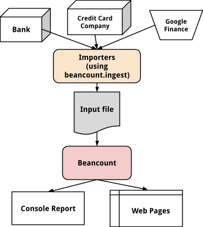

# 命令行会计背景介绍

[<u>Martin Blais</u>](http://plus.google.com/+MartinBlais)，2014年7月

[<u>http://furius.ca/beancount/doc/motivation</u>](http://furius.ca/beancount/doc/motivation)

*本文提供了使用双重记账命令行会计系统管理个人财务的背景和动机。*

> [<u>动机</u>](#motivation)
>
> [<u>“会计”到底是什么?</u>](#what-exactly-is-accounting)
>
> [<u>它能为我做些什么?</u>](#what-can-it-do-for-me)
>
> [<u>记账</u>](#keeping-books)
>
> [<u>生成报告</u>](#generating-reports)
>
> [<u>自定义脚本</u>](#custom-scripting)
>
> [<u>文件存档</u>](#filing-documents)
>
> [<u>各部分如何结合在一起</u>](#how-the-pieces-fit-together)
>
> [<u>为什么不用电子表格?</u>](#why-not-just-use-a-spreadsheet)
>
> [<u>为什么不用商业应用程序?</u>](#why-not-just-use-a-commercial-app)
>
> [<u>Mint.com 如何?</u>](#how-about-mint.com)
>
> [<u>Quicken 如何?</u>](#how-about-quicken)
>
> [<u>Quickbooks 如何?</u>](#how-about-quickbooks)
>
> [<u>GnuCash 如何?</u>](#how-about-gnucash)
>
> [<u>为什么构建计算机语言?</u>](#why-build-a-computer-language)
>
> [<u>命令行记账的优势</u>](#advantages-of-command-line-bookkeeping)
>
> [<u>为什么不用 SQL 数据库?</u>](#why-not-just-use-an-sql-database)
>
> [<u>但是... 我只想做 X?</u>](#but...-i-just-want-to-do-x)
>
> [<u>为什么我这么兴奋?</u>](#why-am-i-so-excited)

## 动机

当我告诉别人我在做命令行会计的事情时，我会收到各种反应。

有时我会听到他们对自己财务状况的绝望之声：很多人希望他们对自己的财务状况有更好的掌握和理解，他们叹息并希望自己能更好地组织起来。其他时候，当我描述我的过程时，他们会难以置信地反应：“你为什么还要费这个劲？”这些人认为他们的财务生活非常简单，可以在 5 分钟内总结出来。他们通常不知道自己有多少个账户，只对自己的财务状况有一个模糊的概念。通常当我们详细检查时，他们才意识到自己的财务生态系统比他们想象的复杂得多。最后，有些人对使用一个强大的会计系统非常感兴趣，但他们实际上不理解我在说什么。他们可能认为这是一个支持投资组合的系统，或者我用它来严格管理预算。通常他们最终认为这太复杂了，不值得开始。

本文尝试用具体的术语解释命令行记账是什么，它能为你带来什么，你可以期待什么结果。事实是，双重记账法是一种每个人在高中就应该学习的基本技术。使用它管理你的财务生活是一种简单而强大的过程。

## “会计”到底是什么？

当人们谈论“会计”时，他们通常隐含地指的是各种不同的财务过程中的一个或多个：

-   **记账。** 将过去的交易记录到一个地方，一个“分类账”，也叫“账簿”，比如“这家公司的账簿”。本质上，这意味着将发生在外部账户对账单上的金额和类别复制到一个包含该实体所有“账户”的单一系统中，并将它们连接在一起。这通常被称为“记账”或“记账活动”。

-   **发票。** 准备发票并跟踪付款。承包商通常会提到这一点，因为这是他们活动的主要关注点：向客户发送支付请求，并在稍后检查是否实际收到相应的付款（如果没有收到付款则采取催收行动）。如果你管理公司的财务，处理工资单也是这一方面的一个重要内容。

-   **税务。** 找到或计算应税收入，填写税务表格并向该实体所属的各种政府机构报税。这个过程可能很繁琐，对于个人资产开始变得复杂的人（许多不同类型的账户、新的报告要求），这可能会非常有压力。这往往是他们开始考虑组织自己的财务的时刻。

-   **支出。** 分析支出，基本上回答“我的钱花到哪里去了？”的问题。收入较低且拥有许多信用卡的人可能希望精确跟踪和计算每个月的支出。这只是培养意识。即使在资源充足的情况下，了解自己定期的收入去向也很有趣，常常会带来惊喜。

-   **预算。** 预测未来的支出，在各种类别中分配有限的金额，并跟踪实际支出与这些分配的接近程度。对于个人来说，这通常是在偿还债务或寻找更多储蓄的方法时进行的。对于公司来说，这在计划各种项目时发生。

-   **投资。** 总结和计算投资回报和资本收益。我们中的许多人现在通过折扣经纪人管理自己的储蓄，投资于 ETF 和自行选择的共同基金。能够查看资产分配和风险暴露以及计算资本收益是很有用的。

-   **报告。** 上市公司有向投资者提供透明度的监管要求。因此，他们通常会报告年度*损益表*和期初和期末的*资产负债表*。对于个人来说，这些报告在向银行申请个人贷款或抵押贷款时非常有用，因为它们提供了一个人财务健康状况的窗口。

本文将描述命令行会计如何为这些活动提供帮助和支持。

## 它能为我做些什么？

你可能会问：当然，但为什么还要费这个劲？我们可以从它能为你解答的问题来看待会计的用途：

-   **我的钱在哪儿，莱博斯基？** 如果你不跟踪花费，使用大量现金，有太多信用卡，或者你只是一个头脑灵活的艺术家，你可能会想知道为什么月底没有留下足够的钱。损益表将回答这个问题。

-   **我想成为沃伦·巴菲特。每月需要节省多少？** 我个人不做预算，但我知道许多人这样做。如果你为一个项目或以后的储蓄设定具体的财务目标，首先你需要分配预算并设定支出限制。跟踪你的钱是第一步。你甚至可以计算你的回报，以便与市场进行比较。

-   **我有一些现金可以投资。根据我的投资组合，我应该投资在哪里？** 能够报告你所有的持有，可以确定你的资产类别和货币风险暴露。这可以帮助你决定将新储蓄放在哪里，以匹配目标投资组合分配。

-   **我值多少钱？** 你有 401k，一个 IRA 和应税账户。一个剩余的学生贷款，或者你可能坐拥房地产和两笔抵押贷款。总共是多少？能够获得一个数字来告诉你离退休目标有多远是很好的。Beancount 可以轻松计算你的净值（精确到分）。

-   **我仍然受 2008 年的影响。我的投资安全吗？** 例如，我用各种折扣经纪人管理我的钱，许多人也是如此。我基本上在用 ETF 运行一个小型对冲基金，我的目标是尽可能在资产类别、行业暴露、货币暴露等方面进行多元化。此外，由于税延账户，我无法在一个地方进行操作。使用 Beancount，你可以生成持仓清单，并按类别汇总。

-   **税务很糟糕。** 好吧，够了。为什么它们很糟糕？主要是因为不确定和怀疑。如果你能立即掌握所有数据，那就不会那么糟糕了。你需要报告什么？对一些人来说，收入来源单一，但对许多人来说，这变得复杂（你可能在这种情况下而你却不知道）。合格与普通股息、长期与短期资本收益、次要来源收入、洗售等。当我做税务时，我会调出今年的损益表，我有一个清晰的项目清单可以输入和扣除。

-   **我想买房子。我能筹集多少首付款？** 如果你突然需要大量现金，你能负担多少？好吧，如果你能生成持仓清单，你可以按流动性汇总。这可以让你知道在紧急情况下可以使用的现金。

-   **银行先生，请借给我一些钱。** 让银行家印象深刻：只需带上你的资产负债表。最好是当天生成的那张表。你应该在任何时候都能获得完整的资产负债表。

-   **你过世后的指示。** 制作遗嘱需要列出你的资产。如果你去世了，让你的孩子的生活更轻松，拥有所有需要传递或收集的财产的完整清单。金额只是故事的一部分：能够列出所有账户和机构将使他人更容易清算你的资产。

-   **我记不住他们是否付钱给我了。** 如果你发送了发票并有应收款项，能够有一个方法跟踪谁已经付款，谁只是说他们会付钱，这很不错。

我相信你能想到更多。告诉我吧。

## 记账

好吧，这就是我给你方法见解的部分。支持所有其他活动的核心和最基本的活动是*记账*。最重要和最根本的认识是，这种相对简单的行为——将所有财务交易复制到一个集成系统中——使你能够生成解决所有其他问题的报告。你正在建立一个数据集，一个包含日期的交易对象列表，每个对象代表一些你拥有的账户之间的钱的流动。该数据提供了你所有财务活动的完整时间线。

你所要做的就是在记录每笔交易时遵守一个简单的约束，即*双重记账法*，其内容如下：

    每次将金额过账到一个账户时，必须将相应的相反金额过账到其他账户，并且这些金额的总和必须为零。

就是这样。这是方法的精髓，遵循这个约束的交易集获得了在我其他文档中详细讨论的好属性。为了生成合理的报告，所有账户都标有四个类别之一：*资产*、*负债*、*收入*和*支出*。第五类，*权益*，仅用于汇总所有以前的收入和支出交易的历史。

*命令行会计*系统只是一种简化的计算机语言，方便地输入、读取和处理这些交易数据，并确保双重记账法的约束得到遵守。它们是简单的计数系统，可以在专用的计数器（“账户”）中添加任何类型的“东西”。它们基本上是带有多个桶的计算器。[<u>Beancount</u>](http://furius.ca/beancount/)和[<u>Ledger</u>](http://ledger-cli.org)在语法和一些语义上可能略有不同，但总体原则是相同的，简化假设也非常相似。

以下是一个交易的具体示例，以便你能感受一下。在一个文本文件中——这是命令行会计系统的输入——写入类似以下内容，并表示信用卡交易：

    2014-05-23 * "CAFE MOGADOR  NEW YO" "Dinner with Caroline"
      Liabilities:US:BofA:CreditCard    -98.32 USD
      Expenses:Restaurant

这是一个有两个“过账”或“腿”的示例交易。“`Expenses:Restaurant`”行是一个账户，而不是类别，尽管账户通常充当类别（这两个概念之间没有区别）。支出账户的金额未指定，这是输入语言允许的便利。软件自动确定其金额为余额的剩余部分，在本例中将为 98.32 USD，因此 -98.32 USD + 98.32 USD = 0（记住，所有过账的总和必须平衡为零——这是语言强制的）。

大多数金融机构提供某种方式让你以某种格式下载账户活动摘要。许多交易的详细信息都是通过这样的下载文件自动获取的，使用你编写的自定义脚本将其转换为上述语法：

-   下载文件总是提供交易日期。

-   “`CAFE MOGADOR NEW YO`”部分是“备忘录”，也由下载文件提供，这些名称通常足以让你知道你花费的商家是什么。这些备忘录是你在信用卡对账单上看到的相同丑陋名称。这作为“收款人”属性附加到交易。

-   我手动添加了“`Dinner with Caroline`”作为注释。我不一定要这样做（这是可选的），但我喜欢在核对新交易时这样做，这只需一分钟，并且如果我在寻找过去的事件时，这有助于我记住它们。

-   导入程序自动带入了 `Liabilities:US:BofA:CreditCard` 过账及其金额，但我必须自己插入 `Expenses:Restaurant` 账户：我手动输入。我在文本编辑器中有快捷方式，可以让我通过账户名称完成来做到这一点，这很简单。更重要的是，预选此账户也可以自动化，通过在相同的输入文件中运行简单的学习算法（我们往往经常去相同的地方）。

语法变得稍微复杂一些，例如，它允许你表示股票购买和销售，跟踪资产的成本基础，并且还有许多其他类型的便利功能，例如能够在账户中定义和计算任何类型的“东西”（例如，“累计假期时间”），但这个示例捕捉了我所做事情的*本质*。我以这种方式复制我拥有的所有账户的所有交易，主要是自动化的。每隔几周我花 1-2 小时更新这个输入文件，并且只针对最常用的账户（信用卡和支票账户）。其他账户我每隔几个月更新一次，或者当我需要生成一些报告时更新。因为我对我的财务有一个坚实的理解，所以这不再是一个负担……这已经变成了*乐趣*。

你得到的是一个完整的历史记录，一个包含所有账户的所有财务交易的完整时间线，*在一个文本文件中*。

## 生成报告

那么精心打理这个文件的目的是什么呢？我有代码可以读取它，解析它，并在我的机器上运行一个本地 Web 服务器来提供各种视图和聚合，或者从这个数据流中生成自定义报告。最有用的视图无疑是*资产负债表*和*损益表*，但还有其他一些：

-   **资产负债表。** *资产负债表*列出了你所有资产和负债账户的最终余额。这是一个**快照**，显示你的净资产（如果你更新了所有账户则非常精确），如果你申请贷款，这也是银行感兴趣的内容。Beancount 可以在任何时间点生成我的资产负债表，但我最常感兴趣的是“当前”或“最新”资产负债表。

-   **损益表。** *损益表*是一个在两个时间点之间发生的所有收入和支出的摘要。它以会计熟悉的格式渲染这些账户的最终余额：左侧是收入账户，右侧是支出账户。这提供了在一段时间内发生的变化的见解，一个**增量**的变化。这告诉你你赚了多少钱，你的钱花在哪里了，详细地说。两者之间的差异就是你节省了多少钱。Beancount 可以为任何任意时间段生成这样的报表，例如，今年，或者逐月。

-   **日记帐。** 对于每个账户（或类别，如果你喜欢这样称呼它们），我可以渲染所有过账到该账户的交易的列表。我称之为*日记帐*（Ledger 称之为“寄存器”）。如果你查看你的信用卡账户的日记帐，它应该与你的银行对账单一致。另一方面，如果你查看你的“餐馆支出”账户，它应该显示你所有的餐馆支出，包括所有支付方式（如果你选择输入）。你可以轻松获取你的财务历史的任何细节，比如“我三年前三月和 Arthur 一起吃饭的地方是哪里？”或者“我想卖掉那张沙发……我当时花了多少钱？”

-   **应付账款和应收账款。** 如果你有已知的应收款项，例如，你报税了或发送了发票并期待付款，或者你寄出了支票并期望它在未来某个时间被兑现，你可以用专用账户来跟踪。交易有语法允许你将它们链接在一起，找出哪些已经支付或收到。

-   **计算税务。** 如果你根据工资单详细信息输入你的工资存款，你可以准确计算你支付了多少税款，并且这些金额应该与雇主的年度收入报告表格（例如，美国的 W2 表格，加拿大的 T4 表格，英国的 P60 表格，或其他地方的表格）报告的金额*完全*一致。这在你需要分期缴税时特别方便。如果你是承包商，你需要跟踪许多这样的事情，包括公司可报销的费用。跟踪你必须报告的应税收入也很有用。

-   **投资。** 我不算富有，但我通过折扣经纪人和主要的 ETF 管理我的资产。此外，我利用各种有限选择的税收优惠账户。这现在很普遍。你可以说我在管理一个小型对冲基金，也不算太离谱。使用 Beancount，我可以生成持仓的详细清单，提供每日市场价值变化、资本收益、股息、资产类型分布（例如股票与固定收益）、货币风险暴露等报告，并找出我有多少资产是流动的，例如，用于房屋首付款的可用资金是多少。精确地，随时随地。这非常好。我还可以生成各种持仓的汇总，即按账户、按工具类型、按货币汇总的价值。

-   **预测。** 我工作的公司有一个员工股票计划，有归属时间表。我可以在合理的假设下预测我的预期收入，包括归属的股票。我可以回答这个问题：“按这个速度，我何时达到 X 的净值？”比如说，如果 X 是你需要的退休金额。

-   **共享费用。** 如果你与他人共享费用，例如与你的朋友一起旅行，或者有一个室友，双重记账法提供了一个自然且简单的解决方案来一起对账。你还可以生成各种费用的报告，以便清晰地了解。没有不确定性。

-   **预算。** 我的收入足以不设定具体目标，但我计划支持这样做的功能。

你基本上就像公司一样管理你的个人财务……但这非常简单，因为你使用的是一个简单且巧妙设计的计算机语言，它做了很多简化（例如去掉了“借方和贷方”的概念），将过程简化到其本质的最小值。

## 自定义脚本

应用是无穷无尽的。我有各种生成自定义报告的疯狂想法。这些是有用且有趣的实验，我称之为“挑战”。一些例子：

-   我曾经拥有一个公寓单元，并在我拥有它的整个期间进行了双重记账，直到出售。所有对应的账户共享 `Loft4530` 名称。这意味着我可以计算与之相关的所有现金流的精确[<u>内部收益率</u>](http://en.wikipedia.org/wiki/Internal_rate_of_return)，包括更换灯泡等小费用。将其视为纯投资。这只是为了好玩。

-   我可以渲染我的年度支出和资产的[<u>树图</u>](http://en.wikipedia.org/wiki/Treemapping)。这是这些类别的良好可视化，保留了它们的相对重要性。

-   我可以查看时间价值货币修正的平均费用。这会很有趣，告诉我我的生活成本随时间的变化。

一旦你有了数据集，如果你逐步维护它，生成这些报告是相对容易的，你可以通过编写一些 Python 代码来做很多有趣的事情。我构建 Beancount 以两种方式实现这一点：

1.  **通过提供“插件”系统**，允许你过滤解析后的交易集。这使你可以通过过滤和转换解析交易列表来黑入 Beancount 语法并原型新数据输入便利。默认提供的插件通过过滤和转换解析交易列表提供扩展功能。而且这很简单：你所要做的就是实现具有特定签名的回调函数，并在你的输入文件中添加一行。

2.  **通过编写脚本。** 你可以用很少的代码解析并获取分类账的内容。在 Python 中，这看起来不比这复杂：  
      
    import beancount.loader  
    …  
    entries, errors, options = beancount.loader.load\_file('myfile.ledger')

      for entry in entries:
        …

瞧。你正走在吐出你想要的任何输出的路上。你可以访问所有的 Python 库，我的代码大部分是函数式的，注释详尽并彻底单元测试。你应该能够轻松找到你的路。此外，如果你对使用这个系统不确定，你可以先开始输入你的数据，然后编写一个脚本将其转换为其他内容。

## 文件存档

如果你为每个真实世界的账户定义了账户，你还创建了一种自然的方法来组织你的对账单和其他纸质文件。随着我们越来越多地通过电子邮件与我们的会计师和机构交流，扫描信件为 PDF 并将其作为计算机文件越来越常见。所有银行现在都已经无纸化，如果你关心，你可以下载这些对账单（我通常在年底一次性下载保存，以防万一）。能够很好地组织这些文件并轻松检索这些文件是很不错的。

我所做的是保持一个与我定义的账户名称相对应的目录层次结构，看起来像这样：

    .../documents/
                  Assets/
                         US/
                            TDBank/
                                   Checking/
                                            2014-04-08.statement.march.pdf
                                            2014-05-07.statement.april.pdf
                                            … 
                  Liabilities/
                              US/
                                 Amex/
                                      Platinum/
                                               2014-04-17.March.pdf
                                               2014-04-19.download.ofx
                                               …
                  Expenses/
                           Health/
                                  Medical/
                                          2014-04-02.anthem.eob-physiotherapy.pdf
                                          … 

这些示例文件将对应于名为 `Assets:US:TDBank:Checking`、`Liabilities:US:Amex:Platinum` 和 `Expenses:Health:Medical` 的账户。我将此目录置于版本控制之下。只要文件名以日期开头，例如“`2014-04-02`”，Beancount 就能自动找到文件并插入指令，这些指令在其 Web 界面上呈现为账户日记帐的一部分，你可以点击查看文件本身。这允许我在一个地方找到所有对账单，如果我在寻找某个文件，它有一个明确的位置，我知道在哪里找。

此外，我编写的导入软件能够识别下载的文件并自动将它们移动到相应的账户目录中。

## 各部分如何结合在一起

所以我描述了我组织财务的方法。这里我将告诉你各种软件部分及其如何结合在一起：

-   [<u>Beancount</u>](http://furius.ca/beancount/)是系统的核心。它读取我更新的文本文件，解析我定义的计算机语言，并从生成的数据结构中生成报告。此软件*仅*读取输入文件，故意不与其他程序通信。它在隔离环境中运行。

-   Beancount 的[<u>ingest</u>](http://github.com/beancount/beancount/tree/v2/beancount/ingest/)包和工具通过从银行和其他机构下载的文件中提取交易来帮助自动更新账户数据。这些工具协调你实现的导入程序的运行（这是所有混乱的导入代码所在的地方，使更新你的文本文件变得更容易，可以解析 OFX 和 CSV 文件，例如）。参见 bean-extract，bean-identify 工具。

-   ingest 包还帮助存档文件（参见 bean-file 工具）。因为它能够识别哪个文件属于哪个账户，它可以自动将下载的文件移动到我的文件档案中。这节省了我的时间。

-   最后，为了提供市场价值，Beancount 输入文件应该有合适的价格指令。Beancount 还包含代码来获取分类账文件中存在的各种商品的最新或历史价格（参见 bean-price 工具）。就像从 OFX 下载中提取交易一样，它也会吐出 Beancount 输入语法用于定义价格。

请参见下图，了解这些如何结合在一起的美丽图示。

## 为什么不用电子表格？

这是一个很好的问题，电子表格确实非常有用。如果我能用电子表格来跟踪我的财务，我肯定不会编写自己的软件。

问题在于双重记账交易数据的内在*结构*不适合表格表示。每个交易都有多个属性（日期、叙述、标签）和两个或多个过账，每个过账都有一个关联的金额和可能的成本。如果你将日期放在一个轴上，账户放在另一个轴上，你会得到一个非常稀疏且非常大的表格；这并不很有用，并且编辑起来非常困难。另一方面，如果你为每行专门分配一个账户名称列，你的所有计算都必须将账户单元格纳入计算逻辑。处理起来会非常困难，甚至是不可能的。所有数据聚合都是相对于账户名称执行的。

此外，处理具有成本基础的单位积累将需要复杂的体操。我甚至不知道如何在电子表格中实现这一点。命令行会计系统的核心部分是库存逻辑，它允许你跟踪账户中每个单位的成本基础，并仅根据现有批次进行位置的减少。这使系统能够自动计算资本收益。这与强制所有交易过账平衡为零的代码相关。

我相信，“交易 <-> 过账”数据表示结合用于更新库存的合理方法是该系统的精髓。对这些需求的需求是创建专用方法构建此数据的理由，例如计算机语言。最后，拥有我们自己的语法提供了其他类型有用指令的机会，例如余额断言、开/关日期以及复杂的交易子集过滤。你无法在电子表格中完成我们正在做的事情。

## 为什么不用商业应用程序？

### Mint.com 如何？

人们常常告诉我他们正在使用[<u>Mint.com</u>](http://mint.com)来跟踪他们的财务，通常会有一些具体的抱怨紧随其后。Mint 等在线服务提供了双重记账的一部分功能。此类服务的主要关注点是按类别报告支出和维护预算。因此，它们在自动下载信用卡和银行交易方面做得很好。我认为，如果你希望一个低维护的选项来跟踪你的财务，并且你对明显的隐私风险没有问题，这是一个*非常好*的选择：它带有 Web 界面、移动应用程序，更新你的账户可能只需要点击一些按钮、提供一些密码和每隔几周进行少量手动修正。

然而，对于我自己使用它，我有几个保留意见：

-   **密码。** 我对任何商业公司分享*所有*我的银行、信用卡和投资账户的密码都不够放心。这对我来说是一个疯狂的想法，非常可怕，我不愿意将这么多信任放在任何一家公司手中。我不在乎他们怎么说：我为几家软件公司工作过，我了解销售人员、网站公关和工程现实之间的脱节。我也知道决心坚定的计算机黑客的力量。

-   **报告不足。** 报告可能非常漂亮和色彩丰富——在网站上非常漂亮——但肯定不足以满足*我*想在我的数据上做的所有报告。我系统中的报告可以写一个脚本，生成*任何*我可能想要的报告。例如，吐出我的费用的树图可视化，而不是无用的饼图。我可以用各种独特的方式切片和切块我的交易。我可以为项目或旅行标记交易子集并报告它们。这比通用报告更强大。

-   **持久性。** 如果公司在 5 年后不再营业怎么办？我的数据会在哪里？如果我花时间管理我的财务数据，我希望确保它将永远对我可用，以开放格式。为了他们的利益，这些网站可能有一个可下载的选项，但谁在使用它？它工作得很好吗？它会包括所有他们下载的交易吗？我不知道。

-   **不国际化。** 它可能不适用于国际、多货币的情况。这些服务针对大多数用户，这些用户大多数在一个国家内处理所有事务。我住在美国，有加拿大的历史，这涉及剩余的税收优惠投资账户，在访问期间偶尔的费用证明保留一个信用卡，并且未来的历史可能涉及在另一个国家（如香港或澳大利亚）生活几年。这在 Mint 中工作吗？可能不会。他们可能支持加拿大，但他们会支持两个地方的账户吗？如果我想搬到其他国家呢？我希望拥有所有账户在所有国家和所有货币中的单一综合视图，永远不少。我的系统非常支持这一点。（我不知道有任何双重记账系统能像 Beancount 一样处理国际问题和货币无关的问题。）

-   **处理特定情况的能力不足。** 如果我拥有房地产呢？我能否以合理的金额定价我的房屋，使其创建一个准确的资产负债表？定期从热心的房地产代理那里获得“可比”价格会比 Zillow 等服务更准确地告诉我我的房屋价值。我需要能够输入以用于我的资产负债表。那些我曾经为之工作的私人持有的澳大利亚公司的股票期权呢？我怎么定价呢？其他无形的东西呢，比如我给朋友的个人贷款的应收账款？我怀疑在线服务能否提供你输入这些的能力。如果你想要精确的全景，你需要能够进行这些调整。

-   **自定义跟踪。** 使用“虚拟货币”，我可以跟踪比货币和股票更多的东西。例如，通过使用 Beancount 中的“`IRAUSD`”商品，我可以跟踪我在任何时候做了多少 401k 贡献。我可以同样跟踪传统 IRA 账户的税后基础。我甚至可以使用虚拟“`VACHR`”货币计算我的假期时间，并与我的工资单核对。

-   **资本收益报告。** 我自己没有试过，但我听说过其他人对 Mint 在资本收益报告方面能力有限的不满。它会维护交易批次吗？它会处理平均成本记账吗？外汇收益的盈亏呢？我通过 PayPal 销售的那本书的收入呢？我希望能够将我的会计系统用作我的税务报告的输入。

-   **现金交易。** 输入现金交易有多困难？我必须登录，还是启动一个只能在 Windows 下运行的慢而重的程序？使用 Beancount 我会在文本编辑器中打开一个文件，这既快捷又简单。在线服务中能输入自定义现金条目吗？

换句话说，我是一个非常复杂的用户，是的，有点*控制狂*。我不会否认这一点。我对使用商业服务没有任何意识形态的反对意见，它可能不适合我。如果它对你来说足够好，随你便。尽管有它们漂亮且充满希望的网站，我还没有听说过有人对这些服务完全满意。我听到很多抱怨，一些轻微的满意，但我还没有遇到过任何人对它赞不绝口。

### Quicken 如何？

Quicken 是一个单一记账系统，即，它复制远程账户的交易到本地，并允许你为每笔交易添加一个标签，以将其分类。我相信它还支持同步投资账户。这对我来说不够，我想跟踪各种各样的东西，我想使用双重记账法，这提供了一种固有的检查我是否正确输入数据的方法。如果你已经了解双重记账法，单一记账就不够好了。

### Quickbooks 如何？

那么，让我们谈谈适合公司的复杂软件。为什么我不用那个呢？如果它对小型企业来说足够好，那对我来说也应该足够好，不是吗？有 Quickbooks 以及其他的。为什么我不使用它们：

-   **它需要花钱。** 商业软件是有价格的。好吧，我可能能够负担得起每年几百美元（Quickbooks 2014 的全套功能大约需要 300 美元/年），但我真的不想支付。

-   **平台。** 这些软件通常运行在[<u>Microsoft Windows</u>](http://windows.microsoft.com/)上，有时在[<u>Mac OS X</u>](https://www.apple.com/osx/)上。我是一个软件开发人员，我主要使用[<u>Linux</u>](https://www.kernel.org)，并且我的笔记本电脑是[<u>Macbook Air</u>](https://www.apple.com/macbook-air/)，我只喜欢在上面运行[<u>tmux</u>](http://tmux.sourceforge.net/)和一个[<u>web 浏览器</u>](http://www.google.com/chrome/)。我不想为了输入一个快速的现金交易而重新启动。

-   **启动慢。** 我不能具体说 Quickbooks 的实现，但几乎每个我使用过的商业范围的软件套件都有一个启动屏幕，并且慢慢地启动，涉及初始化大量插件。他们假设你会花几个小时在里面，这对商业用户来说是合理的，但对我来说，如果我想快速更新分类账，这就不合理了。

-   **用户界面不足。** 我没有见过他们的用户界面，但考虑到交易的性质和我输入精确和快速搜索以及组织事物的愿望，我希望能够以文本编辑。我想这对我来说会不方便。使用[<u>Emacs</u>](http://www.gnu.org/s/emacs/)和[<u>org-mode</u>](http://orgmode.org/)，我可以轻松地[<u>i-search</u>](https://www.gnu.org/software/emacs/manual/html_node/emacs/Incremental-Search.html)我的分类账文件中的任何交易，几秒钟内打开。

-   **不灵活。** 我该如何重新组织我的所有账户名称？我认为我仍在学习双重记账法，在过去犯过错误，错误使我想重新审视我如何在层次结构中组织账户。使用我的文本文件，我能够安全地多次重命名大量账户，并发展我的账户图表以反映我对如何组织财务跟踪系统的改进理解。文本是强大的！

### GnuCash 如何？

我不喜欢用户界面；它们不方便。如果你是程序员，没有什么比编辑一个文本文件更好。而且，GnuCash 不能很好地处理多种货币。每次我测试它时，总是在第一个小时内发现错误，这我每隔几年出于好奇会做一次。其他程序，例如 Skrooge，也采用重型大用户界面的方法。

### 为什么构建计算机语言？

会计系统提供了许多理由来构建一个简单的计算机语言解决方案。

如果你试图全面跟踪一切，单一记账法是完全不够的。现有系统要么限制在费用类别上，除了“对账”之外没有更多检查，有时涉及冻结过去。如果你不是为公司做会计，有时只是更改过去并在错误发生的地方修复错误更有意义。更重要的是，单一记账法让我们想要双重记账系统的自然错误检查机制。

问题还不能通过使用电子表格优雅地解决；双重记账系统的数据结构要么推断出一个非常稀疏的电子表格，账户在一个维度上，交易在另一个维度上。对于实际使用来说，这不切实际。这个主题的另一个迭代涉及插入两个列的过账，一个是账户，一个是金额，但列数的变化和查找代码使之也不优雅。此外，如何处理大量货币也不明显。

提供华丽图形或基于 Web 的用户界面的程序由于问题的性质而不可避免地笨拙：每个交易是通过一个账户的日记帐来组织的，但其过账中任何一个账户都提供了同样有效的视图。理想情况下，你想要的是查看交易。组织它们以便于输入的顺序与它们呈现的顺序无关。使用文本有很多优势：

-   你可以轻松使用搜索和替换和/或 sed 进行全局更改，例如重命名或重新组织你的账户；

-   你可以按最方便的数据输入顺序组织交易；

-   有许多现有工具可以搜索文本；

-   你可以轻松编写各种小工具吐出数据语法，即，用于从其他文件类型导入或从其他系统转换。

-   文本本质上是**开放的**，即文件格式是你可以从中读取数据并存储在其他地方的格式，而不是一个无法理解的数据块，当制作软件的公司停止支持时会变得无法使用。

最后，试图自动导入所有数据的系统（例如 mint.com）有一个主要缺点：通常很难甚至不可能为非自动化账户添加信息。根据我的经验，实际上你会有一些条目和账户跟踪没有漂亮的下载文件格式，或者根本没有现实世界的对应关系。为了生成一个人的资产负债表的完整视图，能够在单个系统中输入所有个人的账户是很重要的。换句话说，自定义账户和手动输入的交易非常重要。

由于上述所有原因，我认为计算机语言比带有自定义界面的重型软件更适合表达这个数据结构。能够轻松调出文本文件并快速输入几行文本以添加交易是非常棒的——快速而简单。分类账文件提供了一种自然开放的方式来表达一个人的数据，并且可以进行源代码控制或在多人之间共享。多个文件可以合并在一起，并且可以对源文件进行脚本化操作以重新组织一个人的数据历史。此外，提供一个只读的 Web 界面来呈现预期的各种报告并允许用户探索数据集的不同视图对于查看数据来说已经足够。

### 命令行记账的优势

总之，与提供用户界面的商业软件包相比，使用命令行会计系统有许多优势：

-   **快速。** 你不需要启动一个慢速程序，有启动屏幕，并且初始化大量插件，以便在账簿中添加东西。从你喜欢的编辑程序（我使用 Emacs）中的书签调出文本文件既简单又快捷。而且，如果你整天都在使用文本编辑器，像许多程序员一样，你在文件出现在你眼前之前不会眨眼。快速而简单。

-   **便携。** 它将在所有平台上工作。Beancount 是用 Python 3 编写的，带有一些 C 扩展，因此将在 Mac、Linux 和 Windows 平台上工作。我非常小心并决定将对第三方包的外部依赖保持在绝对最低限度，以避免安装问题。它应该容易安装和更新，并且在任何地方都一样工作。

-   **开放。** 你的数据是开放的，并且将*永远*保持开放。我计划将我的数据集保留到我死去的那一天。使用开放格式，你永远不会遇到这样的情况：你的交易数据坐在一个未知格式的二进制块中，软件不再受支持。此外，你的数据可以轻松转换为其他语言。你可以轻松调用我提供的解析器并编写脚本，将其输出到另一个程序的输入语法中。你可以将其置于版本控制之下。你可以完全通过 sed 重命名字符串来重组账户的结构。文本是强大的。

-   **定制。** 你可以生成非常定制的报告，解决*完全*你遇到的问题。关于其他财务软件的一个常见抱怨是它们不能完全满足他们的需求。使用命令行会计系统，你至少可以自己编写一个小扩展，使用你的数据集。

## 为什么不用 SQL 数据库？

我不喜欢重新发明轮子。如果这个问题可以通过填充一个 SQL 数据库并对其进行查询来解决，这正是我会做的事情。创建一种语言是一个大的开销，需要维护和发展，这不是一件容易的任务，但事实证明，解决这个问题是必要的和合理的。

问题有几个原因：

-   过滤发生在交易及其子过账的两级数据结构上，将数据表示在一个表中进行操作是不方便的。你不能简单地只处理过账：为了确保报告平衡，你需要选择完整的交易。当你选择交易时，语义是“选择所有具有*此*或*那*属性的交易的过账”。其中一个属性是“所有具有某个账户*X*的过账的交易”。用数据库实现这些语义并不容易。数据结构的性质使其不方便。

-   各种指令的多样性使得设计一个可以容纳所有数据的单一优雅表变得困难。理想情况下，我们希望为每种类型的指令定义两个表：一个表保存所有通用数据（日期、来源文件名和行号、指令类型），一个表保存类型特定数据。虽然这是可能的，但它脱离了单一表数据的简洁结构。

-   对库存——持有账户内容的增量更改数据结构——的操作需要特殊处理，这在数据库中实现起来很困难。批次减少受制于批次的运行库存，每个批次都有特定的成本基础。一些批次减少会触发批次合并（用于平均成本记账）。这需要对这些库存对象进行一些自定义操作。

-   聚合（分解）具有层次性质。账户的树状结构允许我们对过账的子树执行操作。这也不容易用表实现。

最后，输入将很困难。通过定义一种语言，我们绕过了必须构建一个自定义用户界面的问题，该界面允许我们创建数据。

尽管如此，我真的很喜欢使用数据库的想法。提供了一个脚本（bean-sql），将 Beancount 文件的内容转换为 SQL 数据库；对这些表进行计算并不优雅，但无论如何提供了。你应该能够玩弄它，即使操作很困难。我甚至可能预先计算一些操作的输出，以便更容易运行 SQL 查询。

## 但是... 我只想做*X*？

有些人可能会推测，我们所做的事情一定非常复杂，因为他们认为他们可能只想用这样的系统做一个单一目的。但事实上，你决定跟踪多少账户是个人选择。你可以选择跟踪你认为足够详细的最少内容。例如，如果你只对投资感兴趣，那么你可以只对你的投资账户记账。如果你有兴趣替代使用[<u>Mint.com</u>](http://mint.com)或[<u>Quicken</u>](http://quicken.intuit.com/)，你可以只复制你的信用卡对账单，查看相应的费用。

每年从头开始进行痛苦的年度评估你的资产和费用，以查看你的财务状况会让你相信，使用这种方法更简单。使用电子表格查看你的财务状况需要至少从你的投资组合中复制值。每次你想生成报告时，你都需要更新这些值……使用我的方法，你只需更新每个账户的完整活动，你可以获得完整的持有列表作为副产品。如果你有一个系统方法，更新一切是很容易的。

对那些人来说：尝试一下，只对你感兴趣的部分记账。一旦你尝试了双重记账法，并学到了一些语言语法，你就会想要获得更完整的画面。你会被吸引。

## 为什么我这么兴奋？

好吧，我变成了一个会计迷。我不是故意的。只是在我不注意的时候发生了（我仍然不穿棕色袜子）。为什么我不能停止谈论这些东西？

我曾经有一家公司。那是一个用于做合同工作的伞形公司（是的，我原本对它有更大的抱负，但最终只是这样。呃。）作为加拿大的公司老板，我不得不定期向联邦和省政府缴纳五种不同类型的税款，有些每月，有些每三个月，然后变化多端。会计师给我“魔法数字”填在表格上，这些数字我像猴子一样复制，而不完全理解它们以后会如何使用。我不得不分别计算与我的工作相关的各种费用（用于扣除），和那些仅仅是个人的费用——我没有获得不同信用卡的启示，所以我试图跟踪从同一账户中个人与公司的费用。我还必须跟踪公司与个人账户之间的转账，这些转账后来会报告为股息或工资收入。我经常有多个未付发票，需要两个月以上才能收到不同客户的付款。这是一个半地狱。你明白了。我过去试图手动跟踪所有这些事情，使用由小文本文件和电子表格组成的系统，非常仔细地做事，按照特定方式。

事实是，尽管我天生非常有条理，但有时，只是*有时*我会忘记更新其中一个文件。事情会失去同步。当这种情况发生时，非常令人沮丧，我不得不花时间挖掘各种对账单，找出哪里出了问题。这既耗时又不愉快。当然，当你不得不做某件事时，它是令人不愉快的，你往往不会做得那么好。我对公司在一年中的当前状况没有一个清晰的认识，我只是工作并为公司赚了钱。我的会计师会在七月做税务后绘制一张资产负债表，这总是有点惊喜。我总是感到有点困惑，每次我不得不处理“钱的事情”时，我都感到恼火。这不是噩梦，但确实让我很累。我觉得我的生活在我只有一份工作时简单得多。

但有一天……有一天……我看到了光明：我发现了双重记账法。我不记得确切是怎么回事。我想是在一个网站上，是的……这个网站：[<u>dwmbeancounter.com</u>](http://www.dwmbeancounter.com/)（这是一个很棒的网站）。我意识到使用一个*单一系统*，我可以同时解决所有这些问题，并以一种固有的错误检查机制的方式进行。我被震撼了！我想当时我打印了所有东西并通读了每一个教程。这个简单的计数技巧正是我迫切需要的。

但我尝试的所有软件要么令人失望，要么有缺陷，要么太复杂。所以我读了 Ledger。我联系了[<u>它的作者</u>](http://www.newartisans.com/)。然后不久后我开始了 Beancount[^1]。我承认，仅仅为了我的会计问题而设计自己的系统有点过头了，但众所周知，我对[<u>某些事情</u>](http://furius.ca/salsa-book/)非常极端，我非常享受解决这个问题的过程。当我保持“学习”和“做”之间的良好平衡时，我的生活是充实的，而这完全属于“做”的领域。

从那以后，我对任何与个人财务相关的东西都感到兴奋。可能因为这让我对自己的财务状况有如此高的意识感到非常高兴。我甚至有时发现自己以一种新的方式*喜欢*花钱，仅仅是因为我知道以后必须找出如何记录它。这些财务难题的解决让我感到如此兴奋，以至于我曾经在整个周末都在构建这个软件。这些都是具有真正实际应用和可触及后果的小挑战。即时满足感。我有一种*掌控感*。我希望你也有同样的感觉。

[^1]: 关于完整的差异列表，请参阅[<u>本文档</u>](a_comparison_of_beancount_and_ledger_hledger.md)。
