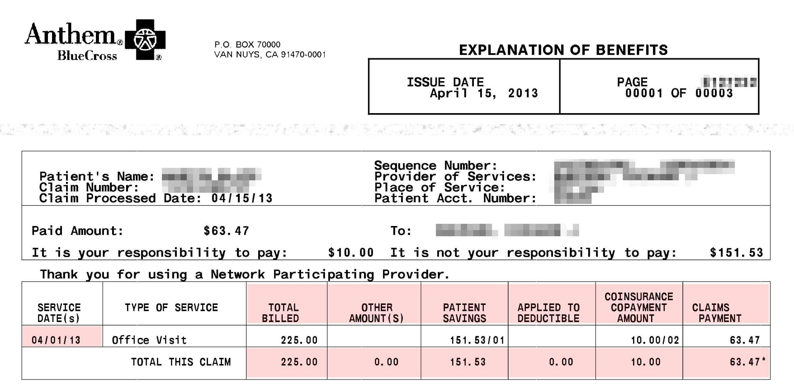
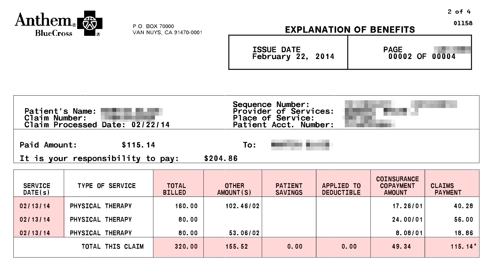

# 医疗费用<a id="title"></a>

[<u>Martin Blais</u>](mailto:blais@furius.ca)，2014年7月

*本文档尚未完成，是正在进行中的工作，尚未发布。*

为您的医疗费用记账与常规费用略有不同，因为您的保险计划施加了各种最高限额。在本节中，我们将假设美国的私人医疗保健系统，但相同的原则可能适用于其他国家（如果有任何不同，可能会更简单）。

### 无保险计划的记账方法——朴素的方法<a id="accounting-with-no-insurance-plan---the-naive-way"></a>

那么医疗费用有什么不同呢？您可能会认为它们应该与其他费用一样对待。比方说，我们可以定义一些类别，如下所示：

```plaintext
1973-04-27 open Expenses:Health:Medical
1973-04-27 open Expenses:Health:Dental
1973-04-27 open Expenses:Health:Vision
1973-04-27 open Expenses:Health:Drugs
1973-04-27 open Expenses:Health:Acupuncture
1973-04-27 open Expenses:Health:Massage-Therapy
1973-04-27 open Expenses:Health:Physical-Therapy
```

当您在这些类别中花费时，只需将款项流出记入这些类别：

```plaintext
2014-01-08 * "CityPT" "Copay for PT session w/ Rob on 12/28"
  Liabilities:US:BofA:Credit-Card     -25 USD
  Expenses:Health:Physical-Therapy     25 USD
```

事实上，如果您支付了所有的医疗费用，这种方法完全可行。如果这是您的情况，您应该这样做。这是直截了当的。

问题是，在实践中，大多数人并不自己支付医疗费用。您大多数的健康相关费用是由保险支付的。这并不意味着没有费用：您的保险通常只支付实际费用的一部分，具体取决于服务。特别是，根据您的保险计划，在任何日历年内，您需要支付100%的医疗费用，直到一个固定金额（通常是几百美元）。这称为*免赔额*。在此之后，您支付服务的一部分费用（*共付金额*），在达到更高的限额（*自付最高限额*）后，您就不再需要支付任何费用；有此类限额的计划保证您永远不会支付超过此金额的费用。

如果您将支付的免赔额金额记入账簿，那么收入报表中反映的费用规模将主要取决于您在1月1日之后*首先使用的服务类型*。这不会准确反映您使用的每项服务的成本。这没有太大用处。

### 记录现金支付——不正确的方法<a id="counting-the-cash-payments---the-incorrect-way"></a>

那么您可能会认为应该将这些款项的流出记入反映其真实性质的类别：

```plaintext
1973-04-27 open Expenses:Health:Medical:Deductible
1973-04-27 open Expenses:Health:Medical:Copayments
1973-04-27 open Expenses:Health:Vision:Deductible
1973-04-27 open Expenses:Health:Vision:Copayments
1973-04-27 open Expenses:Health:Dental:Deductible
1973-04-27 open Expenses:Health:Dental:Copayments
```

然后将支付款记入这些类别：

```plaintext
2014-01-08 * "CityPT" "Copay for PT session w/ Rob on 12/28"
  Liabilities:US:BofA:Credit-Card     -25 USD
  Expenses:Health:Medical:Copayments   25 USD
```

但这在很大程度上是不令人满意的，原因有几个：虽然这跟踪了免赔额和共付金额的总支付金额，但并没有反映任何关于使用了多少特定健康服务提供者的服务。

更重要的是，这是不正确的，因为免赔额和共付金额的限额适用于服务提供的日历年，而不是支付的年份。换句话说，如果您在2013年12月28日接受了服务，但在次年1月8日支付了费用，那么共付金额计入了错误的年份。为了正确处理，您必须在*服务日期*上累积免赔额和共付金额，这在您的保险公司提供的文件中（*利益解释*，稍后会详细介绍）总是提供的。服务日期是您实际上被提供者看诊的日期。

另一种解决方案是为每年定义账户，类似于税务账户（参见税务章节）：

```plaintext
2012-01-01 open Expenses:Health:Medical:Y2012:Deductible
2012-01-01 open Expenses:Health:Medical:Y2012:Copayments
2013-01-01 open Expenses:Health:Medical:Y2013:Deductible
2013-01-01 open Expenses:Health:Medical:Y2013:Copayments
2014-01-01 open Expenses:Health:Medical:Y2014:Deductible
2014-01-01 open Expenses:Health:Medical:Y2014:Copayments
2014-01-01 open Expenses:Health:Dental:Y2012:Deductible
2014-01-01 open Expenses:Health:Dental:Y2012:Copayments
```

然后在记账时，您可以使用服务接收年份对应的账户：

```plaintext
2014-01-08 * "CityPT" "Copay for PT session w/ Rob on 12/28"
  Liabilities:US:BofA:Credit-Card          -25 USD
  Expenses:Health:Medical:Y2013:Copayments  25 USD
```

然而，这不是一个好的解决方案，因为需要为每年创建大量账户，而且仍然不能告诉我们消耗了多少每种服务。我们显然需要一个更好的解决方案。

### 医疗保险支付的工作方式<a id="how-health-care-insurance-payments-work"></a>

让我们首先回顾一下保险支付的工作方式，因为需要对索赔支付有一个基本的了解，以正确计算这些费用。

对于每项服务，您的保险覆盖其一部分，您通常支付差额。这是怎么工作的呢？您的医生向保险公司发送账单，保险公司要么（a）直接向他们支付服务的覆盖部分，要么（b）保险公司给您寄一张支票，您需要签署给医生（通常在一些恼人的提醒后）。有时，但并非总是，您的保险公司会向您发送一份医生的索赔报告。该文件称为*利益解释*（“EOB”），详细说明了保险支付的服务部分、您需要支付的部分以及其他金额。没有与您的保险公司直接关系的服务提供者将需要此详细信息。这是一个有用的会计文件：请确保自己保留一份副本[^1]。

以下是 EOB 的一个示例，突出显示了重要的区域：



上面的示例显示了以下金额：

- **索赔金额。** 医生为服务向保险公司索要的金额。
- **患者节省。** 由于与提供者的预先谈判，服务费用降低的金额（对于网络内的提供者）。
- **应用于免赔额。** 您需要自己支付的本年度免赔额的一部分。您需要支付这部分费用。
- **共付金额。** 保险未覆盖的服务部分。您需要支付这部分费用。
- **索赔支付。** 保险实际向提供者发送的支付金额。

您保险公司提供的 EOB 上使用的术语可能略有不同，但您应该能够轻松找到相应的金额。

医生的账单部门然后会向您发送未覆盖部分的账单[^2]，您通过信用卡、支票或其他方式支付给他们。收到账单或 EOB 时将其视为应付款项。

总之，与索赔相关的有四个日期：

- **服务日期。** 您去医生办公室看诊的日期，接受服务的日期。这是计算免赔额和共付金额的相关日期。
- **发出日期。** 保险公司处理索赔的日期。您可以忽略此日期。
- **账单日期。** 提供者收到索赔支付并向您发出未支付部分账单的日期。我们也不太关心此日期。
- **支付日期。** 您进行支付的日期。此日期会自动显示在您的信用卡或支票账户对账单上，如果您使用现金支付，则需要手动输入（如同处理您关心的所有现金交易）。

引用任何索赔时，最重要的日期是*服务日期*。如果您扫描并将 EOB 文件保存为文档，建议在文件名中包含此日期。

### 提供者网络<a id="provider-networks"></a>

在美国，每位医疗专业人员（或“服务提供者”）决定是否与每个保险公司建立预先安排的协议，取决于他们的支付费率以及支付账单的难易程度。当他们这样做时，他们被保险公司视为“网络内提供者”。否则，他们被视为“网络外提供者”，保险覆盖的服务比例要小得多。这是唯一的区别。在选择保险计划时，保险网络中的提供者列表——以及他们拒绝支付账单的难易程度——通常是一个重要考虑因素，对于有选择权的人来说。

但是，由于大多数雇主通过支付员工的医疗保险费用来竞争福利，并且由于他们通常能够比个人获得更好的保险费率，因为他们代表了大量客户（员工），大多数有工作的人的最终选择是他们雇主的计划，然后尽量选择网络内的提供者。然而，这并不总是可能的：您的家庭医生可能会在一年中决定停止接受您的保险作为网络内提供者，而您可能更愿意维持与医生的既有关系，而不是更换，因此您最终需要支付更多费用。底线是，在典型的一年中，您通常会使用一些网络内和网络外专业人员的服务，并且必须为这些费用进行会计处理。

### 在服务日期上累积——正确的方法<a id="accruing-on-service-date---the-correct-way"></a>

理想情况下，我们希望获得以下金额的余额：

- 每项服务的费用，无论由谁支付
- 每个日历年中使用的免赔额和共付金额

我们将输入两笔条目：

1. 每个 EOB 的条目，在服务日期，我们获得应付款。
2. 每次支付的条目，从*资产*或*负债*账户中支出。

#### 网络内提供者<a id="in-network-providers"></a>

对于网络内提供者，一个典型条目如下所示：

```plaintext
2013-04-01 * "DR RAPPOPORT" "Office visit" ^anthem-claim-8765937424
  Expenses:Health:Medical:Claims            225.00 USD
  Expenses:Health:Medical:PatientSavings   -151.53 USD
  Liabilities:US:Accounts-Payable           -10.00 USD ; Copay
  Expenses:Health:Medical:ClaimsPayment     -63.47 USD
```

一旦您弄清楚从这些 EOB 中提取哪些数字，输入其他条目会变得更简单，因为它们非常规则且都看起来相似。

请注意，网络内 EOB 将包括一个“患者节省”金额。这反映了由于您的保险计划选择而支付的较低费用。（实际上，这有点烟雾弹，因为医生提出的索赔金额通常会被夸大，以反映他们实际得到的支付金额，但我认为保险公司仍然喜欢向您展示这些。）

我喜欢立即将未支付部分反映为“应付款项”负债，这告诉我我已将其注册为即将到来的支付：

```plaintext
1973-04-27 open Liabilities:US:Accounts-Payable
```

然后，当您的信用卡导入时，输入支付条目以消除此应付款：

```plaintext
2014-01-08 * "Rappoport Medical Office" ^anthem-claim-8765937424
  Liabilities:US:BofA:Credit-Card     -10.00 USD
  Liabilities:US:Accounts-Payable      10.00 USD
```

注意如何用“`^anthem-claim-8765937424`”将这两笔交易链接在一起，以便以后可以轻松找到并验证。

对于网络内医生，由于保险支付通常是可预测的，医生办公室有时会在您访问当天要求共付金额。只需将其作为现金条目记入相同的负债账户。

如果您定期拜访某个医生，可以为他们创建专门的负债账户：

```plaintext
2009-09-17 open Liabilities:US:Accounts-Payable:DrRappoport
```

#### 网络外提供者<a id="out-of-network-providers"></a>

对于网络外提供者，EOB 稍有不同：



我们注意到有一个“其他金额”部分，实际上是提供者将撇销的金额，而患者节省部分为空。

与此 EOB 对应的典型条目如下所示：

```plaintext
2014-02-13 * "ROB BOONAN" "Physical Therapy" ^anthem-claim-17646398
  Expenses:Health:PhysicalTherapy:Claims           320.00 USD
  Expenses:Health:PhysicalTherapy:ClaimsPayment   -115.14 USD
  Expenses:Health:PhysicalTherapy:Uncovered       -155.52 USD
  Liabilities:US:Accounts-Payable:CityPT           -49.34 USD
```

您通常会收到服务提供者支付的支票（在示例中是 115.14 美元的支票），并需要将其寄给他们。您可以立即存入支票并用信用卡支付全额，或者将支票寄出并只支付差额（这是大多数人做的事情）：

```plaintext
2014-01-08 * "City PhysioTherapy" ^anthem-claim-17646398
  Liabilities:US:BofA:Credit-Card            -49.34 USD
  Liabilities:US:Accounts-Payable:CityPT      49.34 USD
```

一个有趣的情况是，许多网络外提供者会接受保险公司为网络外服务支付的较低金额并撇销多余的金额，或者只收取名义金额。例如，我最喜欢的物理治疗诊所的“协议”是每次治疗收取 25 美元。再次强调，索赔金额被夸大了，当然，保险公司表示您需要支付的金额也需要大部分撇销。这就是您如何记录这样的 EOB 条目：

```plaintext
2014-02-13 * "ROB BOONAN" "Physical Therapy" ^anthem-claim-17646398
  Expenses:Health:PhysicalTherapy:Claims           320.00 USD
  Expenses:Health:PhysicalTherapy:ClaimsPayment   -115.14 USD
  Liabilities:US:Accounts-Payable:CityPT           -25.00 USD
  Expenses:Health:PhysicalTherapy:WriteOffs
```

提供者的管理员不会在每次访问时收费。她会累计金额，决定处理她的会计时，总共收取费用，这将账户清零。这可能如下所示：

```plaintext
2014-02-26 * "Payment for 3 Physical Therapy treatments"
  Liabilities:US:BofA:CreditCard             -75.00 USD
  Liabilities:US:Accounts-Payable:CityPT
```

### 跟踪免赔额和共付金额限额<a id="tracking-deductible-and-copayment-limits"></a>

如前所述，您为医疗服务支付的金额有限制。这些限额按日历年应用，因此需要在服务日期应用。出于这个原因，我们可以将相应的条目附加到 EOB 条目，然后按年份筛选交易以计算该年份的余额。

我喜欢跟踪这些限额并确保它们得到正确应用。根据我的保险计划，限额定义如下：

- **免赔额。** “您在保险开始支付覆盖服务之前在一个日历年内自掏腰包支付的金额。”
- **自付最高限额。** “您在一个日历年内为覆盖的医疗服务自掏腰包支付的最高金额。有些项目不包括在内，例如处方药和某些服务。”
- **共付金额。** “您为服务支付的固定费用。此费用不随服务实际成本而变化。”

然而，这并不简单，因为对于网络内和网络外提供者，有不同的免赔额和共付金额限额：

- 为网络内免赔额支付的金额计入网络外免赔额限额。
- 为网络内共付金额支付的金额计入网络外共付金额限额。
- 为免赔额支付的金额计入共付金额限额。

我使用在另一个文档中描述的“镜像会计”技术来实现这一点。其想法是使用另一种货币来计算这些金额。

***TODO: 完成此部分***

### 保险费<a id="insurance-premiums"></a>

然后，您需要跟踪在保险费上的支出。这些是您定期支付的固定金额——通常直接从工资中扣除——以获得保险单。如同大多数在美国有工作的人的情况，我的雇主提供一些健康覆盖计划并支付大部分费用，但总有一部分需要我自己支付：

```plaintext
1973-04-27 open Expenses:Health:Insurance
```

在工资单条目中会自动扣除固定的保险费，如工资单上所示：

```plaintext
2014-02-08 * "Acme Corp - Salary"
  …
  Expenses:Health:Insurance        42.45 USD
  …
```

在您的工资单上，请注意不要将其与“Medicare tax”混淆，这是用于支付美国为老年人提供的少量社会化医疗费用的税。这只是一种税，与您的医疗费用没有多大关系。

### 药物<a id="drugs"></a>

药物单独记账。

***TODO: 完成此部分***

[^1]: 您并不总是通过邮件收到这些文件，但保险公司现在终于推出了可以下载所有代表您提出的索赔的网页（并进行记账），即使那些没有邮寄给您的索赔也可以下载。

[^2]: 这是一个巨大的麻烦，因为每个医生都有不同的账单部门，它们通常是过时的，在线支付选项几乎总是有问题（您最终不得不打电话说服一个脾气暴躁的管理员通过信用卡支付，因为他们仍然习惯接受*支票*），而且所有与您提供健康服务的不同服务提供者将分别向您收取费用（也有不同的账单部门）。例如，如果您进行手术，在接下来的 6 个月中，您可以期望收到来自您的外科医生、他的助理、麻醉师、监测您在睡眠中大脑活动的人、做血液检查的实验室、读取 X 光片的人等的不同账单。这些账单可能会在手术后 6 个月以上发出，直到次年。简直是卡夫卡式的。您不得不想知道为什么保险公司不总是全额支付服务提供者，然后只向*您*收取一次免赔额。这会使流程更加简单，并减少管理医疗的高昂成本。
