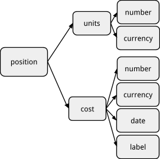

# 库存的工作原理<a id="title"></a>

[<u>Martin Blais</u>](mailto:blais@furius.ca)，2016年12月

[<u>http://furius.ca/beancount/doc/booking</u>](http://furius.ca/beancount/doc/booking)

*本文档解释了我们如何积累商品并将销售（减少）与累积库存内容匹配。*

## 介绍<a id="introduction"></a>

除了能够跟踪和列出记入每个账户的过账（生成一个条目的*日记账*操作）外，Beancount 最常见和有用的操作之一是汇总任意一组过账的头寸。这些聚合是 Beancount 的核心功能，由一个称为“库存”的对象实现。本文档解释了这个聚合过程的工作原理。如果您要跟踪投资，有必要理解以下内容。

## 匹配和预订方法<a id="matches-booking-methods"></a>

为了了解全貌，让我们通过简单的示例来了解各种预订功能。这应该能一次性让您接触到所有主要概念。

### 简单过账 —— 无成本<a id="simple-postings-no-cost"></a>

考虑一个账户的一组简单过账，例如：

```plaintext
2016-04-24 * "存入支票"
  Assets:Bank:Checking      221.23 USD
  … 

2016-04-29 * "ATM 提款"
  Assets:Bank:Checking     -100.00 USD
  … 

2016-04-29 * "借记卡支付"
  Assets:Bank:Checking      -45.67 USD
  … 
```

支票账户的库存开始时为空。在第一次交易后，其内容为 221.23 美元。第二次交易后，为 121.23 美元。最后，第三次交易使余额变为 75.56 美元。这看起来很自然；数字只是相加。

这可能显而易见，但请注意，数字可以改变符号（变为负数）。

### 多种商品<a id="multiple-commodities"></a>

一个库存可能包含多种商品。它相当于从商品到某些数量的映射。例如，

```plaintext
2016-07-24 * "离开纽约前的晚餐"
  Expenses:Restaurants     34.58 USD
  … 

2016-07-26 * "降落后与朋友共进晚餐"
  Expenses:Restaurants     62.11 CAD
  … 
```

在这两次交易之后，餐厅账户包含 34.58 美元和 62.11 加元。它的内容被称为混合商品。当然，过账仅应用于它们影响的货币。例如，以下交易：

```plaintext
2016-07-27 * "早午餐"
  Expenses:Restaurants     23.91 CAD
  … 
```

使该账户的余额变为 34.58 美元和 86.02 加元。美元的单位数未变。

请注意，账户可以包含任意数量的商品，这对于按成本持有的商品也是如此，我们稍后会看到。虽然这是可能的，但我建议您定义足够的账户以保持每个账户仅包含一种商品；可以使用“[<u>onecommodity</u>](http://github.com/beancount/beancount/tree/master/beancount/plugins/onecommodity.py)”插件强制执行这一点。

### 成本基础<a id="cost-basis"></a>

当我们考虑以成本基础跟踪投资时，事情会变得有些复杂。Beancount 允许您将成本基础和可选标签与特定的已购入批次相关联。考虑以下对投资账户的两次购买：

```plaintext
2015-04-01 * "四月购买一些 Hooli 股票"
  Assets:Invest            25 HOOL {23.00 USD, "first-lot"}
  … 

2015-05-01 * "五月购买更多 Hooli 股票"
  Assets:Invest            35 HOOL {27.00 USD}
  … 
```

现在，投资账户的库存包含：

```plaintext
          units ccy   cost  cost-ccy lot-date    label
             25 HOOL {23.00 USD,     2015-04-01, "first-lot"}
             35 HOOL {27.00 USD,     2015-05-01, None}
```

这两个批次没有合并，它们在库存中仍然是两个独立的头寸。库存仅在商品及其*所有*成本属性完全匹配时才会将批次合并并调整单位数。（实际上，两次增加具有相同成本和日期属性的情况非常罕见。）

请注意，Beancount 自动将购入日期与每个批次相关联；如果需要，可以通过添加类似于可选标签的日期来覆盖它。这在进行成本基础调整时很有用。

将*增加*库存内容的过账称为**增加**。

### 减少<a id="reductions"></a>

但是我们如何从库存中移除商品呢？

您可以通过出售其中的一部分来消耗现有批次。您可以通过将**减少**过账记入账户来做到这一点，例如：

```plaintext
2015-05-15 * "卖出一些股票"
  Assets:Invest           -12 HOOL {23.00 USD}
  … 
```

为了清楚起见，使此过账成为**减少**的原因仅仅是因为符号（-）与该商品账户余额（+25）相反。此过账告诉 Beancount 查找所有成本基础为 23.00 美元的批次并从中移除 12 个单位。结果库存将是：

```plaintext
          units ccy   cost  cost-ccy lot-date    label
             13 HOOL {23.00 USD,     2015-04-01, "first-lot"}
             35 HOOL {27.00 USD,     2015-05-01, None}
```

请注意，第一个过账减少了 12 个单位。我们不必指定所有批次的属性，只需成本即可。我们也可以使用日期来指定减少哪个批次：

```plaintext
2015-05-15 * "卖出一些股票"
  Assets:Invest           -12 HOOL {2015-04-01}
  … 
```

或标签：

```plaintext
2015-05-15 * "卖出一些股票"
  Assets:Invest           -12 HOOL {"first-lot"}
  … 
```

或这些的组合。任何属性的组合都将与库存内容匹配，以查找要减少的批次。事实上，如果库存中只有一个批次，您可以这样减少：

```plaintext
2015-05-15 * "卖出一些股票"
  Assets:Invest           -12 HOOL {}
  … 
```

### 模糊匹配<a id="ambiguous-matches"></a>

但是，如果多个批次匹配减少怎么办？例如，使用包含两个批次的先前库存，如果您这样写出售：

```plaintext
2015-05-15 * "卖出一些股票"
  Assets:Invest           -12 HOOL {}
  … 
```

Beancount 将无法确定需要减少哪个批次。我们有一个模糊匹配。

部分模糊匹配也是可能的。例如，如果您有以下库存要减少：

```plaintext
          units ccy   cost  cost-ccy lot-date    label
             25 HOOL {23.00 USD,     2015-04-01, None}
             30 HOOL {25.00 USD,     2015-04-01, None}
             35 HOOL {27.00 USD,     2015-05-01, None}
```

并尝试这样减少：

```plaintext
2015-05-15 * "卖出一些股票"
  Assets:Invest           -12 HOOL {2015-04-01}
  … 
```

前两个批次被选择为匹配项。

### 严格预订<a id="strict-booking"></a>

Beancount 如何处理模糊匹配？默认情况下，它会发出错误。

更准确地说，Beancount 调用**预订方法**，根据设置的方式处理模糊匹配。默认的预订方法是“**STRICT**”，它只是放弃并吐出一个错误，告诉您需要完善输入以消除库存减少的歧义。

### 先进先出和后进先出预订<a id="fifo-and-lifo-booking"></a>

还有其他预订方法。可以使用选项进行配置，如下所示：

```plaintext
option "booking_method" "FIFO"
```

“**FIFO**”方法自动选择匹配批次中最旧的批次，直到完成所请求的减少。例如，给定我们之前的库存：

```plaintext
          units ccy   cost  cost-ccy lot-date    label
             25 HOOL {23.00 USD,     2015-04-01, "first-lot"}
             35 HOOL {27.00 USD,     2015-05-01, None}
```

尝试减少 28 股，如下所示：

```plaintext
2015-05-15 * "卖出一些股票"
  Assets:Invest           -28 HOOL {}
  … 
```

将匹配两个批次，完全减少第一个批次至零单位，并从第二个批次中移除剩余的 3 个单位，结果库存如下：

```plaintext
          units ccy   cost  cost-ccy lot-date    label
             32 HOOL {27.00 USD,     2015-05-01, None}
```

“LIFO”方法类似，但首先消耗最新的（最近的）批次，向后移除。

### 每个账户的预订方法<a id="per-account-booking-method"></a>

您不必让所有账户都遵循相同的预订方法；上一节中的选项设置了所有账户的默认方法。要覆盖特定账户的预订方法，可以在账户的 Open 指令上使用可选字符串选项，如下所示：

```plaintext
2014-01-01 open Assets:Invest    "FIFO"
```

这允许您对不同的账户使用不同的预订解析方式。

### 总匹配<a id="total-matches"></a>

严格预订有一个例外：如果整个库存按完全相同的单位总数减少，则很明显所有匹配批次都将被选择，这在“STRICT”预订下被视为不模糊。例如，在“STRICT”预订下，此减少将清空之前的库存而不会引发错误，因为有 25 + 35 股匹配：

```plaintext
2015-05-15 * "卖出我所有的股票"
  Assets:Invest           -60 HOOL {}
  … 
```

### 平均预订<a id="average-booking"></a>

政府激励计划创建的退休账户（如美国的 401k 计划或加拿大的 RRSP）通常由税前资金组成。对于这些类型的账户，通常经纪公司忽略成本基础的计算，因为税收将在将资金分配到账户外时进行。这些账户通常被充分管理以使其完全投资；因此，费用通常以投资组合的份额支付，按支付费用当天的价格计算。这使得跟踪单个批次的成本基础变得尴尬。

正确的处理方法是分别对每种商品的整个批次集的单位数和成本基础进行处理。例如，以下两笔交易：

```plaintext
2016-07-28 * "购买一些退休基金的股票"
  Assets:Invest       45.0045 VBMPX {11.11 USD}
  … 

2016-10-12 * "购买一些退休基金的股票"
  Assets:Invest       54.5951 VBMPX {10.99 USD}
  … 
```

应该产生一个总单位数和平均成本的单一批次：

```plaintext
          units ccy    cost    cost-ccy lot-date    label
        99.5996 VBMPX {11.0442 USD,     2016-07-28, None}
```

在此账户中收取的费用可能如下所示：

```plaintext
2016-12-30 * "季度管理费"
  Assets:Invest       -1.4154 VBMPX {10.59 USD}
  Expenses:Fees
```

即使单位数为负数，单位和成本也会分别累积：

```plaintext
          units ccy    cost    cost-ccy lot-date    label
        98.1842 VBMPX {11.0508 USD,     2016-07-28, None}
```

这个功能在 Beancount 中尚未支持；实现起来相当棘手，将在未来的小版本中实现。

### 无预订<a id="no-booking"></a>

然而，同时有另一种处理非应税账户的方法：您可以简单地禁用预订。有一种称为“**NONE**”的预订方法，它实现了一种非常宽松的策略，接受任何新批次。新批次总是无条件地附加到库存中。使用这种策略，前一节中的交易将导致以下库存：

```plaintext
          units ccy    cost  cost-ccy lot-date    label
        45.0045 VBMPX {11.11 USD,     2016-07-28, None}
        54.5951 VBMPX {10.99 USD,     2016-10-12, None}
        -1.4154 VBMPX {10.59 USD,     2016-12-30, None}
```

观察结果库存具有混合符号；通常这是不允许的，但在这种退化的预订方法下是容忍的。请注意，在这种方法下，唯一有意义的值是*总*单位数和*总*或*平均*成本金额。单个批次实际上不是批次，它们只是对该账户进行的所有过账的列表。

注意：如果您熟悉 Ledger，这是它支持的默认且唯一的预订方法。

## 总结<a id="summary"></a>

总之，这里是我们在演练中介绍的内容。*增加*从不成问题；它们总是向现有库存添加新的头寸。另一方面，*减少*可能会产生以下结果：

- **单一匹配。** 只有一个头寸匹配减少；它减少。
- **总匹配。** 请求的单位总数匹配匹配头寸的单位总数。这些头寸减少。
- **无匹配。** 没有头寸匹配减少过账。引发错误。
- **模糊匹配。** 库存中的多个头寸匹配减少过账；*调用预订方法来处理这种情况*。

有几种预订方法可以处理最后一种情况：

- **STRICT。** 引发错误。
- **FIFO。** 从最早的批次中选择单位，直到减少完成。
- **LIFO。** 从最新的批次中选择单位，直到减少完成。
- **AVERAGE。** 每次减少后，合并受影响商品的所有单位，并重新计算其新的平均成本。
- **NONE。** 禁用预订；减少的批次仅添加到库存中。这导致库存混合符号，唯一有意义的数字是总单位数和总成本基础。

Beancount 为所有账户提供默认的预订方法，可以使用选项覆盖：

```plaintext
option "booking_method" "FIFO"
```

预订方法的默认值是“STRICT”。我建议您保持这种方式，并为特定账户覆盖预订方法。

可以通过在账户的 Open 指令中添加字符串来为每个账户指定方法：

```plaintext
2016-05-01 open Assets:Vanguard:RGAGX  "AVERAGE"
```

## 价格的使用方式<a id="how-prices-are-used"></a>

简短的回答是，价格不用于预订算法，也不影响预订算法。然而，在这种情况下讨论它们的作用是相关的，因为用户总是对它们的解释感到困惑。

价格有两个用例：在商品之间进行转换和标记减少批次的销售价格以记录并可选地平衡收益。

### 商品转换<a id="commodity-conversions"></a>

转换用于将一种货币兑换为另一种货币。它们如下所示：

```plaintext
2016-04-24 * "存入支票"
  Assets:Bank:Checking      220.00 USD @ 1.3 CAD
  Income:Payment           -286.00 CAD
```

为了将其与支票账户库存进行预订，带有价格的过账被视为与没有价格时相同：支票账户只是收到 220.00 单位的美元存款，并将与商品“USD”的头寸匹配。价格仅用于验证交易是否平衡，并确保遵守复式记账规则（220.00 x 1.3 CAD + -286.00 CAD = 0.00）。它在修改库存内容时被忽略。从某种意义上说，在过账应用到账户库存后，价格被遗忘，库存余额不再记得存款是从转换中发生的。

### 价格与成本基础<a id="price-vs.-cost-basis"></a>

如果存在成本基础规范，价格是如何使用的？例如：

```plaintext
2015-05-15 * "卖出一些股票"
  Assets:Invest:HOOL           -12 HOOL {23.00 USD} @ 24.70 USD
  Assets:Invest:Cash        296.40 USD
  Income:Invest:Gains
```

答案常常让许多用户感到惊讶：如果有成本基础，平衡算法不会使用价格；使用的是成本基础。这是一个有用的属性，使我们能够自动计算资本收益。在前面的示例中，平衡算法将计算 -12 x 23.00 + 296.40 = -20.40 USD，这是资本收益，（24.70 - 23.00） \* 12。它会完成最后的过账并为其分配这个值。

一般来说，销售利润的计算方法是权衡收益，即现金存款，与所售批次的成本基础，这足以确定收益差异。此外，如果一个*增加*过账恰好附有价格注释，也不会使用该价格。

价格是您的记录的注释。它保持附加在过账对象上，如果您想以某种方式使用它，您可以编写一些 Python 代码。有两个插件已经使用了这个注释：

- **<u>beancount.plugins.implicit\_prices</u>**：此插件将附加在过账上的价格自动创建并插入价格指令，以便填充全局价格数据库。
- **<u>beancount.plugins.sellgains</u>**：此插件实现了额外的平衡检查：它使用价格计算预期收益，并将其与交易的所有其他过账（不包括收入账户的任何过账）进行权衡。在我们的示例中，它将检查（-12 x 24.70 + 296.40）= 0。这提供了另一种验证输入正确性的方法。

有关此主题的更多详细信息，请参阅[<u>使用 Beancount 进行交易</u>](trading_with_beancount.md)文档。

## 交易<a id="trades"></a>

购买某项资产并将其卖回的组合被称为“交易”。在 Beancount 中，我们仅将具有成本基础的资产视为交易的对象。由于在预订过程中对累积库存内容进行减少，因此应在此记录和记录交易。

截至目前（2016 年 12 月），交易记录尚未实施。

以前已经测试过一些原型，我相信很容易在不久的将来添加这一功能。这将在此处记录。请关注此处。

交易的实现方式是允许预订过程在增量和减量过账中插入带有唯一 UUID 的匹配元数据。在交易流中，提供可以轻松提取每个减少过账的匹配对并以不同方式筛选它们的功能和报告。最终，应该能够将所有交易列表提取到表格中，包含购入和出售价格以及其他费用。

## 调试预订问题<a id="debugging-booking-issues"></a>

如果您在记录销售时遇到匹配过程的问题，可以使用工具查看应用交易前后账户的详细库存内容。为此，您可以使用 bean-doctor 命令。通过提供文件名和接近您要选择的交易的行号来调用程序，如下所示：

```plaintext
bean-doctor context <filename> <line-no>
```

生成的输出将显示应用交易前所有受影响账户的库存内容列表，包括成本基础、购入日期和可选标签完全呈现。请注意，一些失败通常通过丢弃无效交易的效果来处理（但从不悄悄地处理）。

从 Emacs 或 VI 中，将光标放置在交易附近并调用相应命令是调用命令的最简单方法，因为它会自动插入行号。

## 附录<a id="appendix"></a>

本文档的其余部分深入探讨了更多技术细节。如果您对 Beancount 的工作原理感兴趣，可以忽略这些内容。这不是理解 Beancount 的必要阅读内容。只有在您感兴趣的情况下才去关注。

### 数据表示<a id="data-representation"></a>

了解库存对象中头寸的表示方式是有用的。*头寸*本质上是某种商品的若干单位，具有一些关于其购入的可选信息：

- **成本。** 其每单位购入成本（“成本基础”）。
- **日期。** 购入单位的日期。
- **标签。** 一些用户指定的标签，可以用来引用该批次。

我们通常将这些头寸对象称为“批次”或“腿”。图示，一个头寸对象如下所示：



头寸对象的结构。

有两种不同类型的头寸，详细讨论如下：

- **简单头寸。** 这些是没有成本基础的头寸。“成本”属性设置为 null 值。（在 Python 中为“`None`”。）
- **按成本持有的头寸。** 这些是具有相关成本基础和购入详细信息的头寸。

*库存*只是这些头寸的积累，表示为一个列表。我们有时会谈论*前库存*，指应用交易的过账之前的库存内容，*后库存*指应用交易的过账之后的库存内容。

*过账*是一个对象，它是头寸的超集：除了单位和成本外，它还具有相关的账户和可选的价格属性。如果存在，价格与单位具有相同的类型。它表示输入中的交易的一个部分。过账暗示头寸，这些头寸被添加到库存中。我们可以说一个头寸被*过账*到一个账户中。

有关 Beancount 中使用的内部数据结构的更多详细信息，请参阅[<u>设计文档</u>](beancount_design_doc.md)，其中进一步扩展了此主题。

### 为什么预订并不简单<a id="why-booking-is-not-simple"></a>

当我们考虑如何跟踪各种批次的成本基础时，减少过程的复杂性显现出来。为了演示其工作原理，让我们考虑一个简单的示例，我们将在不同章节中重复使用：

- 4 月 1 日以每股 23 美元购买 25 股。
- 5 月 1 日以每股 27 美元购买 35 股。
- 5 月 15 日出售 30 股；当时价格为每股 26 美元。

暂时忽略佣金，它们不会引入额外的复杂性。在 Beancount 中，此场景将记录如下：

```plaintext
2015-04-01 * "四月购买一些 Hooli 股票"
  Assets:Invest:HOOL            25 HOOL {23.00 USD}
  Assets:Invest:Cash       -575.00 USD

2015-05-01 * "五月购买更多 Hooli 股票"
  Assets:Invest:HOOL            35 HOOL {27.00 USD}
  Assets:Invest:Cash       -945.00 USD

2015-05-15 * "卖出 30 股"
  Assets:Invest:HOOL           -30 HOOL {...} @ 26.00 USD
  Assets:Invest:Cash        780.00 USD
  Income:Invest:HOOL:Gains
```

现在，整个问题围绕着*选择*哪些股票进行出售。我将此输入呈现为红色省略号（“…”）。用户在该位置输入的内容将用于确定我们要使用的批次。

我们选择的待售批次将决定收益金额，因为这是这些股票成本基础的函数。这就是为什么这很重要。

### 增加与减少<a id="augmentations-vs.-reductions"></a>

最重要的观察是，有两种看起来非常相似但处理方式截然不同的批次规范。

当我们购买时，如上面的第一次交易，{…} 成本基础语法为 Beancount 提供有关*新*批次的信息：

```plaintext
2015-05-01 * "五月购买更多 Hooli 股票"
  Assets:Invest:HOOL            35 HOOL {27.00 USD}
  Assets:Invest:Cash       -945.00 USD
```

我们称此为库存的“增加”，因为它将简单地向其中添加一个新头寸。您提供的**成本基础**附加到此头寸并随时间保留在库存中。此外，还有一些其他数据可以为增加批次提供。让我们看一下成本规范中可以提供的所有数据：

- **成本基础。** 这是每单位和总成本数——合并为单个每单位数字——和一种货币。
- **购入日期。** 批次有一个购入日期。默认情况下，其父交易的日期将自动设置为其购入日期。您可以提供一个日期来覆盖此日期。这在处理股票分割或洗售时很有用，可以保留替代股票的原始购入日期。
- **标签。** 您可以为其提供唯一标签，以便以后在出售部分或全部时更容易引用它。
- **合并。** 指示器（标志），指示批次应合并（这对稍后将实施的平均成本预订非常有用）。

对于**增加过账**，这些信息必须提供或自动推断。它们可以按任何顺序提供：

```plaintext
2015-05-01 * "五月购买更多 Hooli 股票"
  Assets:Invest:HOOL            35 HOOL {2015-04-25, 27.00 USD, "hooli-123"}
  Assets:Invest:Cash       -945.00 USD
```

如果省略日期，交易的日期将附加到它。如果省略成本，其余过账必须填充，以便从中推断出成本金额。由于标签是可选的，因此未指定的标签字段保留为 null 值。

您可能想知道为什么允许覆盖增加的日期；这在进行成本基础调整以保留过账的原始购入日期时很有用：您移除过账，然后使用其原始日期和新的成本基础替换它。

现在，当我们出售这些股票时，我们将其称为**“减少”过账**，即“**减少**”。请注意，“增加”和“减少”只是我在设计 Beancount 处理库存时提出的术语；它们不是一般的会计术语。

这是“减少”因为我们正在从其交易日期之前累计的库存中移除股票。例如，如果我们要从 35 股批次中出售 30 股，输入可能如下所示：

```plaintext
2015-05-15 * "卖出 30 股"
  Assets:Invest:HOOL           -30 HOOL {27.00 USD} @ 26.00 USD
  Assets:Invest:Cash        780.00 USD
  Income:Invest:HOOL:Gains
```

虽然输入看起来与增加过账相同，但 Beancount 处理此过账的方式完全不同：它查看应用交易之前的账户库存状态，并查找与您提供的批次数据匹配的所有头寸。然后，它使用匹配批次的详细信息作为减少过账的信息。

在此示例中，它将简单地匹配所有成本基础为 27.00 美元的头寸。此示例的库存包含一个 35 股，成本为 27.00 美元的批次，因此只有一个头寸匹配，并且该批次减少 30 股，剩余 5 股。稍后我们将看到在多个批次匹配规范的情况下会发生什么。

请注意，您可以提供其他批次信息子集进行匹配，例如只提供标签，例如：

```plaintext
2015-05-15 * "卖出 30 股"
  Assets:Invest:HOOL           -30 HOOL {"hooli-123"} @ 26.00 USD
  Assets:Invest:Cash        780.00 USD
  Income:Invest:HOOL:Gains
```

这也是识别要减少的特定批次的有效方法。如果在这里提供日期，它也只用于匹配库存内容，以消除不同日期购入批次之间的歧义，而不是将日期附加到任何地方。此外，如果库存中只有一个批次，您也可以只提供一个空的成本基础规范，如“`{}`”。下一节中的预订方法部分将详细讨论匹配模糊时会发生什么。

总之：

- 当您向账户库存中添加内容（增加）时，您提供的信息用于创建新批次并附加到其中。
- 当您从账户库存中移除内容（减少）时，您提供的信息用于过滤库存内容，以选择要减少的批次，并填写选定批次的信息。

### 同质和混合库存<a id="homogeneous-and-mixed-inventories"></a>

到目前为止的示例和文档中的绝大多数示例中，“增加”意味着添加正数的股票。但是在 Beancount 中，许多账户通常具有负余额，例如负债账户。问一下是否有意义在成本基础上持有负余额的商品是公平的。

答案是肯定的。这些对应于“空头”头寸。大多数人不太可能做空，但 Beancount 库存支持它。我们如何定义“增加”与特定商品的现有批次余额有关。例如，如果一个账户的库存包含以下头寸：

```plaintext
        25 HOOL {23.00 USD, 2016-04-01}
        35 HOOL {27.00 USD, 2016-05-01}
```

那么“添加”意味着正数的股票。另一方面，如果账户中仅包含空头头寸，如下所示：

```plaintext
       -20 HOOL {23.00 USD, 2016-04-15}
       -10 HOOL {27.00 USD, 2016-05-15}
```

那么“添加”意味着负数的股票，而“减少”将通过匹配正数的股票来进行。

上面描绘的两个库存在 HOOL 单位方面是同质的，即所有头寸的符号相同。在大多数预订方法中，我们将看到 Beancount 使创建非同质或“混合”库存变得不可能。但是“NONE”方法允许这样做。例如，混合库存可能具有以下内容：

```plaintext
        25 HOOL {23.00 USD, 2016-04-01}
       -20 HOOL {23.00 USD, 2016-04-15}
```

如您所料，“增加”或“减少”的概念仅适用于同质库存。

### 原始提案<a id="original-proposal"></a>

如果您对导致此实现的设计文档感兴趣，可以在[<u>这里</u>](a_proposal_for_an_improvement_on_inventory_booking.md)找到该文档。我希望最终的实现足够简单但通用。
