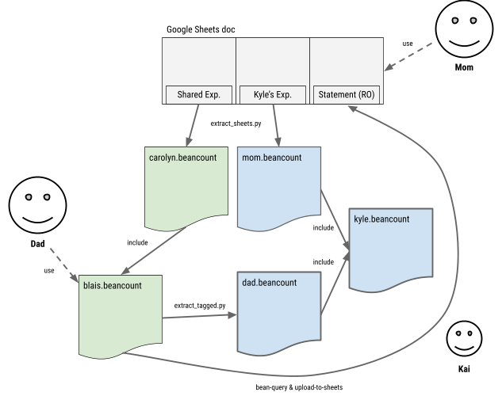

# 我们如何分担费用<a id="title"></a>

*本文档解释了我和我妻子如何分担费用。这有点复杂，我开发了一个好的工作系统，但对于大多数人来说，这不是一个简单的过程，所以我决定花时间描述它，以帮助其他人设计类似的流程。*

## 背景<a id="context"></a>

我们都是在职的专业人士，决定大致以70%/30%的比例分担所有费用。这是我们的目标，这不是一个硬性规则，但我们跟踪它就像它是一个严格的规则，并接受它作为一个好的近似值。我们有两种类型的共享费用：

- **共享费用。** 我们之间的共同费用，例如房租，与朋友外出就餐等。
- **Kyle 的费用。** 我们孩子的费用，例如托儿所、尿布、保姆、婴儿食品。

这些费用处理方式非常不同，因为我们将孩子的费用作为一个单独的项目来处理。（如果您更喜欢图示，在本文档的结尾有一个系统概述的图表。）

## 共享费用<a id="shared-expenses"></a>

对于我们的共享费用，我在我的个人账本文件中为她维护一个账户。这很简单，我并不太感兴趣为我们所有的共同费用维护一个单独的账本。对我来说，只需跟踪她在那个账户上的余额就足够了。您可以将那个账户想象成一张信用卡（我是信用提供者），她通过转账以及自己产生的共享费用来偿还。

我只需在我的个人账本（`blais.beancount`）中声明一个 `Assets:US:Share:Carolyn` 账户。

### 我的共享费用<a id="my-shared-expenses"></a>

每当我产生一笔费用是为我们两个人支付时，我会正常记账，但我会用 \#carolyn 标签标记它：

```plaintext
2018-12-23 * "WHISK" "Water refill" #carolyn
  Liabilities:US:Amex:BlueCash  -32.66 USD
  Expenses:Food:Grocery
```

这会自动转换为：

```plaintext
2018-12-23 * "WHISK" "Water refill" #carolyn
  Liabilities:US:Amex:BlueCash  -32.66 USD
  Expenses:Food:Grocery          19.60 USD
  Assets:US:Share:Carolyn       13.06 USD
    share: TRUE
```

这是通过我编写的[自定义插件](https://github.com/beancount/beancount/tree/master/experiments/sharing)实现的，该插件根据我们之间的一些规则分割费用（参见[这个 Akkukis 的插件](https://github.com/Akuukis/beancount_share)）。在这个例子中，32.66 美元的 40%（13.06 美元）被重新分配到她的账户。请注意，对于我来说，这是一个资产账户，因为她欠这笔钱。

### 她的共享费用<a id="her-shared-expenses"></a>

我们还需要跟踪她自己为共享费用支付的钱。由于她不是 Beancount 用户，我设置了一个 Google Sheets 文档，她可以在其中添加行到特定的表格。这个表格有字段：日期、描述、账户、金额。我尽量保持简单。

然后，我编写了一个 [extract\_sheets.py](http://github.com/beancount/beancount/tree/master/experiments/sharing/extract_sheets.py) 脚本，可以自动提取这些数据并将其写入一个专用文件，每次都会覆盖整个内容。这个账本（`carolyn.beancount`）的内容如下：

```plaintext
pushtag #carolyn
...
2017-05-21 * "Amazon" "Cotton Mattress Protector in White"
  Expenses:Home:Furniture    199.99 USD
  Assets:US:Share:Carolyn  -199.99 USD
...
poptag #carolyn
```

所有这些交易都被标记为 \#carolyn 通过 pushtag/poptag 指令。它们通过插件转换，减少了我应该支付的部分：

```plaintext
2017-05-21 * "Amazon" "Cotton Mattress Protector in White" #carolyn
  Expenses:Home:Furniture    119.99 USD
  Assets:US:Share:Carolyn  -119.99 USD
    share: TRUE
```

这些过账通常会减少她的资产账户，并因此移除她为我支付的共享费用部分。

我用以下命令生成文件：

```plaintext
extract_sheets.py --tag='carolyn' --sheet='Shared Expenses' '<id>' 'Assets:US:Share:Carolyn' > carolyn.beancount
```

在我的个人账本中，我包含这个文件以将这些费用与我自己的指令流合并。我还定义了一个查询来生成她账户的对账单。在 `blais.beancount` 中：

```plaintext
include "carolyn.beancount"

2020-01-01 query "carolyn" "
 select date, description, position, balance
 from open on 2017-01-01
 where account ~ 'Assets:US:Share:Carolyn'
"
```

### 审查和对账单<a id="reviewing-statement"></a>

为了生成供她审查的对账单（并在数据输入中发现偶尔的错误），我只需生成该账户的日记账为 CSV 文件，并将其上传到她输入费用的同一个 Google Sheets 文档中的另一个表格：

```plaintext
bean-query -f csv -o carolyn.csv --numberify $L run carolyn
upload-to-sheets -v --docid="<id>" carolyn.csv:"Shared Account (Read-Only)"
```

这使她可以轻松查看所有记入她与我余额的金额，并指出如果出现错误（总会出现一些错误）。此外，所有信息都在一个地方 —— 重要的是保持简单。最后，我们可以使用 Sheets 的协作功能进行沟通，例如评论、突出显示文本等。

请注意，这个系统的好处是正确地累计了我的费用，通过减少我支付的类别部分并包括她支付的类别部分。

### 对账我们的共享费用<a id="reconciling-our-shared-expenses"></a>

最后，为了对账这个账户，我妻子（或我，但通常是她落后）只需将银行转账到我的账户，我将其记账以减少她的运行账户余额：

```plaintext
2019-01-30 * "HERBANK EXT TRNSFR; DIRECTDEP"
  Assets:US:MyBank:Checking  3000 USD
  Assets:US:Share:Carolyn
```

通常她每个月或两个月会这样做一次。她会在她的笔记本电脑上摆弄，然后随意问“嘿，我的余额是多少，我现在可以转账吗？”这没关系，因为系统精确地跟踪了一切，所以她可以发送一个大致的金额，这没关系，它会记到账户中。

## 孩子的费用<a id="child-expenses"></a>

我设计了一个完全不同的系统来跟踪我们孩子的费用。对于 Kyle，我确实有兴趣跟踪与他相关的总现金流和费用，无论是谁支付的。例如，能够问账本类似于“他的学费是多少？”的问题，或者“我们总共支付了多少尿布？”此外，我们倾向于为 Kyle 支付不同的东西，例如我负责托儿所费用（毕竟我是会计狂热者，这并不奇怪），他的母亲负责购买所有的衣物并准备他的食物。为了全面了解与他相关的所有费用，我们需要正确地记账。

一个有趣的细节是，很难用前面描述的方法做到这一点，因为我必须镜像所有我为他使用的费用账户。这会使我的个人账本非常难看。例如，我想将尿布记到账 `Expenses:Pharmacy`，但我也有我自己的药房费用。所以理论上，要做到这一点，我需要为他和我分别设立账户，例如 `Expenses:Kyle:Pharmacy` 和 `Expenses:Pharmacy`。这必须为我们为他使用的所有账户做到。我不这么做。

### 我的个人账本中的孩子费用<a id="my-child-expenses-on-my-personal-ledger"></a>

而不是这样做，我想要的是将我为他产生的所有费用记到账一个单一的类别：`Expenses:Kyle`，并在共享账本中跟踪所有细节。但我仍然必须将所有费用记到账一些类别，这些会出现在我的个人账本中，没有选择（我不会维护一个单独的信用卡来支付他的费用，那样太过了，所以我必须找到一种方法）。

我通过将费用记到账我自己的费用账户来实现这一点，但标记交易为 \#kyle：

```plaintext
2019-02-01 * "AMAZON.COM" "MERCHANDISE - Diapers size 4 for Kyle" #kyle
  Liabilities:US:Amex:BlueCash  -49.99 USD
  Expenses:Pharmacy
```

我有一个不同的插件*自动*将这些交易转换为：

```plaintext
2019-02-01 * "AMAZON.COM" "MERCHANDISE - Diapers size 4 for Kyle" #kyle
  Liabilities:US:Amex:BlueCash  -49.99 USD
  Expenses:Kyle                   49.99 USD
    diverted_account: "Expenses:Pharmacy"
```

所以从我的个人方面，所有这些费用都会记到账我的“Kyle 项目”账户。这是通过 [divert\_expenses](http://github.com/beancount/beancount/tree/master/beancount/plugins/divert_expenses.py) 插件完成的，配置如下：

```plaintext
plugin "beancount.plugins.divert_expenses" "{
  'tag': 'kyle',
  'account': 'Expenses:Kyle'
}"
```

“diverted\_account” 元数据用于跟踪原始账户，稍后由另一个脚本用于生成一个专门用于他的费用的账本文件（如下所述）。

### Kyle 自己的账本中的孩子费用<a id="my-child-expenses-in-kyles-own-ledger"></a>

现在，因为我们将 Kyle 的费用视为他自己的项目，我必须为他维护一套账本。我自动从我的个人账本中提取我在前一节中描述的交易，并自动将它们转换为一个专门用于他的账本文件。这是通过调用 [extract\_tagged](http://github.com/beancount/beancount/tree/master/experiments/sharing/extract_tagged.py) 脚本完成的：

```plaintext
extract_tagged.py blais.beancount '#kyle' 'Income:Dad' --translate "Expenses:Kyle:Mom=Income:Mom" > dad.beancount
```

前一节中的匹配交易在其中看起来如下所示：

```plaintext
2019-02-01 * "AMAZON.COM" "MERCHANDISE - Diapers size 4 for Kyle" #kyle
  Income:Dad      -49.99 USD
  Expenses:Pharmacy   49.99 USD
```

如您所见，脚本能够通过使用 divert\_expenses 插件在前一节中保存的元数据重建 Kyle 账本中的原始账户名称。它还将支付来源记到账一个显示来自他的父亲（`Income:Dad`）的单一账户。在 Kyle 的账本中没有必要跟踪我使用的支付方式（例如通过信用卡），这对他不重要。

这个账本包含了我为他支付的所有费用的总和。每次运行这个脚本都会完全覆盖文件（这是一个纯粹生成的输出，没有手工编辑，如果我更改任何内容，我会在我的个人账本文件中更改它）。

### 她的孩子费用<a id="her-child-expenses"></a>

为了跟踪她为 Kyle 支付的费用，我们使用与我们共享账户相同的方法（和程序），从同一个 Google Sheets 文档中的另一个表格中提取“Carolyn 为 Kyle 的费用”：

```plaintext
extract_sheets.py --sheet='Kyle Expenses (Regular)' '<id>' 'Income:Mom' > mom.beancount
```

这会提取如下交易：

```plaintext
2018-09-23 * "SPROUT SAN FRANCISCO" "Clothing for Kyle 9-12 months"
  Expenses:Clothing   118.30 USD
  Income:Mom      -118.30 USD
```

费用账户从表格中提取——有时我需要手动修正一下，因为它们可能不完全跟踪我们的账本——收入显示贡献来自他的母亲。

### 将一切整合在一起<a id="putting-it-all-together"></a>

最后，我们需要将所有这些文件整合在一起。我创建了一个顶级的 kyle.beancount 文件，简单地声明了他的所有账户类别，并包括他的母亲和父亲文件。我们有三个文件：

- dad.beancount
- mom.beancount
- kyle.beancount -> 包括来自 dad.beancount 和 mom.beancount 的交易

然后我可以在 kyle.beancount 上运行 bean-web 或 bean-query。在那个账本上有两件有趣的事情：

1. Kyle 费用的分布，也就是说，养育一个孩子的成本是多少（无论谁支付）。
2. 我们的贡献差异。

为了对账（2），我们基本上比较 `Income:Mom` 和 `Income:Dad` 账户的余额。这可以“手动”完成，视觉上（使用计算器），但由于 Beancount 的 API 使得从账本中提取任何数字变得非常容易，我写了一个简单的脚本来做到这一点，计算收入贡献的总金额，根据我们选择的分摊比例细分，比较每个父母的实际贡献，并简单地打印出差异：

```plaintext
$ reconcile_shared.py kyle.beancount

Total contributions:                       71009.30

Dad expected contribution:              42605.58
Dad actual contribution:                42906.58

Mom expected contribution:              28403.72
Mom actual contribution:                28102.72

Mom OWES Dad:       301.00
```

对账后，最终数字应为零。

### 对账孩子的账本<a id="reconciling-the-child-ledger"></a>

为了核算差异并使对 Kyle 抚养的贡献与我们共同约定的60%/40%一致，在上一节中，我妻子需要向我转账301美元。当然，我们实际上并不进行任何转账，我只是添加一个虚拟转账以将差额记到账我的账本中的她的共享账户。为此，我只需在 `blais.beancount` 中插入一笔交易，如下所示：

```plaintext
2019-02-09 * "Transfer to reconcile Kyle's expenses" #kyle
  Assets:US:Share:Carolyn         301.00 USD
  Expenses:Kyle:Mom
```

当这被拉入 `dad.beancount`（如前所述）时，它看起来像这样：

```plaintext
2019-02-09 * "Transfer to reconcile Kyle's expenses" #kyle
  Income:Mom             -301.00 USD
  Income:Dad              301.00 USD
```

之后，返回到 Kyle 账本，重新拉取所有交易（这是通过使用 Makefile 完成的）将显示更新后的余额为0：

```plaintext
$ reconcile_shared.py kyle.beancount

Total contributions:                       71009.30

Dad expected contribution:              42605.58
Dad actual contribution:                42605.58

Mom expected contribution:              28403.72
Mom actual contribution:                28403.72

Mom OWES Dad:       0.00
```

## 系统总结<a id="summary-of-the-system"></a>

以下是整个系统的概述图示：



我（“爸爸”）通过 Emacs 独家使用 Beancount。Carolyn（“妈妈”）只与一个包含三个表的 Google Sheets 文档互动。我从她填写的表格中提取 Carolyn 的共享费用到一个账本中，该账本包含在我的个人账本中。我还从同一个文档中提取她为 Kyle 的费用，从我的个人账本中生成我为 Kyle 的费用。这两个文件都合并到一个顶级账本中，专门用于 Kyle 的费用。

我不会声称这很简单，也不会一直保持最新。我倾向于每季度更新所有这些内容一次，并在每次审查时修正一些输入错误。我通过 Makefile 自动化了很多，但坦率地说，我不经常更新它以至于每次都能记住所有活动的部分，所以每次都有点慌乱，阅读我的 Makefile 并搞清楚什么是什么（事实上，我有动机写这篇文章，以便为将来巩固我的理解）。令人惊讶的是，它从未崩溃，我每次都找到了所有的部分并使其工作。

我们之间有足够的零钱，不需要每周对账一次。我妻子倾向于支付更多的共享费用，我倾向于支付更多的 Kyle 费用，所以我经常从一个账户转移到另一个账户以平衡，这通常相对接近——Kyle 费用的不足弥补了我在共享费用上的不足。

## 结论<a id="conclusion"></a>

我希望这对一些试图用复式记账方法解决问题的人有所帮助。请在 Beancount 邮件列表上写问题和评论，或作为本文档的评论。
