# 双重记账法

马丁·布莱斯，2016年12月

[<u>http://furius.ca/beancount/doc/double-entry</u>](http://furius.ca/beancount/doc/double-entry)

[<u>简介</u>](#introduction)

[<u>双重记账法基础</u>](#basics-of-double-entry-bookkeeping)

> [<u>声明</u>](#statements)
>
> [<u>单式记账法</u>](#single-entry-bookkeeping)
>
> [<u>复式记账法</u>](#double-entry-bookkeeping)
>
> [<u>多账户</u>](#many-accounts)
>
> [<u>多分录</u>](#multiple-postings)

[<u>账户类型</u>](#types-of-accounts)

[<u>试算表</u>](#trial-balance)

[<u>收益表</u>](#income-statement)

[<u>清算收入</u>](#clearing-income)

[<u>权益</u>](#equity)

[<u>资产负债表</u>](#balance-sheet)

[<u>总结</u>](#summarizing)

[<u>期间报告</u>](#period-reporting)

[<u>账户图表</u>](#chart-of-accounts)

> [<u>国家-机构约定</u>](#country-institution-convention)

[<u>借方和贷方</u>](#credits-debits)

[<u>会计等式</u>](#accounting-equations)

[<u>纯文本记账</u>](#plain-text-accounting)

[<u>表格视角</u>](#the-table-perspective)

## 简介

本文档从计算机科学家的角度对双重记账法进行了简明介绍，旨在以尽可能简单的方式解释基本的记账方法，摒弃了一些通常涉及的会计特有术语。它还代表了 [<u>Beancount</u>](http://furius.ca/beancount/) 的工作方式，对所有 [<u>纯文本记账</u>](http://plaintextaccounting.org/) 的用户都有帮助。

请注意，我不是会计师，在撰写本文档的过程中，我可能使用了一些略有不同或不常见的术语，而这些术语在传统会计培训中可能并不常用。我赋予自己创造新事物的自由，以尽可能简单和清晰的方式向不熟悉这些概念的人解释这些想法。

我认为双重记账法应该在高中阶段普及给每个人，因为这是一项极其有用的组织技能，我希望这篇文章可以帮助将其知识传播到专业圈以外。

## 双重记账法基础

双重记账系统只是一种简单的*计数方法*，有一些简单的规则。

让我们首先定义“**账户**”的概念。账户是可以包含物品的东西，像一个袋子。它用于计数和积累物品。让我们画一条水平箭头来直观表示账户随时间变化的内容：

左边是过去，右边是时间的流逝：现在、未来等。

目前，让我们假设账户只能包含一种东西，例如*美元*。所有账户一开始都是零美元。我们将账户中的单位数量称为账户的**余额**。注意，它表示在特定时间点的内容。我会用一个数字来表示账户余额：

账户的内容可以随时间变化。为了改变账户的内容，我们需要向其添加一些东西。我们将此添加称为对账户的**分录**，我会在账户的时间线上画一个圆圈数字来表示这种变化，例如，向账户添加100美元：

现在，我们可以在分录后面用另一个小数字来表示账户的更新余额：

添加100美元后的账户余额现在是100美元。

我们也可以从账户的内容中取出一些。例如，我们可以取出25美元，账户余额现在是75美元：

如果我们取出超过账户中已有的美元数量，账户余额也可能变为*负数*。例如，如果我们取出200美元，余额现在变为-125美元：

账户包含负余额是完全可以的。记住，我们所做的只是计数东西。正如我们将看到的，有些账户在其大部分时间线上会保持负余额。

### 声明

值得注意的是，我在前一节中写的时间线符号与机构为每个客户维护的纸质账户对账单类似，你通常通过邮寄方式收到这些对账单：

<table>
<colgroup>
<col style="width: 15%" />
<col style="width: 54%" />
<col style="width: 14%" />
<col style="width: 15%" />
</colgroup>
<thead>
<tr class="header">
<th><em><strong>日期</strong></em></th>
<th><em><strong>描述</strong></em></th>
<th><em><strong>金额</strong></em></th>
<th><em><strong>余额</strong></em></th>
</tr>
<tr class="odd">
<th>2016-10-02</th>
<th>...</th>
<th>100.00</th>
<th>1100.00</th>
</tr>
<tr class="header">
<th>2016-10-05</th>
<th>...</th>
<th>-25.00</th>
<th>1075.00</th>
</tr>
<tr class="odd">
<th>2016-10-06</th>
<th>...</th>
<th>-200.00</th>
<th>875.00</th>
</tr>
<tr class="header">
<th colspan="3"><em><strong>最终余额</strong></em></th>
<th>875.00</th>
</tr>
</thead>
<tbody>
</tbody>
</table>

有时金额列分为两列，一列显示正数金额，另一列显示负数金额：

<table>
<colgroup>
<col style="width: 14%" />
<col style="width: 38%" />
<col style="width: 16%" />
<col style="width: 14%" />
<col style="width: 15%" />
</colgroup>
<thead>
<tr class="header">
<th><em><strong>日期</strong></em></th>
<th><em><strong>描述</strong></em></th>
<th><em><strong>借方</strong></em></th>
<th><em><strong>贷方</strong></em></th>
<th><em><strong>余额</strong></em></th>
</tr>
<tr class="odd">
<th>2016-10-02</th>
<th>...</th>
<th></th>
<th>100.00</th>
<th>1100.00</th>
</tr>
<tr class="header">
<th>2016-10-05</th>
<th>...</th>
<th>25.00</th>
<th></th>
<th>1075.00</th>
</tr>
<tr class="odd">
<th>2016-10-06</th>
<th>...</th>
<th>200.00</th>
<th></th>
<th>875.00</th>
</tr>
<tr class="header">
<th colspan="4"><em><strong>最终余额</strong></em></th>
<th>875.00</th>
</tr>
</thead>
<tbody>
</tbody>
</table>

这里，“借方”表示“从账户中取出”，“贷方”表示“存入账户”。有时会使用“提款”和“存款”这些词。这取决于上下文：对于支票和储蓄账户，通常有两种分录类型，但对于信用卡账户，通常只显示正数金额，然后是偶尔的月度付款，所以使用单列格式。

无论如何，“余额”列始终显示*在金额分录后*的结果余额。有时对账单按时间递减顺序排列。

### 单式记账法

在这个故事中，这个账户属于某人。我们将这个人称为账户的**所有者**。该账户可用于表示现实世界中的账户，例如，假设我们用它来表示所有者在银行的支票账户内容。因此，我们要给账户起一个名字，在这个例子中为“Checking”：

假设某个时刻，这个账户的余额是1000美元，如图所示。如果所有者花费了79美元，我们会这样表示：

此外，如果这笔费用是餐馆吃饭，我们可以用**类别**标记这笔分录，表示这笔变化的用途。比如说“餐馆”，像这样：

现在，如果我们有很多这样的分录，我们可以编写一个计算机程序来累计每个类别的所有变化并计算它们的总和。例如，这可以告诉我们在餐馆总共花了多少钱。这被称为**单式记账法**。

但我们不会这样做；我们有更好的方法。再忍耐一下。

### 复式记账法

所有者可能有多个账户。我会在同一图形上绘制许多类似的账户时间线来表示这一点。与以前一样，这些都有唯一的名字。假设所有者有与之前相同的“Checking”账户，但现在也有一个**“Restaurant”**账户，用于累计所有在餐馆的费用。它看起来像这样：

现在，我们不再将分录分类到“餐馆类别”，而是在“Restaurant”账户中创建一个匹配的分录，记录我们花在食物上的金额，为79美元：

“Restaurant”账户，如所有其他账户一样，也有一个累计余额，因此我们可以知道在“Restaurant”总共花了多少钱。这完全对称于计算支票账户中的变化。

现在，我们可以将两个分录关联起来，创建一个称为**交易**的父框来引用它们两个：

注意这里我们还为这个交易添加了描述：“Dinner at Uncle Boons”。交易还有一个**日期**，它的所有分录都记录在该日期发生。我们称之为交易日期。

现在我们可以引入双重记账系统的基本规则：

    一笔交易的所有分录的总和必须等于零。

记住这一点，这是双重记账法的基础和最重要的特征。它具有重要的后果，我将在本文档后面讨论。

在我们的例子中，我们从“Checking”账户中取出79美元并将其“给”到“Restaurant”账户。（$79）+（$-79）= $0。为强调这一点，我可以在交易的分录下画一条小的求和线，如下所示：

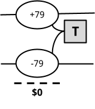

### 多账户

可能会有许多这样的交易，跨越许多不同的账户。例如，如果账户所有者第二天用信用卡支付了一顿午餐，可以通过创建一个专门用于跟踪现实世界信用卡余额的“Credit Card”账户，并相应地创建一个交易来表示：

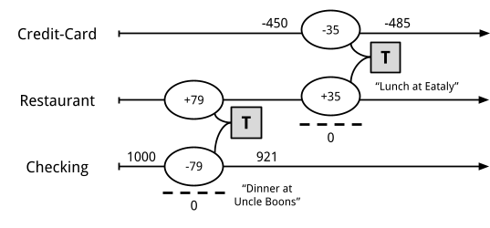

在这个例子中，所有者在餐馆“Eataly”花费了35美元。所有者的信用卡之前的余额是-450美元；费用之后，新余额是-485美元。

对于每个现实世界账户，所有者可以像我们之前一样创建一个记账账户。此外，对于每个支出类别，所有者也可以创建一个记账账户。在这个系统中，创建账户的数量没有限制。

注意，例子中的余额是负数；这不是错误。信用卡账户的余额通常是负数：它们代表你欠的金额，银行以*信用*方式借给你。当你的信用卡公司跟踪你的费用时，他们从他们的角度写出你的对账单，显示正数。对于你来说，这些是你最终需要支付的金额。但在我们的记账系统中，我们从所有者的角度表示这些数字，从她的角度来看，这是她欠的钱，而不是她拥有的东西。我们拥有的是胃里的食物（正数美元的“Restaurant”）。

### 多分录

最后，交易可能有多个分录；实际上，它们可能有任意数量的分录。唯一重要的是，它们的金额总和为零（根据上述双重记账规则）。

例如，让我们看看所有者12月份收到工资会发生什么：

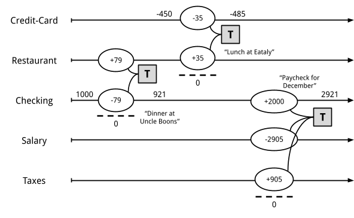

在这个例子中，她收到的工资总额记录为-2905美元（我稍后会解释符号）。905美元用于缴税。她的“净”工资2000美元，存入她的“Checking”账户，账户余额为2921美元（之前余额921美元+2000美元=2921美元）。这个交易有三个分录：（+2000）+（-2905）+（+905）= 0。双重记账规则得到了尊重。

现在，你可能会问：为什么她的工资记录为负数？这里的原因与上面信用卡的类似，虽然可能更微妙。这些账户存在的目的是从账户所有者的角度跟踪所有金额。所有者给予工作，并以此换取金钱和税收（正数金额）。给予的工作以美元单位计价。它“离开”所有者（想象所有者在口袋里储存*潜在工作*，每天上班时洒下这些工作潜力，给予公司）。所有者*给予*了价值2905美元的工作。我们希望跟踪给予了多少工作，这通过“Salary”账户来完成。这是她的总工资。

注意，我们简化了这笔工资交易，为了保持简单。更现实的工资单记录会有更多账户；我们会分别记录州和联邦税额，以及社保和医保缴款、通过工作支付的保险和期间累计的假期时间。但是，这并不会更复杂：所有者只是将工资单上的所有金额转换为一个有更多分录的交易。结构保持相似。

## 账户类型

让我们现在转向所有者可以拥有的不同账户类型。

**余额或变化。** 首先，账户最重要的区别在于我们是否关心**特定时间点**的余额，或者是否只在**一段时间**内的变化有意义。例如，某人的支票或储蓄账户的余额是一个有意义的数字，账户所有者和相应的银行都会关心。类似地，某人的信用卡账户总欠款也是有意义的。同样，某人的房屋抵押贷款余额也是如此。

另一方面，自某人生在地球上起，餐馆费用的总额并不是特别有趣。我们可能关心的是在*特定期间*内的餐馆费用。例如，“你上个月在餐馆花了多少钱？”或者上个季度。或者去年。同样，自某人在公司工作起的总工资金额也不是特别重要。但我们会关心在一个税收年度内的总收入，因为它用于报税。

-   余额在特定时间点有意义的账户称为**资产负债表账户**。有两种此类账户：“**资产**”和“**负债**”。

-   另一类账户，即余额本身并没有特别意义，但我们感兴趣的是在一段时间内的变化称为**收益表账户**。同样，有两种：“**收入**”和“**费用**”。

**正常符号。** 其次，我们考虑账户余额的*通常符号*。大多数账户在双重记账系统中通常有正数符号或负数符号（虽然如前所述，账户余额有时会改变符号）。这就是我们区分前面提到的账户类型的方法：

-   对于资产负债表账户，资产通常有正余额，负债通常有负余额。

-   对于收益表账户，费用通常有正余额，收入账户通常有负余额。

这种情况总结在下表中：

<table>
<colgroup>
<col style="width: 32%" />
<col style="width: 34%" />
<col style="width: 33%" />
</colgroup>
<thead>
<tr class="header">
<th></th>
<th>余额：正 (+)</th>
<th>余额：负 (-)</th>
</tr>
<tr class="odd">
<th>
余额重要 
<strong>在某一时点</strong>

(资产负债表)
</th>
<th><strong>资产</strong></th>
<th><strong>负债</strong></th>
</tr>
<tr class="header">
<th>
<strong>变化</strong> 余额重要 
<strong>在某一期间</strong>

(收益表)
</th>
<th><strong>费用</strong></th>
<th><strong>收入</strong></th>
</tr>
</thead>
<tbody>
</tbody>
</table>

让我们讨论每种账户类型并提供一些例子，使其不再抽象。

-   **资产。 (+)** 资产账户表示*所有者拥有的东西*。典型的例子是银行账户。另一个例子是“现金”账户，用于记录钱包中的钱。投资也是资产（其单位不是美元，而是某些共同基金或股票的股份数量）。最后，如果你拥有房屋，房屋本身被视为资产（其市场价值随时间波动）。

-   **负债。** **(-)** 负债账户表示*所有者欠的东西*。最常见的例子是信用卡。同样，银行提供的对账单会显示正数，但从你自己的角度来看，它们是负数。贷款也是负债账户。例如，如果你为房屋办理抵押贷款，这是你欠的钱，并将通过一个负数账户进行跟踪。每月还贷时，负数金额增加，即其绝对值随着时间的推移变小（例如，-120,000 -> -117,345）。

-   **费用。 (+)** 费用账户表示*你收到的东西*，可能通过交换其他东西购买。这种账户类型会显得很自然：食物、饮料、衣物、租金、航班、酒店和你通常花费可支配收入的大多数类别。然而，税款通常也通过费用账户进行跟踪：当你收到工资收入时，源头扣缴的税款金额立即记录为费用。可以将其视为支付政府在全年提供的服务的费用。

-   **收入。** **(-)** 收入账户用于记录*你为获得其他东西而给予的东西*（通常是资产或费用）。对于大多数有工作的人的来说，这是他们时间的价值（工资收入）。具体来说，我们指的是*总收入*。例如，如果你的年薪为120,000美元，那么这个数字是120,000美元，而不是扣除税款后的金额。其他类型的收入包括投资的股息或持有债券支付的利息。还有一些奇特的东西可以记录为收入，例如信用卡返现或他人赠送的金钱礼物。

在 Beancount 中，所有账户名，毫无例外，必须与上述账户类型之一关联。由于账户类型在其生命周期内从不改变，我们将其类型作为账户名称的一部分，作为*前缀*，按惯例。例如，餐馆的合格账户名称为“Expenses:Restaurant”。银行支票账户的合格账户名称为“Assets:Checking”。

除此之外，你可以选择任何你喜欢的账户名称。你可以创建任意数量的账户，正如我们稍后将看到的，你可以将它们组织成层级结构。本文档编写时，我使用超过700个账户来跟踪我的个人事务。

让我们重新审视我们的例子并添加一些更多账户：

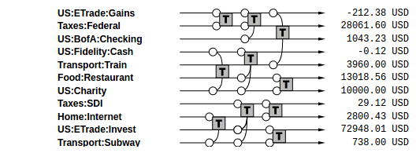

让我们想象还有更多交易：

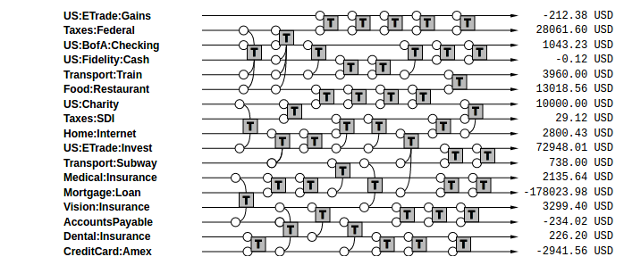

…甚至更多：

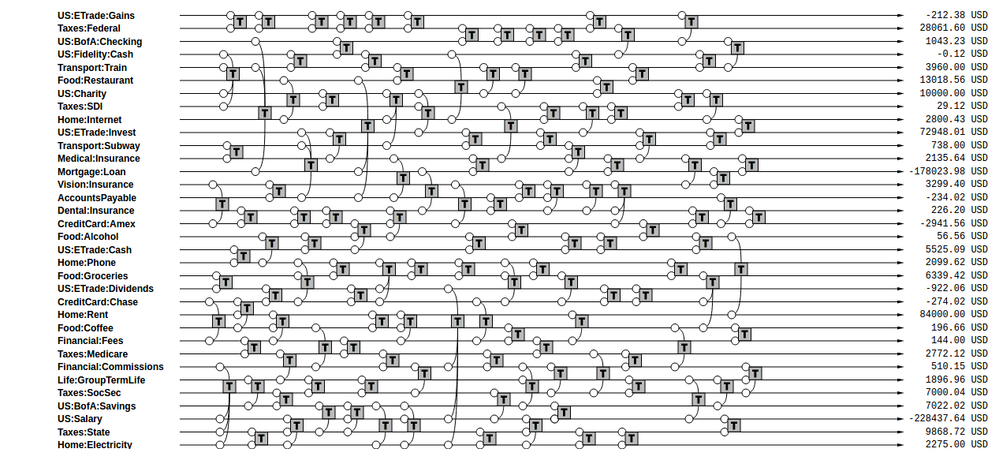

最后，我们可以用其中四种类型中的一种为每个账户添加标签，将类型作为它们账户名称的前缀：

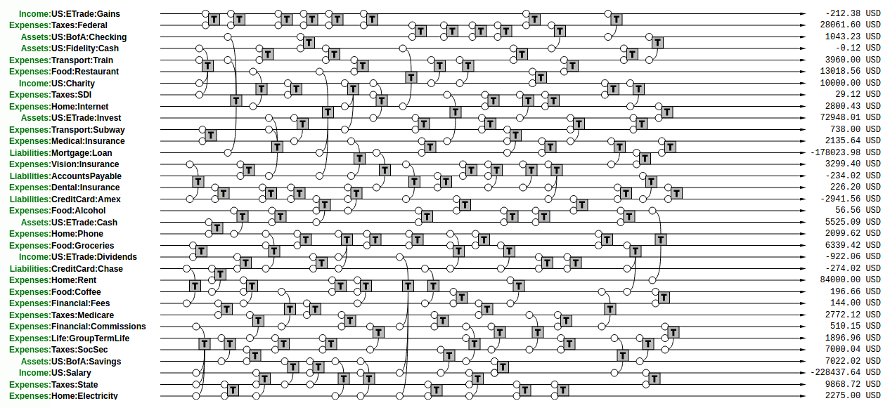

一个现实的账本可能包含一个人全年数千笔交易。但原则很简单，始终如一：分录应用于账户随时间变化，必须附属于一个交易，在这个交易中，所有分录的总和必须为零。

当你为一组账户进行**记账**时，你本质上是在描述所有账户随时间变化的分录，遵循规则的约束。你正在创建一个包含这些分录的数据库，称为**账本**。你在“保持账本”，即传统上包含所有这些交易的账本。有些人称之为“维护日记账”。

现在我们将注意力转向从这些数据中获取有用的信息，总结账本中的信息。

## 试算表

以我们最后的例子为例：我们可以轻松重新排列所有账户，使所有资产账户集中在顶部，然后是负债账户，然后是我们刚刚介绍的一些权益账户（后面会详细讨论），然后是收入账户，最后是费用账户。我们只是改变顺序而不修改交易的结构，以便将每种类型的账户集中在一起：

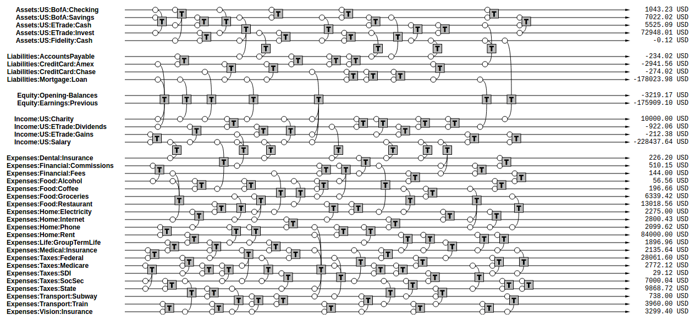

我们将账户重新排列，资产账户集中在顶部，然后是负债账户，然后是一些权益账户，最后是收入和费用账户。

如果我们总结所有账户上的分录并在右侧仅显示账户名称及其最终余额，我们将得到一份称为“试算表”的报告。

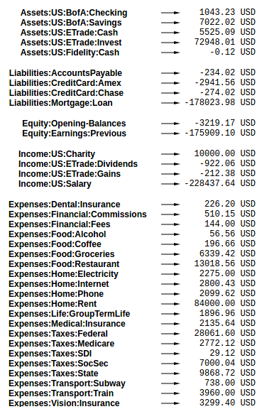

这只是反映特定时间点每个账户的余额。由于每个账户一开始的余额为零，每个交易本身也为零，我们知道所有这些余额的总和必须等于零[^1]。这是我们约束每个分录必须是交易的一部分，并且每个交易必须有平衡分录的结果。

## 收益表

从交易列表中提取的一种常见信息是特定期间内收益表账户余额变化的总结。这告诉我们在这段时间内赚取和花费了多少钱，差额告诉我们产生了多少利润（或亏损）。我们称之为“净收入”。

为了生成此摘要，我们只需关注收入和费用类型账户的余额，总结特定期间内的交易，并将收入余额画在左侧，费用余额画在右侧：

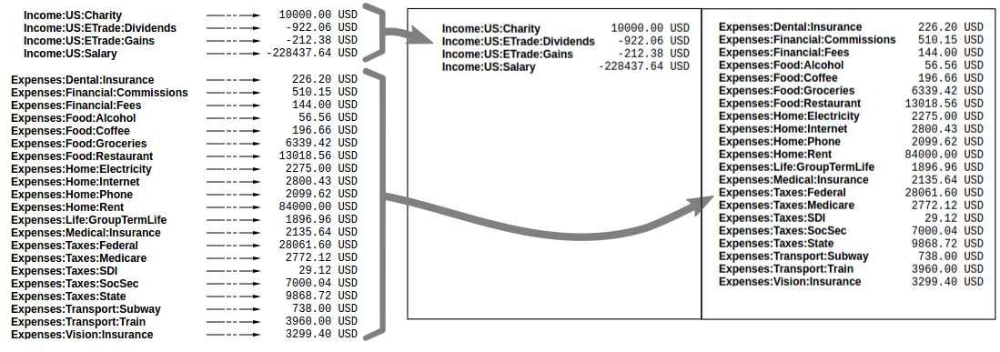

这里需要注意符号：收入数字是负数，费用数字是正数。所以如果你的收入超过支出（这是一个好的结果），收入和费用余额的总和将是一个负数。像任何其他收入一样，净收入是一个负数，这意味着有相应数量的资产和/或负债是正数（对你来说是好的）。

收益表告诉我们在特定期间内发生了什么变化。公司通常**每季度**向投资者和可能的公众（如果它们是上市公司）报告这些信息，以分享他们能够获得多少利润。个人通常在**每年**的报税表上报告这些信息。

## 清算收入

注意在收益表中仅总结特定时间段内的交易。这允许我们，例如，计算一年的总收入。如果我们总结自账户创建以来的所有交易，我们将得到自账户创建以来的总收入。

更好的方法是清零收入和费用账户的余额。Beancount 称这种基本转换为“清算[^2]”。它通过以下步骤进行：

1. 计算这些账户从一开始到报告期开始的余额。例如，如果你在2000年创建了账户，并且你想生成2016年的收益表，你将总结2000年至2016年1月1日的余额。

2. 插入交易以清空这些余额并将它们转移到某个非收入或费用的账户。例如，如果截至2016年1月1日餐馆费用账户的总额为85,321美元，它将插入一笔交易，将85,321美元转移到餐馆，并将85,321美元转移到“以前收益”。交易日期为2016年1月1日。包括这笔交易，该账户在该日期的总和将为零。这正是我们想要的。

如下图所示，所有收益表账户插入的交易用绿色表示。现在总结到账本末尾的整个交易集将只包括2016年的变化，因为账户余额在该日期为零：

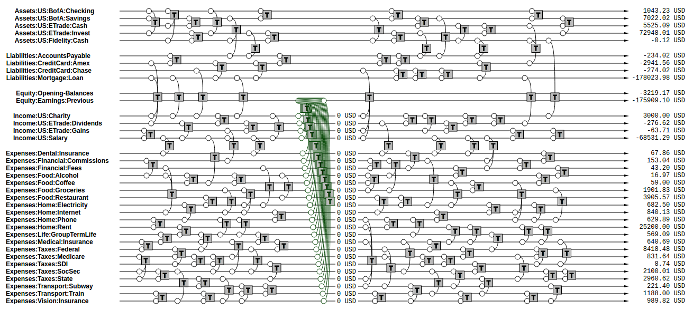

这是 bean-query shell 的“CLEAR”操作的语义。

（请注意，另一种实现收益表账户相同结果的方法是仅统计清算日期之后的交易；然而，联合报告收益表账户和资产负债表账户将导致资产负债表账户的余额不正确。）

## 权益

接收这些以前累积收入的账户称为“以前收益”。它属于第五种也是最后一种账户类型：**权益**。我们之前没有谈到这种账户类型，因为它们通常只用于转移金额以生成报告，所有者通常不会对这些账户进行分录；软件会自动处理这些，例如，当清算净收入时。

“权益”账户类型用于持有所有过去活动的净收入总结。重点是，如果我们现在将资产、负债和权益账户一起列出，因为收入和费用账户已被清零，所有这些余额的总和应等于零。总结所有权益账户清楚地告诉我们我们在实体中的份额，换句话说，如果你用资产偿还所有负债，剩下的就是业务的价值…它的价值。

注意，权益账户的正常符号是*负数*。这没有特别的意义，只是它们用于抵消资产和负债，如果所有者有任何价值，那么这个数字应该是负数。（负数权益意味着某些正数净值。）

在 Beancount 中有几种不同的权益账户：

-   **以前收益**或**留存收益**。用于持有从开始到报告期*开始*的总收入和费用余额的账户。这是我们在上一节中提到的账户。

-   **当前收益**，也称为**净收入**。用于包含报告期间*期间*的收入和费用余额的账户。通过在报告期*结束*时清算收入和费用账户来填充这些账户。

-   **期初余额**。用于抵消初始化账户存款的权益账户。当我们截断过去交易历史时，但也需要确保账户余额以特定金额开始其历史记录时使用这种账户。

再说一遍：你不需要自己定义或使用这些账户，因为这些账户是为了总结交易而创建的。通常，这些账户通过上述清算过程填充，或者通过 Pad 指令填充期初余额权益账户，以说明过去的总结余额。它们由软件自动创建和填充。我们将在接下来的章节中看到它们的使用方式。

## 资产负债表

另一种总结方法是列出所有者的资产和债务，每个账户的余额。这回答了一个问题：“*钱在哪里？*”理论上，我们可以只关注资产和负债账户，并将它们列入报告中：

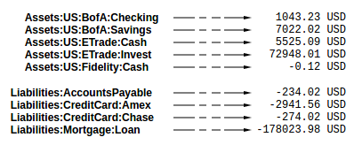

然而，实际上，通常还有另一个相关问题：“*一旦还清所有债务，我们剩下多少？*”这被称为**净值**。

如果收入和费用账户已被清零，所有余额已转移到权益账户，净值应等于所有权益账户的总和。因此，在构建资产负债表时，通常会清算净收入，然后显示权益账户的余额。报告看起来像这样：

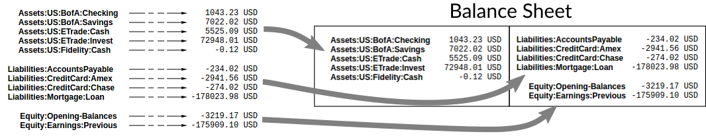

注意，资产负债表可以在*任何时间点*绘制，只需在特定日期后截断交易列表。资产负债表显示一个时间点的余额快照；收益表显示两个日期之间的余额变化。

## 总结

总结过去交易历史为单个等效存款是有用的。例如，如果我们关注2016年期间的交易，对于在2016年1月1日余额为450美元的账户，我们可以删除所有之前的交易，并用一笔450美元的交易替代它，日期为2015年12月31日，并从其他地方取出这些钱。

这个其他地方将是权益账户**期初余额**。首先，我们可以对所有资产和负债账户执行此操作（见蓝色交易）：

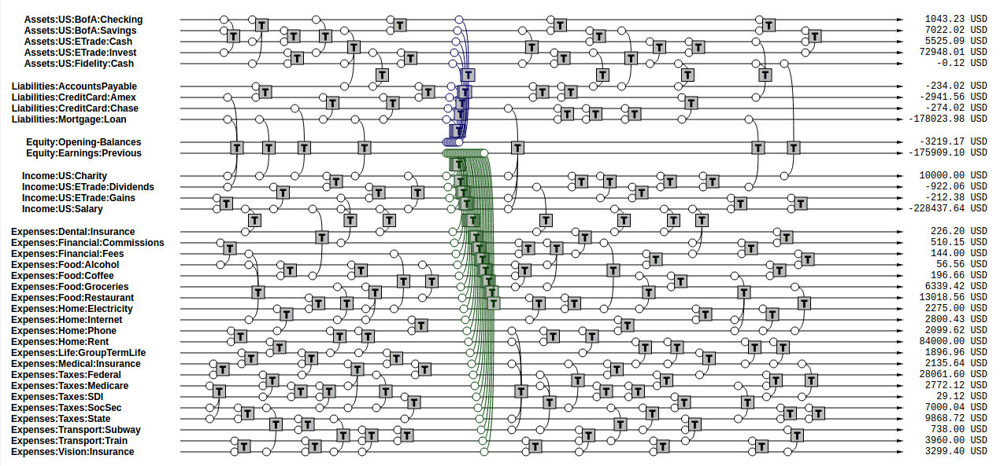

然后我们删除期初日期之前的所有交易，以获得截断的交易列表：

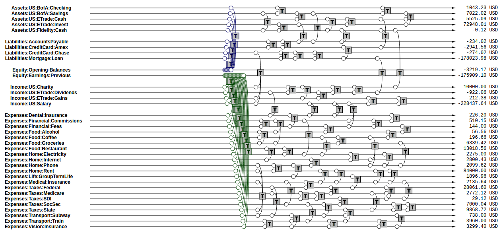

这是当我们专注于特定时间段的交易时有用的操作。

（这是一个实现细节：这些操作与 Beancount 的设计有关。我们没有使用参数进行所有报告操作，而是简化了所有报告例程，并对整个交易流进行操作；通过这种方式，我们将交易列表转换为仅包含我们想要报告的数据。在这种情况下，总结只是一个接受完整交易集并返回等效截断流的转换。然后，从这个流中，我们可以生成不包含过去交易的账本。

从程序设计的角度来看，这是有吸引力的，因为程序的唯一状态是交易流，它从未被直接修改。简单且稳健。）

## 期间报告

现在我们知道可以通过“清算”并仅查看收入和费用账户来生成某一时间段内的变化报告（收益表）。我们还知道可以通过清算来生成任何时间点的资产、负债和权益快照（资产负债表）。

更一般地说，我们感兴趣的是查看特定时间段的报告。这意味着一个收益表，但也包括*期初*资产负债表和*期末*资产负债表。

为此，我们应用以下转换：

-   **开启。** 我们首先在期初清算净收入，将所有以前的收入余额转移到权益**以前收益**账户。然后我们总结到期初。这两个步骤的组合称为“开启”。

-   **关闭。** 我们还截断报告期结束后的所有交易。这个操作称为“关闭”。

这些是 bean-query shell 的“OPEN”和“CLOSE”操作[^3]。生成的交易集应如下所示。

“关闭”涉及两个步骤。首先，我们删除结束日期后的所有交易：

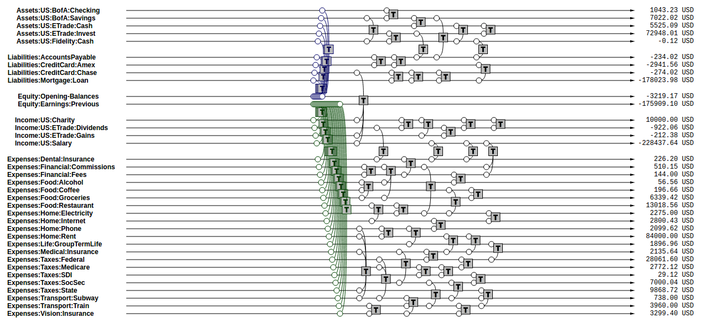

我们可以处理这个交易流生成期间的收益表。

然后我们在报告期结束日期再次清算，但这次将净收入清算到“Equity:Earnings:Current”：

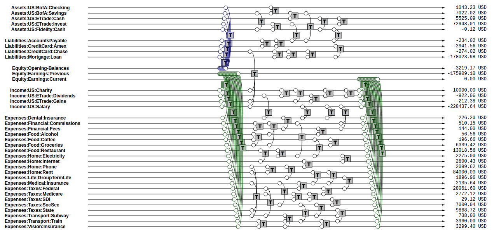

从这些交易中，我们生成期间末的资产负债表。

这总结了使用 Beancount 生成报告的交易流准备操作，以及这些报告类型的基本介绍。

## 账户图表

新用户通常会想知道在账户名称中应该使用多少细节。例如，是否应在账户名称中包含付款人，如下例所示？

    Expenses:Phone:Mobile:VerizonWireless
    Assets:AccountsReceivable:Clients:AcmeInc

还是应该使用简单的名称，依靠“付款人”、“标签”或其他元数据来分组分录？

    Expenses:Phone
    Assets:AccountsReceivable

答案是*取决于你*。这是一个需要做出的任意选择。它是一个品味问题。个人而言，我喜欢滥用账户名称，创建长描述性的名称，其他人则喜欢保持简单并使用标签分组分录。有时甚至不需要过滤分录子组。没有正确答案，取决于你想做什么。

需要记住的一点是账户名称隐含定义了一个层级结构。某些报告代码将“:”分隔符解释为创建内存树，并允许你折叠节点的子账户并计算父节点的总和。这是一种额外的分组分录方式。

### 国家-机构约定

我为资产、负债和收入账户发明的一个约定是将树根定位为账户所在的国家代码，后跟对应机构的简短字符串。在其下是该机构中特定账户的唯一名称。像这样：

    <type> : <country> : <institution> : <account>

例如，支票账户可以选择为“`Assets:US:BofA:Checking`”，其中“BofA”代表“美国银行”。信用卡账户可以包括特定类型卡的名称作为账户名称，例如“`Liabilities:US:Amex:Platinum`”，这在你有多张卡时很有用。

我发现对于费用账户使用这种方案对我来说没有意义，因为这些账户通常表示通用类别。对于这些账户，将它们按类别分组似乎更有意义，例如使用“`Expenses:Food:Restaurant`”而不是简单的“`Expenses:Restaurant`”。

无论如何，Beancount 不强制执行任何东西，除了根账户；这只是一个建议，这个约定没有在软件中编码。你有很大的自由去实验，可以轻松通过处理文本文件来更改所有名称。有关更多实用指南，请参阅 [<u>食谱</u>](command_line_accounting_cookbook.md)。

## 借方和贷方

到目前为止，我们还没有讨论“借方”和“贷方”的概念。这是有意为之：Beancount 基本上消除了这些概念，因为这使一切变得更简单。我认为，学习收入、负债和权益账户通常有负余额，并将所有账户视为相同，比处理借方和贷方术语并区分不同账户类别更简单。无论如何，本节解释了这些是什么。

正如我在前几节中指出的，我们认为“收入”、“负债”和“权益”账户通常有负余额。这可能听起来很奇怪；毕竟，没人会把他们的总工资视为负数，当然你的信用卡账单或抵押贷款对账单报告的是正数。这是因为在我们的双重记账系统中，我们认为所有账户都由*账户所有者的视角*持有。我们使用一致的符号，因为这使对账户内容的所有操作变得简单：它们都是简单的加法，并且所有账户都以相同的方式处理。

相比之下，会计师通常将其所有账户的余额保持为正数，然后根据应用分录的账户类型不同对分录进行不同处理。每个账户的符号完全由其类型决定：资产和费用账户是借方账户，负债、权益和收入账户是贷方账户，需要符号调整。此外，将正数金额记录在账户上称为“借记”，从账户中取出称为“贷记”。请参阅 [<u>这个外部文档</u>](http://www.accountingtools.com/debits-and-credits)，例如，它几乎让我头晕，[<u>这个最近的讨论</u>](https://groups.google.com/d/msgid/beancount/CAPD_o%2B8W2BpTA9qtmMvaTdqdW51v%2Bt5uFrMRbZ93aPqoWokzQw%40mail.gmail.com) 有更多细节。这种处理分录的方法使一切变得比实际需要的复杂得多。

这种方法的问题在于，分录的总和不再是简单的加法。例如，假设你正在创建一个包含两个资产账户、一个费用账户和一个收入账户分录的新交易，系统告诉你有一个9.95美元的不平衡错误。你盯着这个条目看；哪一个分录太小？或者某个分录是否太大？此外，可能需要添加新的分录，但它是借方账户还是贷方账户？进行这些心理体操是很费力的。一些双重记账软件试图通过为借方和贷方创建单独的列并允许用户仅在对应分录账户类型的列中输入金额来处理这个问题。这在视觉上有帮助，但为什么不直接使用符号呢？

此外，当你查看会计等式时，也必须考虑它们的符号。这使得对它们进行转换变得尴尬，使本质上是简单的分录加和变得复杂难懂。

在纯文本记账中，我们宁愿摆脱这种不方便的负担。我们只是到处使用加法，并记住负债、权益和收入账户通常有负余额。虽然这不符合传统，但它更容易理解。如果需要查看仅包含正数的常规报告，我们将能够在报告代码中触发该功能[^4]，只需在输出中反转符号。

省些痛苦：忘记“借方”和“贷方”术语。

## 会计等式

根据前几节内容，我们可以很容易地用符号表达会计等式。如果，

-   A = 所有资产分录的总和

-   L = 所有负债分录的总和

-   X = 所有费用分录的总和

-   I = 所有收入分录的总和

-   E = 所有权益分录的总和

我们可以说：

    A + L + E + X + I = 0

这源于

    所有分录的总和 = 0

这源于每笔交易本身平衡（由 Beancount 强制执行）：

    对所有交易 t，t 的分录总和 = 0

此外，收入和费用的分录总和是净收入（NI）：

    NI = X + I

如果我们通过清算收入到权益留存收益账户来调整权益以反映总净收入效果，我们得到更新的权益值（E'）：

    E’ = E + NI = E + X + I

我们有一个简化的会计等式：

    A + L + E’ = 0

如果我们调整借方和贷方符号（见前一节），使所有总和为正数，这成为熟悉的会计等式：

    资产 - 负债 = 权益

如你所见，只是加总数字要简单得多。

## 纯文本记账

好了，现在我们了解了这个方法及其理论上的用途。双重记账系统的目的是允许你将各种现实世界账户中的交易复制到单一统一系统中，以共同表示，并从这些数据中提取各种视图和报告。现在让我们转向如何实际记录这些数据。

本文档讨论 Beancount，其目的是“使用文本文件进行双重记账”。Beancount 实现了一个简单语法的解析器，允许你记录交易和分录。示例交易的语法如下所示：

    2016-12-06 * "Biang!" "Dinner"
      Liabilities:CreditCard   -47.23 USD
      Expenses:Restaurants

你在文件中编写许多这样的声明，Beancount 将读取它并在内存中创建相应的数据结构。

**验证。** 解析交易后，Beancount 还验证双重记账法的规则：检查所有交易的分录总和是否为零。如果你犯了错误，记录了一个非零余额的交易，将显示错误。

**余额断言。** Beancount 允许你复制外部账户声明的余额，例如，月度对账单上的余额。它处理这些并检查输入交易产生的余额是否与声明的余额一致。这有助于你轻松检测和发现错误。

**插件。** Beancount 允许你构建程序，以自动化和/或处理输入文件中的交易流。你可以通过直接处理交易流的代码构建自定义功能。

**查询和报告。** 它提供工具来处理这个交易流，生成我们在本文档前面讨论的报告类型。

还有一些细节，例如，Beancount 允许你跟踪成本基础并进行货币转换，但这就是它的本质。

## 表格视角

几乎总是，用户在邮件列表上提出的关于如何计算或跟踪某些值的问题，只需将数据视为长行列表，其中某些行需要过滤和汇总就能轻松解决。如果你考虑到我们最终要做的只是求这些分录的“总和”，而交易和分录的属性允许我们过滤分录的子集，这就变得非常简单。在几乎所有情况下，答案都是找到某种方式来区分分录，例如通过账户名称、附加标签、使用某些元数据等。考虑如何将这些数据表示为表格可能是很有启发性的。

想象你有两个表格：一个包含每个交易的字段，例如日期和描述；另一个表格包含每个分录的字段，例如账户、金额和货币，以及其父交易的引用。最简单的表示方法是**连接**这两个表格，复制父交易的值到每个分录。

例如，这个 Beancount 输入：

    2016-12-04 * "Christmas gift"
      Liabilities:CreditCard       -153.45 USD
      Expenses:Gifts

    2016-12-06 * "Biang!" "Dinner"
      Liabilities:CreditCard   -47.23 USD
      Expenses:Restaurants

    2016-12-07 * "Pouring Ribbons" "Drinks with friends"
      Assets:Cash     -25.00 USD
      Expenses:Tips     4.00 USD
      Expenses:Alcohol

可以表示为这样的表格：

<table>
<colgroup>
<col style="width: 12%" />
<col style="width: 4%" />
<col style="width: 17%" />
<col style="width: 23%" />
<col style="width: 24%" />
<col style="width: 10%" />
<col style="width: 7%" />
</colgroup>
<thead>
<tr class="header">
<th><em><strong>日期</strong></em></th>
<th><em><strong>标志</strong></em></th>
<th><em><strong>付款人</strong></em></th>
<th><em><strong>说明</strong></em></th>
<th><em><strong>账户</strong></em></th>
<th><em><strong>金额</strong></em></th>
<th><em><strong>货币</strong></em></th>
</tr>
<tr class="odd">
<th>2016-12-04</th>
<th>*</th>
<th></th>
<th>Christmas gift</th>
<th>Liabilities:CreditCard</th>
<th>-153.45</th>
<th>USD</th>
</tr>
<tr class="header">
<th>2016-12-04</th>
<th>*</th>
<th></th>
<th>Christmas gift</th>
<th>Expenses:Gifts</th>
<th>153.45</th>
<th>USD</th>
</tr>
<tr class="odd">
<th>2016-12-06</th>
<th>*</th>
<th>Biang!</th>
<th>Dinner</th>
<th>Liabilities:CreditCard</th>
<th>-47.23</th>
<th>USD</th>
</tr>
<tr class="header">
<th>2016-12-06</th>
<th>*</th>
<th>Biang!</th>
<th>Dinner</th>
<th>Expenses:Restaurants</th>
<th>47.23</th>
<th>USD</th>
</tr>
<tr class="odd">
<th>2016-12-07</th>
<th>*</th>
<th>Pouring Ribbons</th>
<th>Drinks with friends</th>
<th>Assets:Cash</th>
<th>-25.00</th>
<th>USD</tr>
<tr class="header">
<th>2016-12-07</th>
<th>*</th>
<th>Pouring Ribbons</th>
<th>Drinks with friends</th>
<th>Expenses:Tips</th>
<th>4.00</th>
<th>USD</th>
</tr>
<tr class="odd">
<th>2016-12-07</th>
<th>*</th>
<th>Pouring Ribbons</th>
<th>Drinks with friends</th>
<th>Expenses:Alcohol</th>
<th>21.00</th>
<th>USD</th>
</tr>
</thead>
<tbody>
</tbody>
</table>

注意交易字段的值为每个分录重复。这与常规数据库连接操作完全相同。分录字段从“账户”列开始。（请注意，这个示例表格是简化版；实际上还有很多字段。）

如果你有一个这样的连接表格，你可以过滤它并汇总任意分录组的金额。这正是 bean-query 工具允许你做的：你可以在等效于这个内存表的数据上运行 SQL 查询，并列出如下值：

    SELECT date, payee, number WHERE account = "Liabilities:CreditCard";

或者汇总如下位置：

    SELECT account, sum(position) GROUP BY account;

这个简单的最后一个命令生成了试算表报告。

注意表格表示本质上并不约束分录总和为零。如果你的行选择标准（在 WHERE 子句中）始终选择***所有***匹配交易的分录，你可以确保所有分录的最终总和为零。如果不是，总和可能是其他值。只是需要记住的一点。

如果你熟悉 SQL 数据库，你可能会问为什么 Beancount 不直接处理其数据以填充现有数据库系统，以便用户可以使用这些数据库的工具。这里有两个主要原因：

-   **报告操作。** 为了生成收益表和资产负债表，交易列表需要预处理，使用前面描述的清算、开启和关闭操作。这些操作不容易在数据库查询中实现，并且依赖于报告，理想情况下不需要修改输入数据。我们已经通过解析输入文件加载分录数据到内存中，数据库步骤是多余的。

-   **汇总位置。** 虽然我们在本文档中尚未讨论这一点，但账户的内容可能包含不同类型的商品以及具有附加成本基础的位置。这些位置的汇总方式需要实现自定义数据类型，因为它遵循一些关于位置如何相互抵消的规则（有关详细信息，请参阅 [<u>库存工作原理</u>](how_inventories_work.md)）。使用 SQL 数据库实现这些操作非常困难，超出了使用单一货币并忽略成本基础的上下文。

这就是 Beancount 提供自定义工具直接处理和查询其数据的原因：它提供自己的 SQL 客户端实现，允许你指定开启和关闭日期，并利用自定义“库存”数据结构来创建分录位置的总和。这个工具支持 Beancount 核心类型的列：金额、位置和库存对象。

（无论如何，如果你不信服，Beancount 提供了一个 [<u>工具</u>](https://github.com/beancount/beancount/tree/v2/bin/bean-sql) 将其内容导出到常规 SQL 数据库系统。如果你喜欢，可以自由地进行实验，随意折腾。）

[^1]: 请不要注意这些大图中的数字，它们是随机生成的，并不反映这一点。我们只是对显示结构感兴趣。

[^2]: 注意，这与“清算交易”一词无关，后者指的是会计核对并检查交易的正确性。

[^3]: 注意，这些操作与 Beancount 提供的开启和关闭指令无关。

[^4]: Beancount 尚未提供此功能，但实现起来很简单。我们只需要反转负债、收入和权益账户余额的符号。这在路线图中，最终会提供这个功能。
